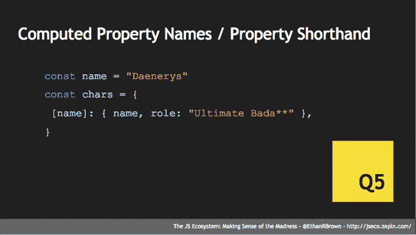

# JavaScript 2018:你需要知道的事情，还有一些你可以跳过

> 原文：<https://thenewstack.io/js-2018-things-need-know-can-skip/>

JavaScript 已经成长起来了——我们不再仅仅是在网页中制作微小的交互元素，我们正在用 JavaScript 构建整个巨大的应用程序。因此，当然，它比以往任何时候都更复杂，有如此多的移动部分，以至于很难把握当前 JavaScript 生态系统的规模和范围。

作为一名在职软件工程师和为 O'Reilly Media 出版的两本 JavaScript 书籍的作者， [Ethan Brown](https://www.linkedin.com/in/ethan-brown-5b74b13a/) 花了很多时间解析 JavaScript 领域，试图弄清楚那里有什么，以及现代 JavaScript 开发人员如何开始将所有这些部分组合在一起。

以下是 Brown 对 JavaScript 生态系统的一些方面的预测，这些方面对聪明的开发者来说是最有前途的，或者至少是最有用的，可以让他们在 2018 年熟悉。有两个警告:首先，他指出了 JavaScript 领域所有变化中值得注意的好的方面，即使这个列表中的一些项目不是你的重点。当您遇到不同领域的交叉问题时，拥有这种总体意识将有助于您建立联系，知道与谁交谈以及寻找什么技术。

他还强调，这些选择是他自己的意见，基于他自己在生态系统中的经验，当然你的可能完全不同。“这只是我的看法，我们都可以画自己的地图，我知道我漏掉了一些东西，”布朗说。

尽管如此，我们总得从某个地方开始。

**web assembly**:[web assembly](http://webassembly.org/)是 JavaScript 的子集，为其他语言提供编译器目标。所以，如果你想把你的 C++编译成 JavaScript， [WebAssembly 是你应该找的地方](https://thenewstack.io/ready-web-assembly-revolution/)——它允许几乎任何语言以浏览器或目标 Node.js 为目标，并且有一些非常有趣的应用。“我有一种感觉，这将是一个大事件，这将是非常重要的，”布朗说。“我肯定会竖起耳朵，在 2018 年花些时间更好地学习这一点。”

**函数式编程**:“这不是一个新想法，它已经被 JavaScript 社区的很大一部分接受，但我觉得 2018 年将是函数式编程真正达到临界质量和规模的一年，”布朗说。他继续说，通常的批评是，它更难学习，更难理解，但这实际上是一个视角问题:如果我们都从函数式编程开始，命令式编程的混乱、副作用和混乱对我们来说将是奇怪和困难的。

布朗的建议是:“如果你想尝试真正受约束的函数式编程，你可以看看 [Elm](http://elm-lang.org/) 或 [ClojureScript](https://clojure.org/about/functional_programming) ，但你现在可以在 JavaScript 中简单地说，‘好吧，我代码中的一切都将是纯函数。’"

**不变性**:与函数式编程齐头并进。“虽然很多人在第一次谈到不变性时会想‘哇，这真的很低效，你在创建所有东西的副本，所有的内存看起来都是非常不必要的’”，Brown 说。但请记住，他补充道，你只是复制了变化的东西——其他结构保持不变。此外，这确实是 JavaScript 的事情——身份比较在 JavaScript 中既快又便宜，所以当大多数人转向不变性架构时，他们会发现它提高了性能。

更好的是，不变性为实验提供了一个天然的安全网——如果你知道你实际上不能改变任何已存在的东西，你只能创建一个被修改的新副本，这鼓励了你可能不习惯的实验。这对于初学编程的人来说也很棒。

**单向数据绑定**:“这是为前端伙计们准备的，一个由 Elm 带到桌面上的想法，由[脸书](https://www.facebook.com/Engineering/)用[通量](https://facebook.github.io/flux/)拾起，然后有了 [Redux](https://redux.js.org/) ，现在它在 [Angular](https://angular.io/) 和 [Vue](http://vuejs.org) 中，”布朗说。越来越多的人意识到这是一个伟大的想法，2018 年是一个认识的好时机。

单向数据绑定确实使应用程序状态更容易管理。当你第一次看到它时，你会想，天哪，这要做的工作太多了，我要写的东西太多了，这看起来太多了。对于小应用程序来说，这可能有点过了，但是一旦你的应用程序达到一定的规模，它确实有助于将你的思维限制在整个应用程序上，而不仅仅是你正在工作的部分。因为当您使用单向数据绑定时，您必须考虑应用程序每个部分的状态以及它在应用程序层次结构中的位置。

[**计算属性名称/属性简写** :](http://www.benmvp.com/learning-es6-enhanced-object-literals/) “这是 [ECMAScript 6](http://es6-features.org/#Constants) (ES6)的卧铺 hit。我还没有看到人们经常使用它，我认为它可以用得更多。这是一个奇妙的语法糖，允许你动态地构造属性名和对象初始化器或对象文字，”布朗说。“我觉得每周我都能找到一种新的很酷的方式来使用它。这对于函数式编程来说也非常有用，所以如果你以前没有看过，一定要去看看——我非常希望看到它在社区中得到更多的使用。”

## 无需担心的事情:

据布朗说，也有一些知识领域我们可以跳过。至少现在是这样。

**面向对象编程**:“我不是 JavaScript 中经典面向对象编程的忠实粉丝。我认为有更好的范例，更好的方法来用 JavaScript 完成事情，实现代码重用。因此，如果你在 JavaScript 领域，我不会为学习 OOP 的所有知识而烦恼，”他推荐道。

[生成器](https://developer.mozilla.org/en-US/docs/Web/JavaScript/Reference/Global_Objects/Generator):“这是 JavaScript 的一个很酷的特性，肯定有一些用例，但我认为主要的一个被 [async/await 排除了。](https://ponyfoo.com/articles/understanding-javascript-async-await)因此，有一段时间，我们真的很高兴使用 [Koa.js](http://koajs.com/) 和生成器，这样我们就可以在异步编程中使用漂亮的同步语义，但现在我们有了 async 和 await，甚至更好。所以除非你是在那些奇怪的使用案例中，发电机是有意义的，否则我不会太担心，”他说。

布朗说:“这是另一个伟大的想法，是对语言的一个奇妙的补充，但是(A)我没有看到人们使用它，以及(B)每次我试图使用符号时，我只会遇到框架和序列化的问题。”。简而言之，他不认为 JavaScript 生态系统真的适合符号，甚至可能不适合我们用 JavaScript 做的事情。他的建议是:在这一点上，在符号上观望。

<svg xmlns:xlink="http://www.w3.org/1999/xlink" viewBox="0 0 68 31" version="1.1"><title>Group</title> <desc>Created with Sketch.</desc></svg>