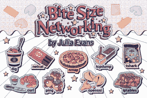
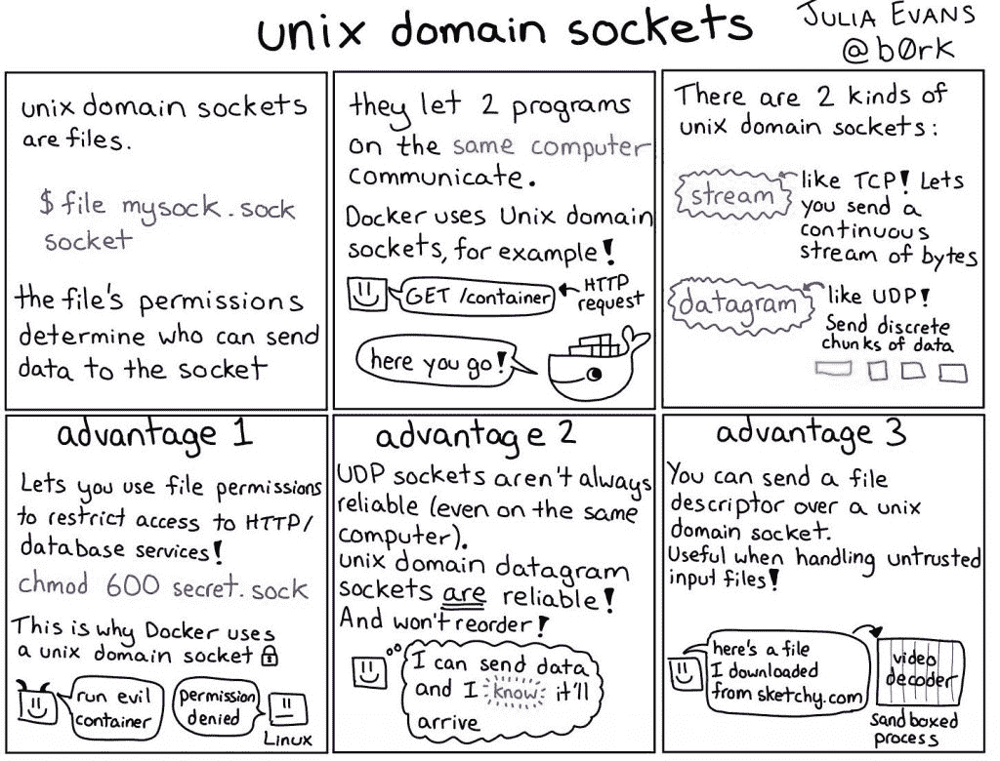
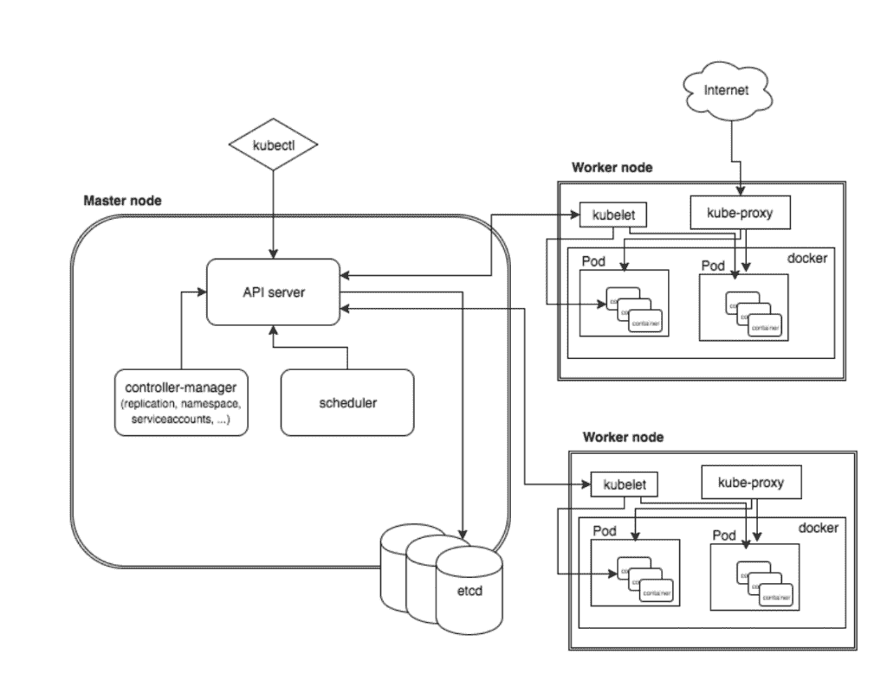
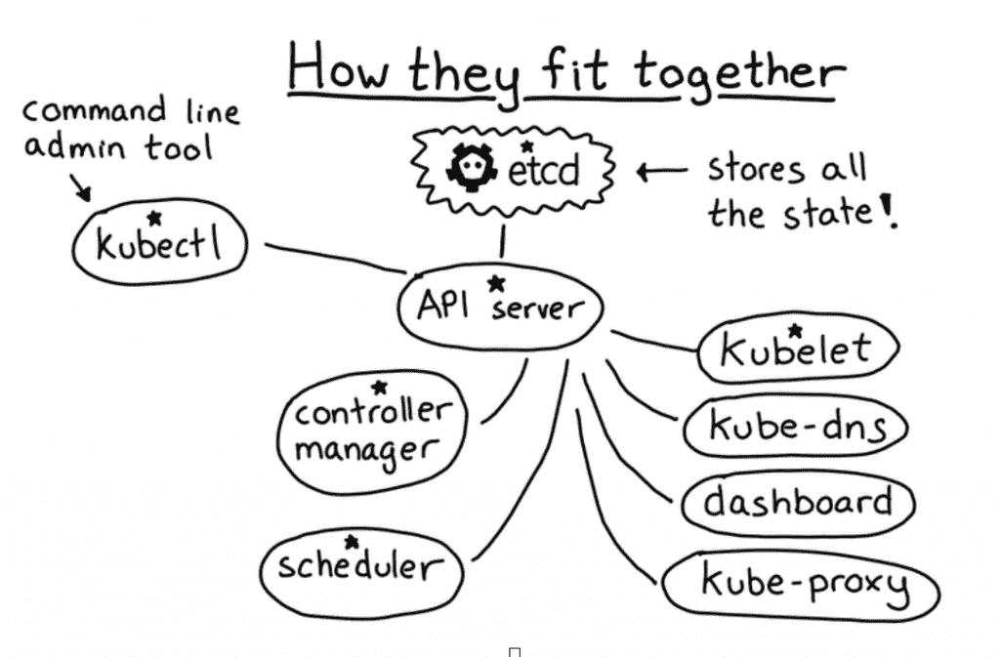

# 朱莉娅·埃文斯的一口大小的杂志打破了它

> 原文：<https://thenewstack.io/julia-evans-bite-size-zines-break-it-down/>

PyCon 2014 有史以来最好的会议赠品之一。Stripe 的软件工程师 Julia Evans 在 Strace 上做了一次演讲，并制作了一本杂志分发给与会者。从那以后，她已经写了 17 本杂志，主题从 Linux 到命令行和机器学习。她的最新作品，“网络！ACK！”加入“哦，妈的，饭桶！”和“救命！我有经理了！”除其他外。这些杂志通常有 20 页，充满了知识性和趣味性的漫画，埃文斯希望这些漫画能教会你一些有用的东西。

【T2

不同于《水手水星》面向高中生的月刊，埃文的杂志面向在职程序员。“想法是你很忙，你想知道如何使用 grep / tcpdump / Strace，而手册页让你头疼，”她在电话采访中说。很多科技写作都来自一个让作者看起来很聪明的地方，大部分编程书籍的编写都不是为了教授编程，而是为了展示作者对这门语言了解多少。这使得工程师们仍然需要学习如何在日常生活中使用这个程序。

自 2014 年以来，埃文斯一直是 Stripe 的工程师，当时她开设了一个博客，现在有数百个有用的帖子，分为 30 个不同的类别，从纯技术(Rust，调试工具，计算机网络)，到职业建议(与他人合作，沟通，远程工作，包容)。她在会议上分享她的智慧，在那里她经常给与会者分发一口大小的杂志。

## 为什么是 Zines？

她杂志上的许多话题都来自她自己不得不学习的东西。“我多年来一直害怕 tcpdump，”她在博客上承认。“直到我从事编程工作 10 年后，我才了解到这些东西。但是我没有理由不早点学会它们！只是没人告诉我。但它并不真的那么可怕，如果我能帮助一些人不被它吓倒，那么我就完成了我的工作。”

“对我来说，漫画经常给人一种神奇的感觉，”她说。她得到的积极反馈表明，用漫画解释复杂的事情对很多人来说效果很好。因为它以一种可爱的形式呈现，人们会毫不犹豫地拿起它。“有趣的、可访问的内容是有用的。”

## 清楚

但这不是可爱的问题，她说，这只是快乐的副作用。仅仅把某样东西做成卡通并不一定意味着它教会了人们需要知道的东西。一个很好的例子是《Kubernetes 儿童图解指南》，这是一个关于长颈鹿菲皮的可爱故事。可悲的是，虽然它引入了许多重要的想法，但它被简化到了毫无用处的地步，她说。她说，理解 Kubernetes 的关键是理解 etcd 的作用，而这一点甚至没有被提及。

一口大小的杂志都是关于清晰度。他们用简单的术语解释事情，但是仍然解释你作为一个工程师需要知道的。“我发现真正有效的是快速解释一些非常复杂的重要事情，比如‘如何运行 Kubernetes’或‘分布式系统如何工作’，”她说。关注基本面，而不是人们想卖给你和告诉你的 5 亿件事情。

来自朱莉娅·埃文斯的“一口大小的 Linux！”

她开始分解一些非常复杂的东西，快速解释一些重要的事情。“通常当试图解释一个巨大的话题时，人们会从泛泛而谈开始(‘让我解释一下什么是可线性化系统！’)”，她在博客上写道我有另一个更喜欢的方法，我认为是“场景来自”方法，或者“变得具体！”"

例如，当使用可线性化的分布式系统时，由于领导者选举，它将周期性地变得不可用。知道这一点很常见会非常有用。

她的[小型网络](https://wizardzines.com/zines/bite-size-networking/)杂志花了很长时间，因为她想在 24 页里谈论所有的网络。她说，人际关系网以艰难著称。但是她的信息是“这个系统计算机的东西并不难。一次只做一件事，一次只学一件事，最终，你会全懂的。”

## 打破特使和 Kubernetes

她的杂志用简单的术语解释事情，但是包括你作为一个工程师需要知道的事情。例如，她说她花了一段时间从现有的文档中理解特使。“我终于明白了，Envoy 是为使用 HTTP2 而编写的，而不是为整个程序提供信息的 HTTP，”她说。“云原生比，用 HTTP2 工作要抽象得多。这是理解该系统的关键，但人们通常不会明确指出。”

她目前正在进行的工作是一本关于 Kubernetes 的杂志，这是一个有许多组件的复杂系统，她发现可用的文档并不总是非常有用。例如，传统的 Kubernetes 图如下所示:

“这种方法在很多情况下都很有效，”她解释道，“但就我个人而言，我发现它经常让我对系统的工作方式感到困惑。”她花了几个月的时间对这个系统有了足够的了解，从而简化了它。她最终将 etcd 放在了最有意义的位置:

“我认为漫画很适合这一点，因为你可以很容易地混合文本和小图表，而像管道这样的小图表很有帮助，”她说。

漫画尤其有助于解释场景，解释一个简单的想法，以及写简短的结构化列表。她告诉我，它不会提供你需要知道的一切，但它确实提供了第一步，以及如何开始。

## 接下来会发生什么？

虽然艾凡喜欢她所有的杂志，但她最喜欢的是《救命！我有经理了！”从员工的角度来看，这显示了良好的经理/员工关系。她说:“我们从未被教导如何与经理共事，而这对你的职业生涯至关重要。”。

她会继续做杂志，因为她会分解和理解更复杂的技术。她说，这很有趣，也很神奇。“例如，我会在/proc 上发布一幅漫画，许多人会告诉我‘哇，我不知道有这个，它太有用了！’很明显，用漫画来解释事情对很多人来说都很有效。"

特写图片来自 Julia Evans 的《[咬大小 Linux！](https://wizardzines.com/zines/bite-size-linux/)

<svg xmlns:xlink="http://www.w3.org/1999/xlink" viewBox="0 0 68 31" version="1.1"><title>Group</title> <desc>Created with Sketch.</desc></svg>