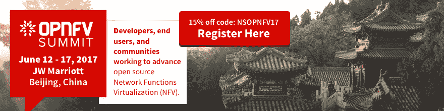

# Juniper Networks:工作负载和基础架构是否应该在同一个平台上进行管理？

> 原文：<https://thenewstack.io/juniper-networks-dilemma-deserves-power-manage-infrastructure/>

“OpenStack 的问题在于它过于关注基础设施，” [Juniper Networks](http://www.juniper.net/us/en/) 的工程师 Chandan Dutta Chowdhury 在几周前的 OpenStack 峰会的周二上午会议开始时说道。

这就像说莎士比亚的问题在于他对语言的强烈关注。然而，Chowdhury 确实切入了企业、公共部门和小型企业中 OpenStack 实践者之间的主要辩论:管理工作负载和管理基础设施的工作应该是同一份工作吗？

“如果你看看应用程序，”Chowdhury 继续说，“应用程序更倾向于考虑它们将拥有什么样的资源。他们从内存、CPU 使用率、存储、网络带宽分配等方面考虑，而所有这些功能实际上都由基础架构提供商控制。OpenStack 可以为您提供控制所有这些基础设施的 API。因此，我们看到应用程序实际想要使用的东西和 OpenStack 提供的东西之间存在差距。”

## 输入应用基础架构

应用程序能够从基础设施层请求资源，Chowdhury [ *见右图* ]承认可靠 API 的存在。但他认为，这并不等同于交流。假设应用能够在需要时从 OpenStack 动态请求资源。该应用程序可以通过直接传输到 OpenStack 组件的统计数据组，定期报告其资源使用情况。

Chowdhury 建议的解决方案是一种通信组件，他称之为应用基础设施 API，或 App Infra。他说，这样一个系统将使 OpenStack 重新聚焦于集装箱化系统所采用的更加以应用为中心的思维模式。

“让应用程序开发者自己向你请求更多的资源，或者应用程序发现缺少的资源，而不是第三方将应用程序作为一个进程来监控，并请求那些资源，”他建议道。

OpenStack 作为可靠地配置和管理数据中心基础设施的平台赢得了声誉。但是，关于这项工作有多容易仍有争议。Chowdhury 认为，开发人员在设计他们的应用程序时，最大的困难是在分布式系统基础设施中可靠地正确使用资源。

上个月，华特迪士尼动画工作室的系统工程师贾斯汀·加里森发表了一份 T2 调查的结果，该调查涵盖了基础设施和应用程序。共有 222 名受访者，其中 45%的人认为自己是 DevOps 角色，53%的人在一家拥有 100 多名员工的组织中工作。

他指出，在这样的环境中，一个正在运行的应用程序应该能够生成其消费的运行概况。这并不是一个真正的自动化过程——不像过程监视器那样从上面监督应用程序，并预测接下来会发生什么。相反，Chowdhury 的想法依赖于开发人员明智地使用他设想的 API 来提供他们需要的基础设施资源，包括在微服务环境中，其中一个应用程序的多个实例可能共存。

这种想法可以将管理资源的负担从管理平台转移到应用程序本身，或者转移到一些外部协调器或第三方性能监视器上。

这可能是 Juniper Networks 的另一个革命性想法。也就是说，如果瞻博网络是幕后黑手的话。

Juniper 软件定义网络(SDN)和云高级总监 [Scott Sneddon](https://twitter.com/ssneddon?lang=en) 在接受新堆栈采访时表示:“没有一种规格适合所有人。

Sneddon 是 Nuage Networks 的首席解决方案架构师，在此之前是 Brocade 的 [Vyatta SDN](http://www.brocade.com/en/products-services/software-networking/sdn-controllers-applications/sdn-controller.html) 的首席解决方案架构师，他是软件定义网络领域世界上最有成就的工程师之一。正是 SDN 使得虚拟组件沿着虚拟基础架构虚拟联网成为可能。OpenStack 认为它已经组装的系统通过虚拟地址和由 SDN 实现的覆盖连接在一起。不管你喜不喜欢，网络让堆栈成为可能。

但到目前为止，网络一直是每天与 Juniper 或 Brocade 和 Cisco 等公司打交道的人的权限。Juniper 的 Chowdhury 看到了将这一权限扩展到开发人员领域的机会。Juniper 的 Sneddon 看到了这种方法的局限性。

“我们在一家希望利用无服务器优势的游戏开发商身上看到了这一点；我们在网飞看到了这一点，它希望建立一个大规模分布式系统，其中包括 CDN[*内容交付网络*]，”斯奈登说。“所有这些应用都有不同的要求。因此，他所描述的模型在 NFV 环境中可能非常有趣，也许在交易环境中，特定应用程序的性能、延迟和 I/O 是该应用程序交付的关键。

“而与 Friends 或 Farmville 或其他公司一起为 next Words 开发后端的 Web 开发人员可能对延迟和吞吐量有不同的要求，并且可能能够扩大规模以解决基础架构限制。这是 [Kubernetes](/category/kubernetes/) 的承诺之一:无论我使用什么分析平台，如果它检测到性能异常，它可以自动扩展到更多的服务器，假设我有无限的资源供应。这与了解基础设施上可用的旋钮并在运行时利用它们的方法相反。”

## 绝对权力

我请 Chowdhury 解释一下，相对于依赖于 orchestrator 的 Kubernetes 方法，他认为 App Infra 方法在动态管理资源消耗方面有哪些优势。毕竟，从一开始，容器架构就应该让面向用户的代码独立于运行它的系统。

“如果你想从外部的角度监控一个应用程序，一个外部代理可以为很多应用程序工作，”他回答说。“这是非常通用的。它可以查看进程的属性，并得出应用程序使用多少资源的一些值。”

Chowdhury 继续说，将这种通用报告与应用程序设计人员能够为自己构建的东西(他称之为动态性能矩阵)进行比较，这种通用报告将永远达不到标准。但是，如果基础设施在历史上是由其他人管理的，这样的开发人员如何理解基础设施的需求呢？她会知道该怎么做吗？

“你可以从不同的角度来看，”他回答道。“一种看法是，是的，如果你使用 API 代理，你就把它交给第三方，他们可能专门监控应用程序。但是，如果你想从你的平台中挤出最大的价值，使用弹性平台，那么给应用程序开发人员一个与基础设施进行实际通信的方法，给应用程序开发人员很大的权力。”

“强大的能力”是世界上任何地方的网络管理员都希望应用程序开发人员拥有的吗？

Juniper 的 Sneddon 说:“我认为那些希望在部署时了解那么多细节的开发人员是特例。我不认为大多数开发者想要调整。

“我觉得 Chandan 的想法——最终，它的用户可能会是某种人工智能、机器学习类型的应用程序，”Sneddon 一度表示。“你希望基础设施将信息的每一个小部件和旋钮都提供给机器学习平台，然后机器学习平台将对其进行抽象。”

斯奈登和乔杜里都承认，当然，组织需要选择。但是他们做出正确的选择是至关重要的——从他们每个人的角度来看，都会有不同的结果。如果基础设施对动态配置开放，OpenStack 保持*一个堆栈*，而不是之前考虑的— [，并且每次都被拒绝—几个，那么 Chowdhury 的预测就会发生:开发者*将*拥有权力。但是，在网络管理员仍然拥有这些技能和工作的组织中，这种能力可能是无用的或未被使用的。](https://thenewstack.io/openstack-summit-austin-many-different-openstacks-need/)

Sneddon 认为有一类客户总是需要更确定的性能，并以英特尔和纳斯达克的合作为例。他称这个群体为“角落阶层”——占据了市场的一大块角落，但仍然是一个角落。

## 失败的风险

有没有一种方法可以为最适合的客户类别可靠地划分系统架构？Juniper Networks 的架构和技术营销副总裁 Jason Venner 解释道:不尽然。

Venner 在一次 OpenStack 峰会上告诉我:“我认为我们将会看到，实际上，PaaS 层正在发展，这样你就可以通过完全控制来获得你需要的直接联系，或者为没有时间、专业知识或没有必要的人提供紧密的指导。一般的开发人员可能不会，但如果你正在做某种需要 GPU 访问的深度学习应用程序，你会希望对事情的完成方式有更多的控制，而不是在做另一个广告网络。”

他继续说，PaaS 平台的目标是为不愿意直接管理效率或安全性的个人和组织高效、安全地交付资源。在后来与我和一些其他与会者的讨论中，Venner 说他观察到那些依赖资深开发人员来指导他们的架构的组织已经或正在迁移到 Kubernetes。在他看来，市场的另一面是一个只希望架构问题得到解决、完成和解决的群体。他观察到，这个群体已经或正在向云代工厂 T2 转移。

“我已经经历了大概七、八年的云之旅，”Venner 一度说道。“而且还在不断发展。实际上，这是关于在加快行动的同时找到管理风险的方法。我在金融部门呆了很长时间。作为风险管理，我会考虑很多事情。我们当前的大多数实践都是关于，我们如何管理失败的风险？我们建立错综复杂的流程，花费大量的时间和金钱，以此来降低灾难性失败的风险。我们看到的是，DevOps 中持续交付的精益模式提供了另一种管理风险的方式，让我们更快地看到我们所做事情的结果，并降低失败的总体成本。”

换句话说，建筑师有一种方法来构建系统，这种系统是如此的系统化，以至于他们不可能一下子全部失败。简单性让人们更清楚地了解风险是什么……也许这就是驱使建筑师建造复杂建筑的问题。

*TNS 研究分析师 [Lawrence Hecht](https://thenewstack.io/author/lawrence-hecht/) 对本文有贡献。*

[Cloud Foundry](https://www.cncf.io/) 是新堆栈的赞助商。

<svg xmlns:xlink="http://www.w3.org/1999/xlink" viewBox="0 0 68 31" version="1.1"><title>Group</title> <desc>Created with Sketch.</desc></svg>