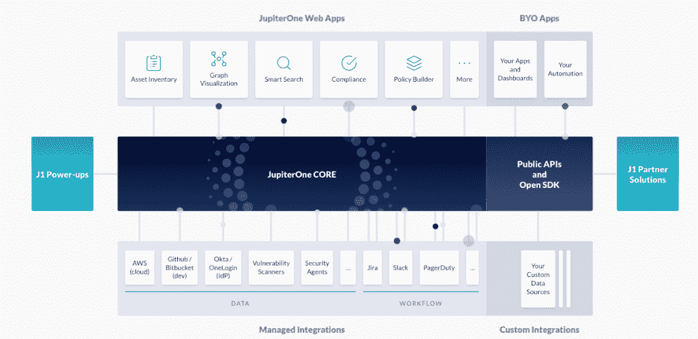
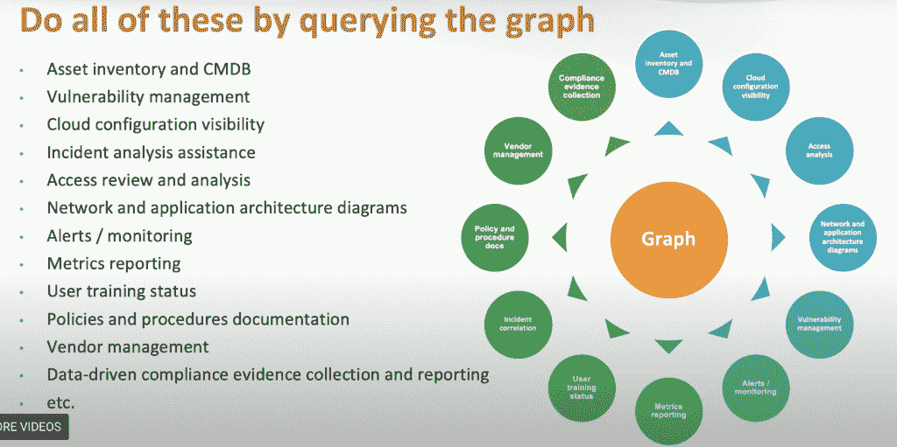

# JupiterOne 自动化资产管理、安全性、合规性

> 原文：<https://thenewstack.io/jupiterone-automates-asset-management-security-compliance/>

古希腊格言“了解你自己”是安全组织最难执行的一条，尤其是在一个瞬息万变、多云的世界里。

JupiterOne 创始人尔康·郑说:“我们都有这样一个问题:了解自己，知道我们有什么资源，那里的用户，事情是如何联系在一起的。”。“因此，为了更好地保护我们自己，我们需要这种可见性，在云时代，……一切都是短暂的，一切都被定义为软件，事情变化如此之快，如此之多，安全团队无法跟上。”

总部位于北卡罗莱纳州莫里斯维尔的初创公司 [JupiterOne](https://jupiterone.com/) 通过自动化、理解连接的图形数据库、可视化以及建立和执行安全和合规政策的工具来处理资产管理。

该技术是为医疗保健技术供应商 LifeOmic 内部开发的，并于 2018 年从该公司剥离出来。

“我们正在建立安全实践、治理和合规性，我们需要一些东西来推动这种基本的可见性，以便我们可以回答审计员提出的问题，我们可以回答运营团队每天需要提出的问题，以降低风险，”他说。

郑当时是首席信息安全官，但此前也曾在富达、IBM、思科和其他几家公司从事过 15 年的安全工作。

虽然 JupiterOne 已经存在了大约 18 个月，但它一直将最近宣布的由贝恩资本风险投资公司牵头的 1900 万美元 A 轮投资称为“启动”。

其客户包括 Reddit、Databricks、HashiCorp、Addepar、Auth0 和 OhMD。

## 基于图形的数据库

JupiterOne 的核心技术是建立在基于图形的配置管理数据库(CMDB)之上的资产发现/管理引擎。顶层灵活且可扩展的查询语言可用于为公司构建配置管理、漏洞管理、合规性、事件响应和威胁搜寻工作负载。

在三月份的 RSA 大会上，郑[概述了这样一个数据库的好处](https://jupiterone.com/blog/jupiterone-reddit-at-rsa/)，解释说它将包含漏洞管理；治理、风险管理和合规；网络；端点和基础设施数据。然后用户可以基于中心问题查询数据:这有什么关系？这一发现在我的环境中意味着什么？

他说，基本要素是数据之间的背景和关系。

郑说，目前使用的大多数 CMDBs 都是公司团队保持最新状态的。这是不可持续或不可扩展的。他说，这需要自动化。

JupiterOne 集成了三十多个 Amazon Web Services 服务，以及十多个安全和 DevOps 工具，包括 Okta、Heroku、Snyk、Cisco Meraki 和 VMware 的 Carbon Black Defense。它会自动获取只读数据，以创建公司数字资产的实时更新清单。

它根据其知识图中映射的关系确定该数字环境的实时状态，并根据各种安全性和合规性框架进行绘制。

它还根据安全策略和程序评估这些资源的状态，这些安全策略和程序可以通过其策略生成器来创建。其模板将程序和控制映射到 PCI、HIPAA、HITrust、NIST 和 GDPR 等安全框架。

## 将这些点连接起来

如果你试图修复一个漏洞，你需要回答这样的问题:它的程度如何？特定事件或漏洞的连锁反应可能是什么？如果我让服务器脱机会发生什么？

郑解释说，这些类型的答案存在于数字环境中资源之间的联系和关系中。

“木星一号是连接这些点的地方。我们使用软件和连接器连接到一个组织的操作环境的 API，”郑说。可以连接到像 AWS、GCP 和 Azure 这样的云基础设施。它可以连接到由单点登录和多因素身份认证驱动的用户环境。它可以连接到代码存储库、在您的端点上运行的代理，以及从各种不同的扫描器输入到中央存储库的漏洞发现。

“因此，第一步是我们发现这些数据并将其汇总到一个中央存储库中。第二步是我们标准化，然后使用一个通用的数据模型来描述以前来自不同形状和形式的所有数据，使之成为一个易于分析的通用数据模型，”郑说。“第三，我们绘制图表，建立联系，这样我们不仅知道外面有什么，还知道它们是如何联系在一起的？

因此，现在有了这些数据，我们允许人们提问和运行查询，进行搜索和回答问题，如漏洞补救问题，事件响应问题，威胁分析问题，配置审计问题，”郑说。

## 安全性+合规性

据郑介绍，JupiterOne 将法规遵从性从手动、调查驱动的时间点快照转变为实时流程。

“我们正在将安全性和合规性重新整合到同一个计划中，并使用数据来推动合规性答案，而不是使用电子表格、调查和采访问题来推动综合答案，”他说。“这将使组织能够设置正确的数据和正确的查询，并在持续的基础上实现自动化。因此，组织将会看到法规遵从性成为安全的自然结果，并正确地执行安全措施，而不是将法规遵从性作为日常安全操作的一个单独举措。”

Databricks 的 Adam Youngberg 写了一篇工程博客[关于 JupiterOne 如何帮助他的公司快速识别哪些亚马逊 S3 桶是公共的还是私有的，以便对它们进行更严格的控制。](https://databricks.com/blog/2020/07/16/bucket-brigade-securing-public-s3-buckets.html)

根据 BCC Research 的数据，企业资产管理技术的全球市场预计到 2024 年将增长到 93 亿美元，但根据 Rain Capital 创始人兼普通合伙人[王晨曦](https://www.linkedin.com/in/chenxiwang88/)的说法，资产管理引擎本身并不是 JupiterOne 产品中最有趣的部分。

“在传统基础架构中，法规遵从性、漏洞管理、事件响应、资产管理、威胁搜寻意味着五到六种不同的安全产品协同工作。这意味着更高的成本、更多的技术债务、更多需要管理的 IT 资源，”她说。

“现在是我们在云中以不同的方式行事的时候了，不再重复我们在传统环境的安全性和 It 运营方面犯下的错误。JupiterOne 采用了这种令人耳目一新的方法，并建立了一个技术平台，使人们能够做到这一点。通过这种方式，多云、多环境也是免费的。”

亚马逊网络服务、Snyk 和 VMware 是新堆栈的赞助商。

专题图片:罗马圣格雷戈里奥女修道院挖掘出的一幅死亡纪念品马赛克，上面有希腊格言“认识你自己”公共领域。

<svg xmlns:xlink="http://www.w3.org/1999/xlink" viewBox="0 0 68 31" version="1.1"><title>Group</title> <desc>Created with Sketch.</desc></svg>