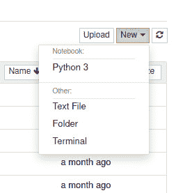

# Jupyter 笔记本:你一直在寻找的基于网络的开发工具

> 原文：<https://thenewstack.io/jupyter-notebooks-the-web-based-dev-tool-youve-been-seeking/>

Jupyter 笔记本现在风靡一时，而且有充分的理由。这种基于 web 的交互式计算环境使得软件工程师可以轻松地创建和共享包含实时代码、公式、可视化甚至叙述性文本的文档。您可以使用小部件、绘图、图像、视频等来自定义您的笔记本。

开源[项目 Jupyter](https://jupyter.org/) 支持超过 40 种语言(比如 Python、R、Julia、Matlab、Octave、Scheme、Processing 和 Scala)。你可以通过电子邮件或 Dropbox 和 GitHub 分享你的笔记本。凭借交互式输出和大数据集成，您不能忽视这款功能强大、用户友好的工具。

我想向您介绍安装 Jupyter 和推出您的第一台笔记本电脑的过程。我将在 Linux Mint 上演示，但是您可以将它安装在任何支持 conda、pip、pipenv 或 Docker 的设备上。完成后，您将拥有一台功能齐全的 Jupyter 笔记本，随时可以开始您的第一个项目。

## 安装依赖项

在部署 Jupyter 笔记本电脑之前，必须安装许多软件包。

要安装的第一个依赖项是 Python。同样，我们使用 Linux Mint 如果您选择不同的 Linux 桌面版本，您可能需要更改安装命令(比如将`apt-get`换成`dnf`)。

要在 Linux Mint 上安装 Python，请登录，打开终端窗口并发出命令:

`sudo apt-get install python3 -y`

您可能会发现已经安装了 Python3。无论哪种方式，要验证安装，请发出以下命令:

`python3 --version`

您应该会看到您的机器上安装的 Python 的确切版本。

接下来，我们需要安装一个软件来创建 Python 虚拟环境。安装它的命令是:

`sudo apt-get install python3-venv -y`

因为我们将使用 Python 包安装程序 pip，所以必须使用以下命令安装它:

`sudo apt-get install python3-pip -y`

最后，我们需要安装 Voila，这样就可以在网络浏览器中查看 Jupyter 笔记本。首先，使用命令创建一个新目录:

`mkdir ~/voila`

我们现在将进入新目录:

`cd ~/voila`

我们现在可以使用 Python `venv`命令来创建虚拟环境，就像这样:

`python3 -m venv venv`

上面的命令将创建一个名为 **venv** 的新目录，其中包含许多文件和子目录。在该目录中，我们可以使用以下命令加载预定义的变量:

`source venv/bin/activate`

最后，我们可以使用 pip 安装 Voila:

`pip install voila`

## 安装 Jupyter

所有的依赖项都解决了，我们现在可以安装 Jupyter 了。我们将添加几个库来使它更加有用。您可以根据需要随时返回并安装更多的 Python 库。发出命令:

`pip install jupyter numpy matplotlib`

就是这样。您已经完成了安装。现在是时候部署您的第一台 Jupyter 笔记本电脑了。

## 部署笔记本电脑

不幸的是，Jupyter 笔记本每次都必须从命令行部署。所以没有方便的桌面快捷方式可以点击。这是因为笔记本电脑必须从虚拟环境中启动。因此，在~/voila 目录中，发出命令:

`jupyter notebook`

在运行该命令后不久，您的默认 web 浏览器将会打开，Jupyter Notebook 的一个实例已经准备就绪(图 1)。


图 1:我们的第一台 Jupyter 笔记本已经准备就绪。

从笔记本主页中，单击 New 显示一个下拉列表(图 2)。



图 2:新文件下拉框，您可以从中选择可用的类型。

选择 Python3，然后在出现的窗口(图 3)中，单击 Untitled 为您的笔记本命名。


图 3:新的文件窗口，在这里您可以开始创建 Python 项目。

## 内核和细胞

为了成功地使用 Jupyter 笔记本，您需要理解两个术语:内核和单元。

在 Jupyter 领域中，内核是一个计算引擎，它执行包含在 Jupyter 笔记本文档中的代码。一个单元格就是笔记本的主体。您可以在单元格内书写(或粘贴)内容。有两种类型的单元格:代码单元格和降价单元格。正如您可能猜到的，code 单元格包含代码，Markdown 单元格包含使用 Markdown 格式化的文本。

## 你好，世界！

让我们创建一个新的代码单元，使用可靠的“Hello，World！”Python 代码。在主窗口中，您会看到一个空单元格，键入:

打印(“你好，新堆栈”)

您已经创建了您的第一个代码单元(图 4)。


图 4:我们的 Hello World Python 程序准备运行了。

如果您单击 Run 按钮，内核将执行代码并在单元格下打印结果(图 5)。


图 5:嗯，你好，新栈！

运行代码后，将在第一个单元格下面创建一个新的单元格，这样您就可以继续构建了。

## 使用数组

让我们看一个不同类型的例子。还记得吗，在安装的时候，我们包括了 numpy？Numpy 是一个 Python 库，增加了对大型多维数组的支持。让我们利用图书馆。

首先，我们将通过在新的单元格中键入以下内容来导入库:

```
import numpy as np
def square(x):
    return  x  *  x

```

点击运行执行代码。我们现在可以将 numpy 引用为 np，并在我们创建的任何其他单元格中使用变量 square。

接下来，我们将创建一个计算变量平方的小 Python 程序。在新单元格中键入以下代码:

```
x  =  np.random.randint(1,  10)
y  =  square(x)
print('%d squared is %d'  %  (x,  y))

```

单击 Run，您将看到新程序的输出(图 6)。


图 6: 6 的平方肯定是 36。

如果您选择单元格 3 并单击 Run 按钮，程序将再次运行，给您不同的结果。该单元格将被标记为 4(图 7)，因为这是您第四次单击 Run 按钮(Jupyter 会为您跟踪这一点)。


图 7:我们的新结果和新的单元号。

## 关闭你的笔记本

如果您关闭包含 Jupyter 笔记本的浏览器，您会看到该命令仍在运行。要结束命令，请按[Ctrl]+键盘组合键。然后会询问您是否要关闭笔记本电脑服务器。键入 y 并按回车键，服务器将关闭。

Jupyter Notebook 的好处是它可以自动保存你的项目。再次部署笔记本(使用命令 jupyter notebook)。当浏览器窗口打开时，您将看到您命名的笔记本(后跟`.ipymb`扩展名)。单击该名称，您会发现您的工作已保存，您可以再次开始工作了。

祝贺您，您已经安装了 Jupyter Notebook 并创建了一个新项目。要了解更多关于使用这个强大工具的信息，请查看【Jupyter 官方笔记本文档。

<svg xmlns:xlink="http://www.w3.org/1999/xlink" viewBox="0 0 68 31" version="1.1"><title>Group</title> <desc>Created with Sketch.</desc></svg>