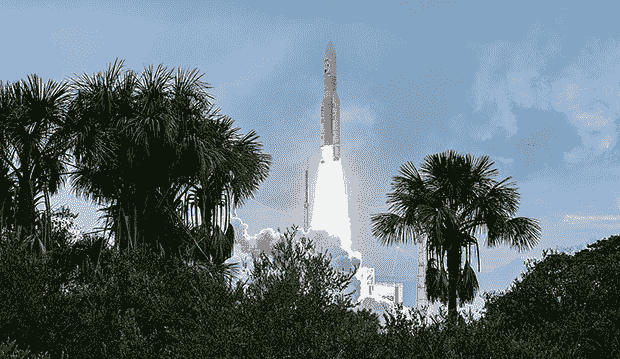
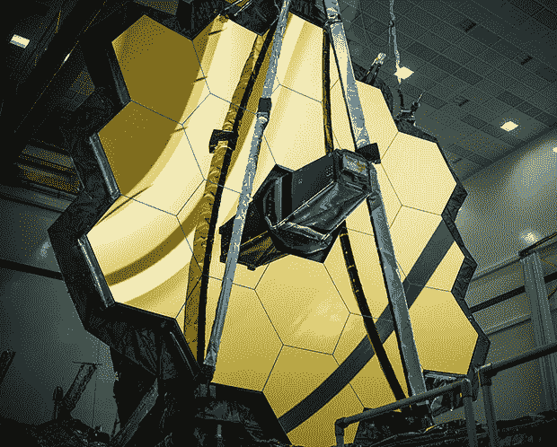

# #JWST:最昂贵的 SRE 项目的第二天运营

> 原文：<https://thenewstack.io/jwst-day-2-operations-of-the-most-expensive-sre-project/>

我们已经进行了两个多月，来自詹姆斯·韦伯太空望远镜(JWST)的结果是无价的。好吧，100 亿美元是一个沉重的价格标签，但[网站可靠性工程(SRE)](https://thenewstack.io/how-is-platform-engineering-different-from-devops-and-sre/) 的教训——通常是不要做什么——继续从一百万英里外飘来。

在对 New Stack 关于克服(或至少计划)NASA 面对 JWST 的 [344 个单点故障](https://thenewstack.io/james-webb-space-telescope-and-344-single-points-of-failure/)的文章做出回应后，我们采访了 [Robert Barron、](https://www.linkedin.com/in/flyingbarron/)IBM 的[、](https://www.linkedin.com/in/flyingbarron/)SRE 建筑师，了解望远镜项目进展如何，现在已经进入第二天的操作。

## JWST 一路上的坎坷

那么，最先进、最昂贵、零冗余或可修复的望远镜做得怎么样了？“非常好，”巴伦说。通过科学和工程测量，“所有的结果都达到或超过了规格”。

任何望远镜的关键遥测技术之一是机载燃料——因为当燃料耗尽时，它就变成了太空垃圾。对 JWST 来说，燃料成功的设计年限是五年，希望能持续十年。

“事实是，发射足够精确，他们在途中节省了大量燃料，”巴伦说，这意味着美国宇航局不必进行任何修正。“现在他们认为 10 年将是底线，然后可能是 15 到 20 年。它的寿命几乎延长了一倍，只是因为发射非常非常精确，比他们计划的还要精确。”

2021 年 12 月 25 日，JWST 乘坐阿丽亚娜 5 号火箭升空。鸣谢:欧空局/CNES/阿丽亚娜航天公司/CSG 光学公司-JM·吉永

巴伦把这比作《星际迷航》中的斯科蒂总是说星舰企业号不能再磨损了，但柯克船长还是要求出现奇迹。

“当工程师这样做时，他们总是保持一个秘密的缓冲区…所以如果发生意外，你有掩护，”他说。“如果你的经理说 5 年，你至少要加上 12 年的缓冲期。要精确到 100 米以内，设计为 50 米以内。

"所以，即使你犯了一个错误，你仍然会在你的范围内."

这在美国宇航局并不是闻所未闻。旅行者 1 号太空探测器于 1977 年 9 月发射，携带足够五到七年的燃料——足以到达木星和土星。45 年后，它仍在运行，已经到达天王星、海王星，并进入星际空间。

由于 JWST 从太阳能电池板获得电力，它有一个优势，但宇宙最大的望远镜(据我们所知)的道路上还有其他障碍，如流星。美国宇航局知道望远镜的太阳护盾最终会被击中。

巴伦说，几千年来，科学家们一直在研究流星雨的大小、形状和规律性，以建立模式。这使得美国国家航空航天局能够预测撞击的频率和强度，这些都被计入 JWST 69 英尺乘 46 英尺的遮阳罩的尺寸中。

当科学家知道望远镜将在一个方向有更多阵雨的区域运行时，他们可以关闭相机，改变望远镜面对的方向以降低风险。

早在五月，当它还在建造中的时候，[号 JWST 就被一颗陨石](https://arxiv.org/ftp/arxiv/papers/2207/2207.05632.pdf)击中了，这颗陨石的大小是美国宇航局工程师计算的两倍。它摧毁了组成望远镜标志性蜂巢形状的 18 面镜子中的一面。同样，这次撞击比 NASA 团队预测的要大，但仍在他们的紧急缓冲区范围内。

JWST 十八面镜子之一。鸣谢:美国宇航局/克里斯·冈恩

这次碰撞似乎降低了[收集的一些数据的准确性，但是，即使有这个小小的挫折，望远镜迄今为止的总体结果已经超出了任何预期。](https://news.sky.com/story/meteoroid-hit-has-caused-significant-uncorrectable-damage-to-james-webb-space-telescope-12655489)

“据我了解，准备工作已经有了回报。一个又一个发现。一幅又一幅壮观的画面。很少问题，”巴伦说。

各种太空探测器也有一个“安全模式”，基本上停止运行，接下来是大量的测试。Barron 说，众所周知，哈勃望远镜在第一天/第二天的大部分时间都处于安全模式，因为随着温度的不断变化，当它从太阳移动到阴影时，会出现金属弯曲和其他错误。

“据我所知，除了测试恢复情况，韦伯还没有进入安全模式，”巴伦说。“他们花了这么多时间进行测试，花了这么多时间将可靠性设计到系统中，它实际上正在工作。”

## 服务的适度降级

JWST 的最新问题是在 8 月底检测到的，并在 9 月底报告说，单摄像头模式下的一个调整轮有点“粘滞”，并报告在操作过程中比预期的摩擦更多。

这是一个多大的问题？在随后的采访中，Barron 提醒新的堆栈“SREs 区分不同种类的监测或可观测性信号。”

延迟、流量、错误和饱和度这四个黄金信号通常被认为是 SRE 最重要的考虑因素。这些指标代表当前的问题——工作缓慢(延迟)或根本不工作(错误),以及潜在的问题，例如业务关键程度(吞吐量)和满负荷程度(饱和)。

> “韦伯正在看更远的东西，但我们正在利用上个世纪积累的知识来了解何时何地。”
> 
> —IBM SRE 建筑师 Robert Barron

巴伦说，JWST 引人注目的粘性轮是一种“饱和信号，这意味着韦伯正在比预期更努力地调整相机。一旦调整好相机，图像就没问题了。”

虽然现在没有问题，他继续说，“美国宇航局的 SREs 很谨慎，已经停止使用这种特定的配置——并且正在花时间调查为什么需要比预期更多的摩擦来调整相机。”这台望远镜和它的其他 16 台相机和科学仪器一起照常工作。

这遵循了地球上的 SRE 概念[服务的优雅降级](https://www.w3.org/wiki/Graceful_degradation_versus_progressive_enhancement)，在这种情况下，你不是冒着不受控制的故障的风险，而是有目的地停用一个组件并提供更有限的替换，这样你就可以执行更深入的调查，而不会冒任何意外的、面向客户的问题的风险。

相比之下，当[哈勃太空望远镜](https://www.nasa.gov/mission_pages/hubble/main/index.html)在 1990 年发射时，它的主镜安装不正确，从第一天起就影响了拍摄的图像。美国国家航空航天局的团队不得不全面降低服务质量，直到宇航员能够飞上去进行现场维修。

相比之下，[没有人能够飞出](https://thenewstack.io/james-webb-space-telescope-and-344-single-points-of-failure/)去修理一次性的 JWST。因此，巴伦说，“韦伯的维修将不得不远程，这就是为什么其服务的优雅退化是如此重要的持续成功运作。”

## 为什么 JWST 不好做生意

因为 JWST 是如此独特和前沿，并不是所有的 SRE 经验都适用于负责保持企业平稳运行的地球工程师。

“这是一个技术奇迹，”巴伦承认。“但是，从商业角度来看，这绝对是你不应该做的事情——孤注一掷。”

JWST 不会像商业项目那样运作:它超出了预算，而且晚了好几年。Barron 说，做一个敏捷、快速的解决方案会好得多。

“如果 SRE 团队想要达到完美，达到韦伯的可靠性，这个应用程序就永远不会投入生产，因为现实世界中对系统变化的预期是如此之快，”他说。"如果你力求完美，那你就太慢了。"

即使是这种类型的长期承诺也是允许的，因为太空望远镜不是任何太空竞赛的一部分。但是，美国国家航空航天局仍未发射的绕月卫星 Artemis I 太空发射系统(SLS)与其来自 SpaceX、蓝色起源和维珍银河的商业竞争对手之间有一个惊人的对比。

事实上，20 世纪 60 年代和 70 年代的登月竞赛是步伐的竞争，“第一个做这个，第一个做那个。从长远来看，很多这样的‘我是第一个做的人’可能毫无意义，”巴伦说。类似地，当前的商业太空竞赛“绝对走敏捷之路。”

他提到了[猎鹰 9 号](https://www.spacex.com/vehicles/falcon-9/)，SpaceX 公司尝试的一种可重复使用的火箭——在发表时，它已经经历了 176 次发射。

巴伦说:“每枚火箭都必须有正在开发的猎鹰星际飞船的多个版本。”埃隆·马斯克“并不是说‘我们将推出星际飞船’我们将一路走来。“迄今为止，SpaceX 已经进行了 42 次猎鹰发射。

巴伦说，马斯克正在传达在 SpaceX 能够到达月球之前，将有 20 个不同的里程碑需要满足，在它能够把人类带到月球之前，还有 40 个里程碑需要满足:“马斯克有无限的钱，但风险也很低，因为他不欠任何人。”

巴伦还观察到，马斯克正在管理预期，并将失败视为积极的学习机会。

相比之下，NASA 的 Artemis，作为一个纯科学的努力，可能只有一次发射，在本文写作时已经被推迟了几次。Barron 说，Artemis 与 JWST 非常相似，都是在瀑布式项目管理中产生的整体解决方案——一个非常晚而且非常超出预算的方案。

“美国宇航局，他们正在做的是，我们将发射 SLS，它将会成功，然后下一次我们将去月球，”他说。这个庞然大物不能失败，因为“美国宇航局的失败是你浪费了数十亿美元。”

单一科学进步的成本远远大于商业成功，因为正如巴伦所说，“建造半个韦伯只会给我们十分之一的价值。”

> “SRE 确实对在这个平台上运营的业务负有责任，一种自豪感和所有权。不仅仅是为编写代码的开发人员，也为运行代码的人。和可靠性。”
> 
> —IBM SRE 建筑师 Robert Barron

但是 JWST 不是 SRE 的方式。马斯克的方式是。“要快失败。做实验。不要害怕实验失败，因为它不会那么昂贵，”巴伦说。即使 SpaceX 的一些发射失败了，成功也远远大于失败。

这使得 NASA 比 SpaceX 要谨慎得多。早在 12 月，JWST 号的发射被推迟，因为地面系统的三个冗余系统中的一个出现了故障。

但就在几周前，美国宇航局发射了一颗相对更实惠的通信卫星，故障率相同。巴伦说:“一些经理和 SRE 签署:‘我知道风险。这是经过计算的风险。我愿意发射。不值得花力气停下来。"

JWST 和阿耳忒弥斯都没有冒险。今年 8 月，后者的首次发射被推迟，因为它也有冗余的问题，这次是传感器。阿耳忒弥斯小组本可以冒这个险，它可能会很好，但这不是美国宇航局的方式。

另一方面，Barron 说，“SREs 永远不想处在那个你不能冒险的位置。你总是想管理风险。如果这没有发生，我的退路是什么？永远不应该是一切都失败，火箭爆炸，”

## 基于模块化的混沌工程

架构和实验都必须足够模块化，以允许单个部分出现故障，而不会导致整个系统瘫痪。“我不能注射我知道会造成如此大损害的东西，”巴伦说。“我需要尽可能小，这样我就可以一直管理它。”

如果你有两台这样的望远镜，你可以在生产中进行测试，但是所有的 344 个单点故障必须在发射前测试完毕。通常，sre 至少有虚拟环境和复制系统来继续他们的伪混沌工程。

JWST 的地面预发射[混沌工程](https://thenewstack.io/chaos-engineering-can-give-distributed-systems-stability/)依赖于真正组件化的基础设施，对每一部分进行极限拉伸和测试。巴伦告诉新的堆栈，美国宇航局在试图打开箔遮阳罩时面临失败:“他们撕裂并不好，但另一方面，他们在地面上撕裂，以便他们可以重新设计它们，这太棒了。”

> “你需要能够失败。系统作为一个整体应该是成功的，但是每个部分都应该有失败的可能。部分原因是，如果发生更大的事情，你应该能够管理失败。那就是混沌工程。”
> 
> —罗伯特·巴伦，SRE 建筑师，IBM

为了在整个红色星球提供冗余，有两个美国宇航局火星漫游者。当其中一个出现故障时，美国宇航局可以选择在一个更加可控的环境中复制另一个的故障，试图解决它。

“10 年没有调校，对任何车辆来说都非常不错！”巴伦沉思着漫游者说。“这是美国宇航局工程师和地球 SREs 之间的另一个巨大差异——达到那种可靠性水平几乎总是浪费时间。”

事实上，为了追求五个九的可用性，最后的 0.0001%将永远是最昂贵的。“与其打破预算，错过目标日期，不如接受有一些你永远无法完全自动化的手工任务，”他说。

## SREs 首先考虑业务

Barron 将他从太空中获得的经验应用到他作为 IBM SRE 架构师的角色中，在该公司首席信息官的 1200 人办公室中从事混合云平台的工作。

该办公室致力于为 170 多个国家的 250，000 名 IBM 用户优化 IBM 的内部云和内部开发系统和流程。在这种情况下，混合系统包括 20 世纪 70 年代在旧主机上编写的系统，一直到现代化的新平台，由 Kubernetes、 [Red Hat OpenShift、](https://www.openshift.com/try?utm_content=inline-mention)和人工智能提供支持。

Barron 说:“在过去的两年中，我们已经将传统数据中心的占地面积减少了近一半，并对 1900 多个应用程序进行了现代化改造。"

他补充说，“我们正在将我们的内部 IT 工作负载从全球 74 个不同的传统数据中心迁移到一组具有高能效的公共云和私有云环境中。”

Barron 的目标是帮助人们成为更好的 SRE，并以 SRE 的方式进行开发——通过辅导、设计工作和代码审查，以及为新解决方案开发架构，以协作、可靠和冗余的方式快速失败。

这包括领导向 ChatOps 的过渡，ChatOps 的目标是所有技术工作都在一个集中的环境中完成，而不是在 10 个不同的终端。Barron 说，这允许技术工作和业务人员之间的透明——超过 300，000 Slack 用户。"如果你能在同一个空闲频道看到他们，你们可以一起工作."

当我们走向宇宙和更远的地方时，集中沟通和透明是关键。

* * *

*罗伯特·巴伦将于 10 月 25 日至 27 日在阿姆斯特丹举行的[EMEA 论坛上或在线发表演讲，题为“超过 90 亿美元的 SRE 经验”。](https://bit.ly/sre22emeaprog)*

<svg xmlns:xlink="http://www.w3.org/1999/xlink" viewBox="0 0 68 31" version="1.1"><title>Group</title> <desc>Created with Sketch.</desc></svg>