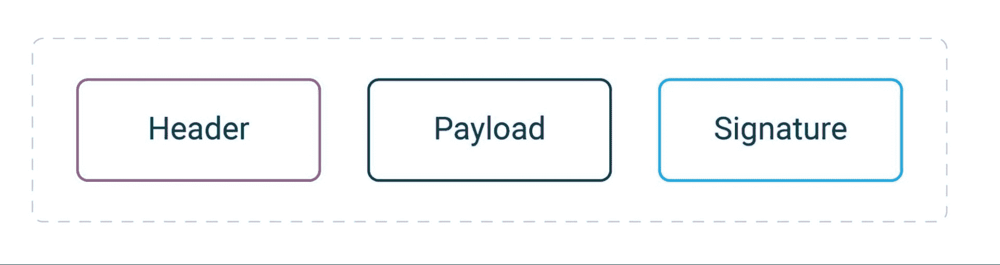
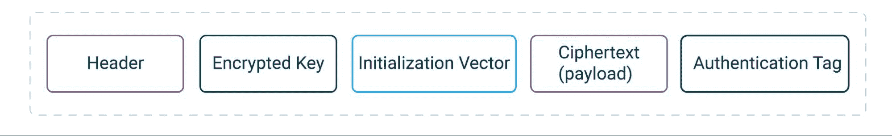

# JWTs:连接这些点:为什么，何时和如何

> 原文：<https://thenewstack.io/jwts-connecting-the-dots-why-when-and-how/>

JSON web 令牌(jwt)非常棒——它们易于使用且无状态，需要与集中式认证服务器进行较少的通信。当您需要在服务之间安全地传递信息时，jwt 非常方便。因此，它们通常被用作 ID 令牌或访问令牌。

这通常被认为是一种安全的做法，因为令牌通常是经过签名和加密的。但是，如果配置不正确或使用不当，jwt 可能会导致对象级授权或函数级授权漏洞。这些漏洞可能会暴露一种状态，在这种状态下，用户可以超越其权限访问其他数据或端点。因此，遵循使用 jwt 的最佳实践至关重要。

在确定行为策略时，了解和理解 jwt 的基础是必不可少的。

## 什么是 jwt？

JWT 是在 RFC 7519 中定义的标准，它的主要目的是以一种紧凑的、URL 安全的和防篡改的方式在双方之间传递 JSON 消息。令牌看起来像一个被分成几部分并用点分隔开的长字符串。它的结构取决于令牌是签名的(JWS)还是加密的(JWE)。

JWS 结构

JWE 结构

## **jwt 安全吗？**

简而言之，这要视情况而定。jwt 的安全性不是已知的。如上所述，jwt 通常被认为是安全的，因为它们被签名或者被[加密](https://thenewstack.io/protect-and-index-sensitive-data-with-polymorphic-encryption/)，但是它们的安全性实际上取决于它们如何被使用。JWT 是一种消息格式，其中的结构和安全措施是由 RFC 定义的，但是您有责任确保它们的使用不会以任何方式损害整个系统的安全。

## **何时使用 jwt**

*是否应该将它们用作访问和 ID [令牌](https://thenewstack.io/the-different-token-types-and-formats-explained/)？*

jwt 通常用作 OAuth 和 OpenID 连接流中的访问令牌和 ID 令牌。它们还可以用于不同的目的，例如传输信息、在 OpenID Connect 中请求对象、验证应用程序、授权操作和其他通用用例。

有人说使用 jwt 作为访问令牌是不明智的决定。然而，在我看来，如果开发人员基于对 jwt 本质上是什么的清晰理解而进行的充分研究来选择这种策略，并没有错。另一方面，最糟糕的情况是仅仅因为 jwt 时髦就开始使用它们。谈到安全性，没有什么太多的细节，所以遵循最佳实践和理解 jwt 的特性是至关重要的。

jwt 是按值令牌，包含面向 API 开发人员的数据，以便 API 可以解码和验证令牌。但是，如果 jwt 被发布用作客户端的访问令牌，那么客户端开发人员也有访问这些数据的风险。您应该知道，这可能会导致意外的数据泄漏，因为令牌的一些声明不应该公开。还存在破坏依赖于令牌内容的第三方集成的风险。

因此，建议:

*   请记住，将更改引入用作访问令牌的 jwt 可能会导致应用程序集成出现问题。
*   当令牌中使用敏感或个人信息时，考虑切换到[幻影令牌](https://curity.io/resources/learn/phantom-token-pattern/?utm_source=medium&utm_medium=article&utm_campaign=jwts)或[分割令牌](https://curity.io/resources/learn/split-token-pattern/?utm_source=medium&utm_medium=article&utm_campaign=jwts)。在这些情况下，应该在基础设施之外使用不透明令牌。
*   当需要高级别的安全性时，使用[拥有证明](https://curity.io/resources/learn/dpop-overview/?utm_source=medium&utm_medium=article&utm_campaign=)令牌，而不是无记名令牌，通过添加确认声明来降低不必要访问的风险。

是否应该使用它们来处理会话？

不恰当使用 jwt 的一个例子是选择它们作为会话保留机制，并用 jwt 替换会话 cookies 和集中式会话。您应该避免这种策略的原因之一是 jwt 不能失效，这意味着您不能撤销旧的或恶意的会话。大小问题是另一个问题，因为 jwt 会占用很多空间。因此，将它们存储在 cookies 中会很快超过大小限制。解决这个问题可能需要将它们存储在其他地方，比如本地存储，但这将使您容易受到跨站点脚本攻击。

jwt 从来没有打算处理会话，所以我建议避免这种做法。

## jwt 中使用的声明以及如何处理它们

jwt 使用声明来传递信息。正确使用这些声明对于安全性和功能性至关重要。这里有一些关于如何处理它们的基本知识。

## 验证令牌

重要的是要记住，传入的 jwt 应该总是被验证。如果您只在内部网络上工作(授权服务器、客户端和资源服务器不通过互联网连接)，这并不重要。环境设置可以更改，如果服务公开，您的系统很快就会变得易受攻击。如果有恶意的参与者在内部工作，实现令牌验证也可以保护您的系统。

验证 jwt 时，请始终确保它们按预期使用:

*   检查令牌的范围。
*   不要相信所有的说法。验证声明中包含的密钥或任何 URIs 是否对应于令牌的颁发者并包含您期望的值。

## 与 jwt 一起使用的最佳算法

JSON Web 签名和加密算法的[注册表](https://www.iana.org/assignments/jose/jose.xhtml#web-signature-encryption-algorithms)列出了所有可用于签名或加密 jwt 的算法。它还非常有助于您选择哪些算法应该由客户端和服务器来实现。

目前，最推荐的签名算法是 [EdDSA](https://curity.io/resources/learn/jwt-signatures/) 或 ES256。它们比最流行的 RS256 更受青睐，因为它们比久经考验的 RS256 快得多。

无论令牌类型是 JWS 还是 JWE，它们都在报头中包含一个 *alg* 声明。该声明指出了签名或加密所使用的算法。这种声明应该始终用您的系统接受的算法的安全列表来检查。Allowlisting 有助于缓解试图篡改令牌的攻击(这些攻击可能试图迫使系统使用不同的、安全性较低的算法来验证签名或解密令牌)。它也比 denylisting 更有效，因为它避免了区分大小写的问题。

## 如何签署 jwt

关于 JWS 签名需要记住的一点是，它们用于对有效载荷和令牌头进行签名。因此，如果您对标头或有效负载进行了更改，无论只是添加或删除空格或换行符，您的签名都将不再有效。

我对签署 jwt 的建议如下:

*   为了避免重复的令牌，在 *jti* 声明中添加一个随机的令牌 id。许多授权服务器都提供了这种机会。
*   验证签名、密钥和证书。可以从授权服务器获得密钥和证书。一个好的做法是使用端点并动态下载它们。这使得以不破坏实现的方式旋转密钥变得容易。
*   根据 allowlist 检查 JWS 标头中发送的密钥和证书，或者验证证书的信任链。

不建议在签署 jwt 时使用对称密钥。使用对称签名的前提是所有各方都需要知道共享的秘密。随着参与方数量的增长，保护秘密的安全性以及在秘密被泄露时替换它变得更加困难。

对称签名的另一个问题是，您不知道谁实际上签署了令牌。使用非对称密钥时，您可以确定 JWT 是由拥有私钥的人签名的。在对称签名的情况下，有权访问秘密的任何一方也可以发布签名的令牌。总是选择非对称签名。这样，您将知道谁实际上签署了 JWT，并使安全管理更容易。

## JWTs 和 API 安全性

API 安全已经成为网络安全工作的主要焦点之一。不幸的是，随着 API 对整体功能变得至关重要，漏洞也在增加。减轻风险的方法之一是确保正确使用 jwt。jwt 应该填充与客户端、用户、使用的身份验证方法和其他因素相对应的作用域和声明。

## 结论

jwt 是一项伟大的技术，可以节省开发人员的时间和精力，并确保 API 和系统的安全性。然而，为了充分获得它们的好处，您必须确保选择的 jwt 适合您的特定需求和用例。此外，确保它们被正确使用是至关重要的。为此，请遵循安全专家的最佳实践。

以下是一些附加准则:

<svg xmlns:xlink="http://www.w3.org/1999/xlink" viewBox="0 0 68 31" version="1.1"><title>Group</title> <desc>Created with Sketch.</desc></svg>