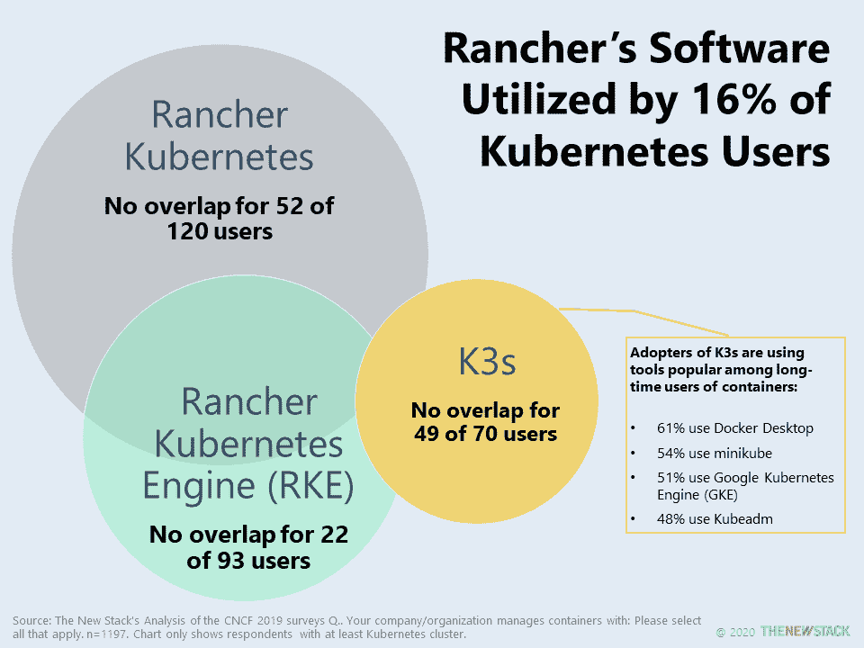
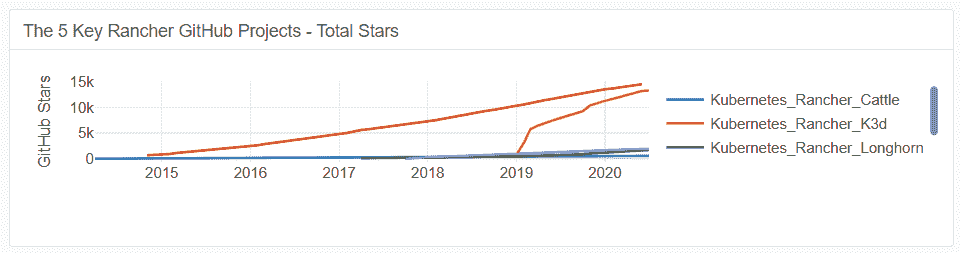

# Rancher 的 K3s 对 SUSE 的 Kubernetes 的成功至关重要

> 原文：<https://thenewstack.io/k3s-expanded-ranchers-leadership-and-will-be-crucial-for-suses-kubernetes-success/>

通过收购 [Rancher Labs](https://rancher.com/) , [SUSE](https://www.suse.com/company/about/) 将在 [Kubernetes 生态系统](https://thenewstack.io/ebooks/kubernetes/state-of-kubernetes-ecosystem-second-edition-2020/)中获得两个[立足点](https://thenewstack.io/suse-will-gain-a-foothold-in-the-kubernetes-ecosystem-with-rancher-purchase/):用户和创新。2019 年[云原生计算基金会](https://www.cncf.io/kubecon-cloudnativecon-events/)调查的 1197 名 Kubernetes 用户中有 16%使用 Rancher 的软件。这个用户群增长迅速，似乎对 Rancher 的技术实力和支持感到满意。SUSE 的专业企业销售团队可能正迫不及待地向 Rancher Kubernetes 和 Rancher Kubernetes Engine(RKE)的用户追加销售托管服务和支持。

Rancher 的第三个 Kubernetes 发行版， [K3s](https://k3s.io/) ，提供了 SUSE 的快速增长和一组独特的新用户，这些用户被它可以与物联网和边缘用例一起部署的便利性所吸引。它的 2019 年版本受到了热烈的欢迎，随后被大量采用。K3s 在自己动手的 Kubernetes 用户和 Kubernetes 开发者社区的长期成员中特别受欢迎，这可能解释了为什么一半的 K3s 用户也部署了带有[谷歌 Kubernetes 引擎](https://cloud.google.com/kubernetes-engine) (GKE)的容器。如果是这样的话，随着这些部署的扩大，GKE 可能会失败——尽管另一种情况可能是，如果谷歌云的其他服务与扩大的边缘用例相结合，它的业务可能会增加。

前述调查中的大多数 k3 来自 SUSE 或 Rancher 很少或根本不存在的组织。这是 SUSE 创新和工程卓越的新立足点。另一个立足点是依赖 Linux 的容器优化操作系统，这是一个它已经有产品的领域。

企业管理协会高级分析师 Torsten Volk 绘制了 K3s 最近受欢迎程度的图表(点击查看)。

关于这个话题的更多内容，请关注即将发布的 Kubernetes 生态系统电子书的第二版。

freestocks 的特征图像-来自 Pixabay 的照片。

CNCF 是新堆栈的赞助商。

目前，新堆栈不允许直接在该网站上发表评论。我们邀请所有希望讨论故事的读者通过[推特](https://twitter.com/thenewstack)或[脸书](https://www.facebook.com/thenewstack/)访问我们。我们也欢迎您通过电子邮件发送新闻提示和反馈: [feedback@thenewstack.io](mailto:feedback@thenewstack.io) 。

<svg xmlns:xlink="http://www.w3.org/1999/xlink" viewBox="0 0 68 31" version="1.1"><title>Group</title> <desc>Created with Sketch.</desc></svg>