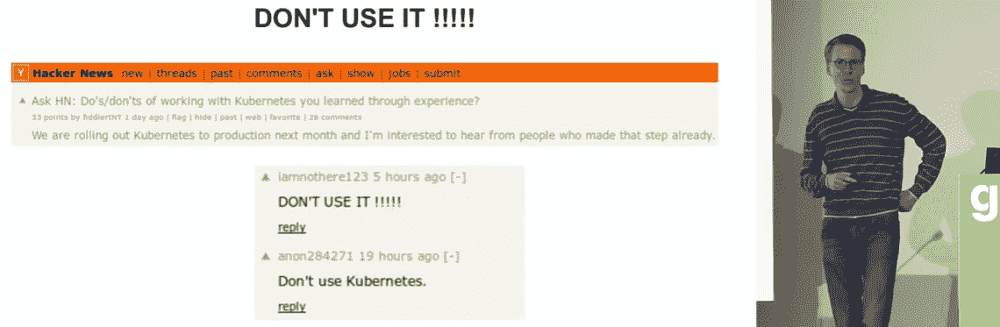

# K8s.af:当 Kubernetes 变坏

> 原文：<https://thenewstack.io/k8s-af-when-kubernetes-goes-bad/>

周四标志着 [Kubernetes 失败故事](https://k8s.af/)一周年，这是一个精心策划的非常公开的事后分析链接集。

在托管在自己的域名(k8s.af)之前，这个项目只存在于 GitHub 的一个库上[。在这一页的底部有一个关于它的使命的简洁明了的描述:](https://github.com/hjacobs/kubernetes-failure-stories)

Kubernetes 是一个相当复杂的系统，有许多活动部件。它的生态系统在不断发展，并向组合中添加了更多层(服务网格等)。

*考虑到这种环境，我们没有听到足够多的真实世界的恐怖故事来互相学习！这种失败故事的汇编应该使处理 Kubernetes 运营的人(SRE、运营、平台/基础设施团队)更容易向他人学习，并减少在生产中运行 Kubernetes 的未知情况。*

该网站还感谢在谷歌担任高级软件工程师期间成为 Kubernetes 联合创始人之一的 Joe Beda，“为这个项目贡献了他的域名 k8s.af！”

除了标题之外，每个列表还包括公司名称和事后分析出现的位置，以及所涉及的系统组件和影响的列表。(例如，“部分生产中断”或“传出 TCP 连接延迟 1-3 秒。”)

但在这一切的背后是一个真实世界的 Kubernetes 用户，他致力于高质量的信息、开源软件和真实世界的工作场所结果。“这完全是由我自己和/或我们从其他人的经验和失败中学习的动机驱动的，”该网站的创始人 [Henning Jacobs](https://github.com/hjacobs) 在 2019 年出现在谷歌的 Kubernetes 播客上时解释道。

“我认为一个好方法是回馈社会，并向人们展示分享这些失败并不是什么大不了的事情。”

## **分享故事**

雅各布斯是 Zalando 的开发者生产力主管，Zalando 是一个运行超过 140 个 Kubernetes 集群的电子商务平台。它正在使用 Kubernetes 支持超过 1100 名开发者，在 2019 年 3 月的一篇博客文章中，雅各布斯[解释了为什么](https://srcco.de/posts/why-kubernetes.html)。“Kubernetes 的内聚和可扩展 API 很重要……”他写道，并鼓励他的博客读者，“学习它是值得的，即使你只是想运行一堆容器。"

[https://www.youtube.com/embed/_BEf7vVxMjA?feature=oembed](https://www.youtube.com/embed/_BEf7vVxMjA?feature=oembed)

视频

雅各布斯是在回应一篇名为“[也许你不需要 Kubernetes](https://endler.dev/2019/maybe-you-dont-need-kubernetes/) ”的博客文章，这篇文章是由酒店列表网站 Trivago 的后端工程师撰写的。(“尤其是对于较小的团队来说，维护起来可能很耗时，而且学习曲线很陡。”)Jacobs 同意运行容器有许多选择，而且“它们都‘工作’,但是在它们提供的接口上差别很大……”

但他也认为“拥有一个可扩展的 API 很重要，因为你迟早会遇到基础设施 API 没有 100%反映的用例，并且/或者你需要与你现有组织的环境相集成。”他称赞定制资源定义(CRD)，它“允许在核心概念之上构建更高层次的抽象。”Jacobs 的博客文章还指出，在 Kubernetes API 的基础上已经建立了一个巨大的生态系统，认为世界正在向它的功能集靠拢，就像它对 Linux 内核(或其服务和系统管理组件)所做的那样。

“我认为这种网络效应将会盛行，我们将会看到越来越多的高级工具(应用、运营商、..)为了 Kubernetes……”他写道。他甚至将 k8s.af 视为这些资源之一。“我开始收集 Kubernetes 的失败案例，没有别的原因，只是为了利用庞大的社区和改善基础设施运营(对于托管和自托管来说都是如此)…”

Beda 甚至曾经开玩笑说，域名“af”可以代表“建筑故障”，尽管从技术上讲，它是阿富汗的顶级域名。

但是他对 Kubernetes 到底是什么感觉呢？雅各布斯看起来并不像是被敌对的 snark 所驱使，而是真诚地希望让事情变得更好。2019 年，他应邀成为谷歌自己的 Kubernetes 播客的嘉宾[，在那里他分享了自己在 2015 年 Zalando 迁移到云时的经历，并表示该网站是出于他们对开源软件的承诺而发展起来的。虽然 Zalando 在 GitHub 上分享了他们自己的开源 Kubernetes 组件，但“这不仅仅是关于代码，也是关于如何处理代码和组件，它们如何协同工作，以及如何实际设置。”](https://kubernetespodcast.com/episode/038-kubernetes-failure-stories/)

“也许，当我寻找失败的故事时，事情往往是如何被框定的，这就是我们如何迁移的。这些是成功的故事。然后在路上，挑战…我想把它转过来一点，让它更开放地学习失败。但我认为，很多这样的失败和挑战总是隐藏在成功的故事中……

所以 k8s.af 分享另一种故事:

*   ***10 种用 Kubernetes 搬起石头砸自己的脚，#9 会让你大吃一惊(Datadog 的[演示](https://www.youtube.com/watch?v=QKI-JRs2RIE)在 KubeCon Barcelona 2019)***
*   ***一个 Kubernetes 的失败故事(由一位匿名的 Fullstaq 客户，分享来自 2019 年荷兰 Kubernetes meetup 的[幻灯片](https://pieterlange.github.io/failure-stories/2019-06.dex.html))***
*   ***如何不做 Kubernetes(由谷歌高级网站可靠性工程师和云原生存储解决方案 Portworx 的产品管理副总裁，[在 2018 年的云原生会议上发言](https://www.youtube.com/watch?v=V0DVkrHf08k)***
*   ***在生产中运行 Kubernetes:让您的集群崩溃的一百万种方法(Zalando，[幻灯片](https://www.slideshare.net/try_except_/running-kubernetes-in-production-a-million-ways-to-crash-your-cluster-devopscon-munich-2018)来自 2018 年慕尼黑开发展上的一次演示)***

“这不是要把人们从 Kubernetes 赶走，”雅各布斯在对黑客新闻的评论中解释道，警告人们不要把容易获得的故事误认为是代表性的样本。他指出，收集关于内部故障甚至其他更分散的编排框架的故事可能不那么容易。"我们将永远听不到他们的消息，因为他们被埋在组织内部."

这是他在柏林 GOTO 2019 会议上的讲话中提到的一点，在题为“为什么我喜欢 Kubernetes 的失败故事，你也应该喜欢”的讲话中解释了他的哲学。

[https://www.youtube.com/embed/E0GBU8Q-VFY?feature=oembed](https://www.youtube.com/embed/E0GBU8Q-VFY?feature=oembed)

视频

“我们现在有了这个生态系统——我们现在有了可以谈论的共同语言，我们*可以*有这些失败的故事，这对许多其他事情来说没有意义，无论是专有的还是没有被广泛采用的。”

作为 [CNCF 终端用户社区](https://www.cncf.io/people/end-user-community/)的一员，他也看到了分享体验的价值——Jacobs 也是 CNCF 终端用户开发者体验 SIG 的联合主席。)在他的演讲中，他指出，虽然很多人计划推出 Kubernetes，但征求建议并不总是有用的。

“每个人都喜欢失败的故事，但可能是出于错误的原因，”注意到[这个演讲的描述](https://gotober.com/2019/sessions/1129/why-i-love-kubernetes-failure-stories-and-you-should-too)，引用了我们对幸灾乐祸的喜爱，而不是希望“通过无可指责的事后分析、分享事件和记录学习来持续改进。”

但该演讲的描述解释说，它最终旨在强调“尽管 Kubernetes 被认为很复杂，但为什么它有意义。”

## **策展收藏**

故事不断传来。今年早些时候，旅游搜索引擎 Omio 的一名 DevOps 工程师——该引擎 100%的工作负载都在 Kubernetes 上运行——写道“ [CPU 限制和 Kubernetes](https://medium.com/omio-engineering/cpu-limits-and-aggressive-throttling-in-kubernetes-c5b20bd8a718) 中的激进节流”导致了高延迟和错误。(“内核中有一个严重的已知 CFS 错误，它会导致不必要的节流和暂停…”)

旅游搜索网站 LoveHolidays 的 DevOps 负责人记得有一次 Google Kubernetes 引擎(GKE)耗尽了 IP 地址，导致部署停滞，并阻止了 pod 和节点的自动扩展。(“默认情况下，GKE 为每个节点分配 256 个 IP，这意味着当您运行 256 个节点时，即使像/16 这样的大型子网也会很快耗尽。”)

2019 年，Exponea 电子邮件列表验证网站的 DevOps 工程师在博客中讲述了他们推迟集成 Istio 并将其部署到生产中的原因。(“Istio 做了一些更改，使得 Istio 在多租户设置中不可部署…”)

不可否认，这是一个受欢迎的网站。当雅各布斯在 2019 年发布关于该网站的博客时，该链接吸引了超过 500 张投票和 236 条评论。(就像“我工作的一个团队花费了大量的时间试图用 AWS 中的手动 k8 解决网络问题……真让人头疼。”)亨宁自己也加入了谈话，分享了另一位德国开发者的[无服务器故障案例列表](https://github.com/cristim/serverless-failure-stories)。

他甚至在 Sysdig 的游戏“[卡片对抗容器](https://thenewstack.io/cards-against-containers-a-devops-card-game-from-sysdig/)”中被提及，其中一张卡片上的答案是“浏览 k8s.af，而不是做实际工作”但他在后藤的演讲以明确邀请其他人贡献他们自己的事后分析而结束——并提醒为什么它是必要的。

“我认为，作为一个行业，我们需要向这个方向发展，我们应该更加开放地分享我们的失败、事故和事后分析，以便相互学习。”

* * *

## WebReduce

<svg xmlns:xlink="http://www.w3.org/1999/xlink" viewBox="0 0 68 31" version="1.1"><title>Group</title> <desc>Created with Sketch.</desc></svg>