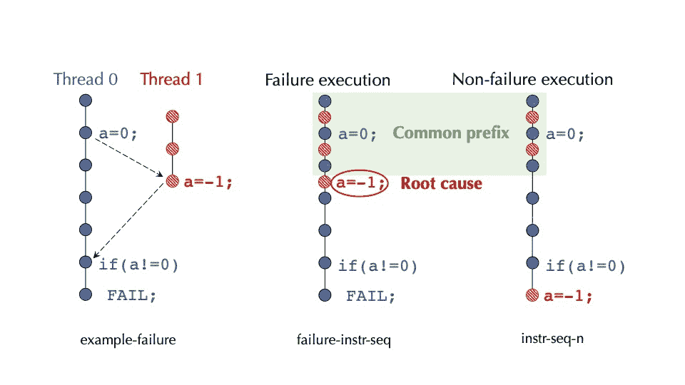
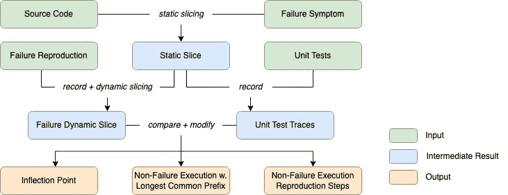

# Kairux:识别和调试根本原因

> 原文：<https://thenewstack.io/kairux-root-cause-debugging-with-the-inflection-point-hypothesis/>

任何使用过分布式系统的人都知道出错的机会太多了。在源代码中精确定位就像大海捞针。

Kairux 是一个用于基于 Java 的系统的错误定位工具，它使用单元测试和自适应动态切片从失败执行开始向后工作，以确定哪里出错了以及为什么出错。

通过实现拐点假设——任何失败的根本原因也是失败执行和成功执行发生分歧的步骤——kai rux 可以识别 bug 并提供理解其发生原因所需的源代码。

分布式系统中大约 77%的故障不仅仅是由一件事情引起的。没有完美的解决方案，选择“正确的”根本原因是主观的。虽然 Kairux 不能保证选择了“正确的”根本原因，但它可以识别最后一个根本原因，因此通过继续重复应用 Kairux，可以识别执行中的多个 bug。

Kairux 首先减少要比较的成功线程的潜在数量，然后将具有最长公共前缀的线程返回给失败线程。

Usenix 在本月[强调了这个研究项目，尽管该项目的作者还没有表明他们是否计划开源适用于 Java 代码的代码，或者着手进行商业实现。](https://www.usenix.org/publications/loginonline/kairux-distributed-system-fault-localization-based-inflection-point#reference-6)

## **什么是拐点假说？**

拐点假说简单明了。拐点是问题的根本原因，是失败执行与非失败执行相背离的第一条指令。因此，确定拐点的最佳方法是找到成功执行和失败执行的最长公共前缀。

拐点作为故障执行的最后一步具有重要意义，此时故障仍然是可以避免的。通过使用这种假设作为指导原则，故障定位成为一个原则性的搜索问题。

由写后读数据竞争引起的故障。在 example-failure 中，线程 1 修改了 a = -1，它不再是导致失败的 0。failure-instr-seq 是导致 example-failure 中的错误的指令序列。如果创建了所有成功的指令组合，并与 failure-instr-seq 进行比较，最终将出现具有最长公共前缀的序列。在这个例子中，它是 instr-seq-n

## **Kairux 自动化拐点假说**

Kairux 是一套用于基于 Java 的分布式系统的算法，它抽象出了所有繁重的工作。它接受以下输入:

*   重现 bug 所需的步骤，通常打包在单元测试中。
*   失败症状本身。
*   源代码。
*   所有单元测试。

为了输出:

*   拐点。
*   具有最长公共前缀的指令序列。
*   复制具有最长公共前缀的指令序列所需的步骤。

通过将失败执行的源代码与最长的成功源代码进行比较，可以理解 bug 的“为什么”和“如何”。通过最小化潜在来源的数量，更容易定位“在哪里”。Kairux 通过以下关键概念减少了潜在的无限数量的组合:

*   **自适应动态切片**:只考虑与 bug 相关的序列和源代码。所有剩余的目标指令序列被分成不同线程中的子序列，在适应性地将分析扩展到其他线程之前，首先处理包含缺陷的线程。
*   **单元测试利用** : Kairux 只考虑包含在现有单元测试中的成功序列，通过优先考虑与失败执行最相似的代码，该列表被进一步最小化。
*   **有效执行修改**:为了充分利用测试提供的序列，Kairux 试图修改测试的输入参数，以减少失败线程出现的任何偏差。当更新的参数不再导致有效的执行时，尝试结束。

关于 Kairux 算法的更多细节可以在技术论文[中找到。](https://yonglezh-purdue.github.io/files/sosp19-kairux.pdf)

## **kai rux 的架构和实现**

凯鲁的建筑。(来源:Usenix)

由于与动态分析相关的高开销成本，Kairux 使用静态分析而不是动态分析。静态片是属于任何失败执行的动态片的指令的超集。

Kairux 通过设置断点来构建它需要的动态切片，然后再现失败的执行。它能够命中的每个断点都被记录下来，并获得一个跟踪，然后进行依赖性分析，然后注释网络通信库。由此，获得动态切片。

其他工作包括使用断点来执行不同的线程调度，以及分配唯一的标记来区分源代码对象的不同运行时实例并跟踪数据流。

## **最终结果**

简短的回答是:它有效。失败的根本原因有 70%被找到。在这个过程中，被检测的序列数从可能的无穷大减少到 0.2%。由“遗漏事件”引起的故障，即应该发生但没有发生的事情，以及由异常事件引起的故障都得到了解释。

Kairux 在 HBase、HDFS 和 ZooKeeper 的随机抽样真实故障上进行评估。

<svg xmlns:xlink="http://www.w3.org/1999/xlink" viewBox="0 0 68 31" version="1.1"><title>Group</title> <desc>Created with Sketch.</desc></svg>