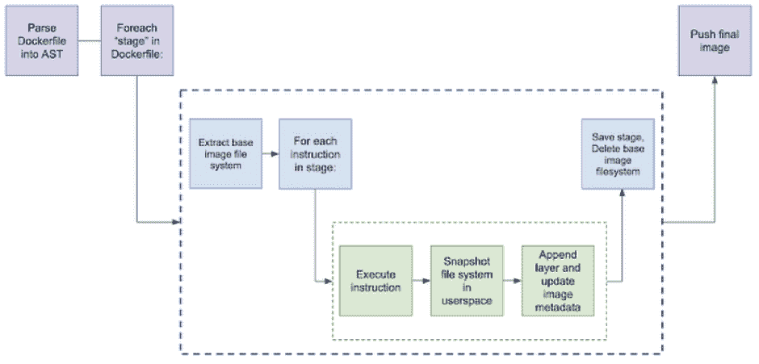
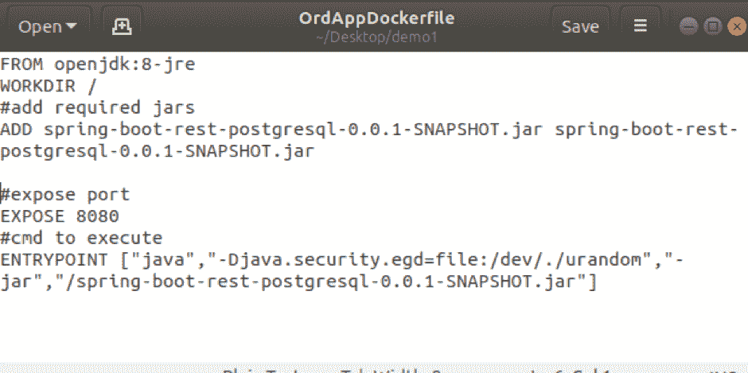
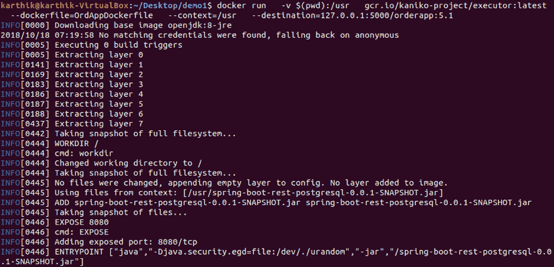

# Kaniko 在没有 Docker 守护进程的情况下构建容器映像

> 原文：<https://thenewstack.io/kaniko-builds-container-images-without-the-docker-daemon/>

Google 最近推出了 Kaniko T1，这是一个开源工具，即使没有特权根访问，也可以从 docker 文件构建容器图像。如果你已经注意到，Docker 守护进程总是作为*根*用户运行。它实际上绑定到 Unix 套接字，而不是 TCP 端口。默认情况下，Unix 套接字归用户 *root* 所有，其他用户只能使用 *sudo* 命令访问它。使用 Kaniko，我们可以从 Dockerfile 文件构建一个映像，并将其推送到注册表中，而无需 root 用户访问。由于它不需要任何特殊的特权或权限，因此可以在没有特权或 Docker 守护程序的环境中运行。

在这种背景下，让我们尝试并理解它是如何工作的，并使用 Kaniko 工具构建容器映像。

## 它是如何工作的

Kaniko 作为一个容器运行，并接受三个参数:Dockerfile、构建上下文和注册表的名称，它应该将最终图像推送到该注册表。它获取并提取基本映像文件系统到 root(基本映像是 Dockerfile 的 FROM 行中的映像)。它按顺序执行每个命令，并在每个命令后拍摄文件系统的快照。



Kaniko:工作原理/来源——谷歌博客

Kaniko 解压缩文件系统，执行命令，并在 executor 映像的用户空间中对文件系统进行完整的快照。由于它运行在用户空间，它避免了在你的机器上需要特权访问，也不涉及 docker 守护进程或 CLI。

## 使用 Kaniko 构建容器图像

 [Karthikeyan Shanmugam

Karthikeyan Shanmugam (Karthik)是一名经验丰富的解决方案架构师，在银行、金融服务和航空领域的应用程序设计和开发方面拥有超过 17 年的经验。目前参与技术咨询和提供应用程序转换领域的解决方案，包括传统应用程序的现代化、管理转换练习以及为转换提供解决方案架构。](https://www.upnxtblog.com) 

设置 Kaniko 的推荐方式是使用现成的 executor 映像，它可以作为 Docker 容器或 Kubernetes 中的容器启动。

```
docker run  \
-v  &lt;path-on-host&gt;:&lt;path-inside-container&gt;  \
gcr.io/kaniko-project/executor:latest  \
--dockerfile=&lt;path to dockerfile&gt;  \
--context=&lt;path-inside-container&gt;  \
--destination=&lt;repo with image name&gt;:&lt;tag&gt;

```

这里

*   -维护到 *Dockerfile* 的路径及其依赖项+将在容器内使用的路径
*   io/kaniko-项目/执行者是 Kaniko 的执行者
*   –docker file 到 *Dockerfile* 的路径(包括文件名)
*   –挂载目录的上下文路径(在容器内部)
*   –destination 用 Image name : Tag 表示 Docker 注册表的完整 URL

```
docker run  \
-v  $(pwd):/usr  \
gcr.io/kaniko-project/executor:latest  \
--dockerfile=OrdAppDockerfile  \
--context=/usr  \
--destination=localhost:5000:5.1

```



样例 Dockerfile 文件(Spring Boot Java 应用程序)



使用 Kaniko 构建容器图像

如果在目的地注册中心启用了身份验证，那么将本地 Docker config.json 文件挂载到 kaniko 容器，这样它就可以使用目的地 Docker 注册中心的凭证进行身份验证。

像 Kaniko 一样，还有其他工具，如 [img](https://github.com/genuinetools/img) 和 [orca-build](https://github.com/cyphar/orca-build) ，它们从 Dockerfiles 构建容器映像，但是方法不同。

在本文中，您已经学习了如何在不使用 Docker 的情况下使用 Kaniko 构建 Docker 映像。和往常一样，Kaniko 工具的内容比这里介绍的要多得多，但是现在您已经对基础知识有了很好的了解。另外请记住，kaniko 正在开发中，可能目前并不支持来自 *Dockerfile* 的所有命令。

## 额外资源

<svg xmlns:xlink="http://www.w3.org/1999/xlink" viewBox="0 0 68 31" version="1.1"><title>Group</title> <desc>Created with Sketch.</desc></svg>