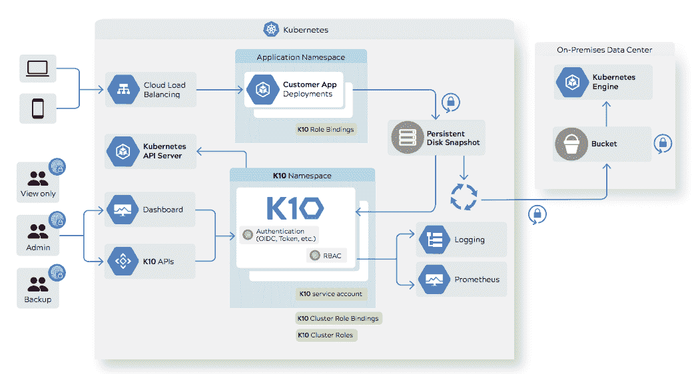
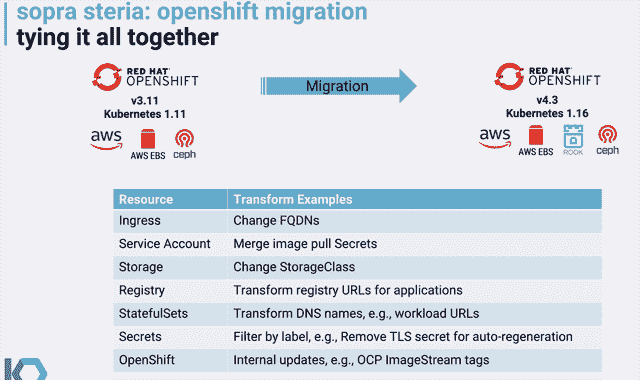
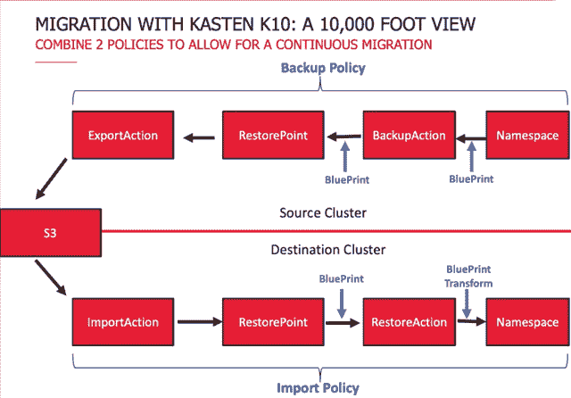
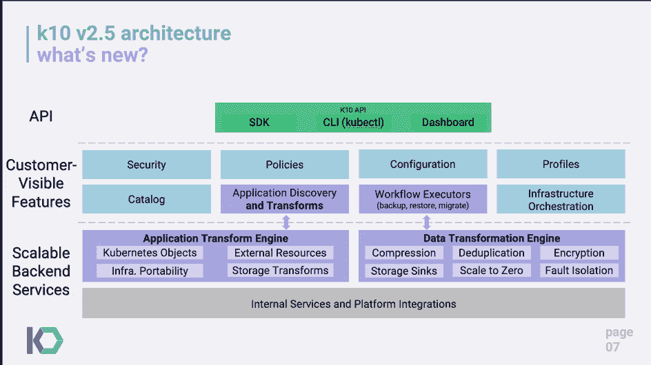

# kasten:Kubernetes 的数据管理

> 原文：<https://thenewstack.io/kasten-data-management-for-kubernetes/>

像许多创业公司一样，Kubernetes 数据管理供应商 [Kasten](https://www.kasten.io/) 在痛苦中成长。

其创始人[尼拉杰·托利亚](https://www.linkedin.com/in/nirajtolia/)和[瓦伊巴夫·卡姆拉](https://twitter.com/vaibhavkamra?lang=en)于 2014 年收购 [Maginatics](https://blog.dellemc.com/en-us/welcoming-spanning-maginatics-emc-family/) 后加入 EMC。Maginatics 仍然是 EMC 的一个产品，它提供了跨存储平台的安全全局命名空间，使内容可以从任何设备或位置进行访问。

正如 Tolia 所说，在 2015 年，将他在 EMC 负责的产品的控制面板迁移到 Google Cloud 并在 Kubernetes 上运行非常困难，这让开发人员开始抱怨。

“在产品开发的生命周期中，我们比以往更早发现集成问题。这是五年前的事了，所以当时我突然意识到这将是未来，”他说。

“在 EMC，我们是构建数据保护产品的数据保护小组的一员。我们没有任何可以保存的东西。我们有一个手写的东西，但随着事情的发展，这是不可扩展或不可行的。”

因此，Kasten 于 2017 年成立，其名称来自德语单词 box 或 container。

在一篇博客文章中，Tolia 坚持认为传统的数据管理平台跟不上基于微服务的系统。

“这些传统产品处理不了这么多东西，因为你需要捕捉的组件数量实际上是 100 倍的爆炸，”他说。

“经常有重新安排。很多东西都被锁起来了。…事实上，大型传统供应商的提案之一是，在您的防火墙上戳洞…开放您的网络策略，允许我们进入您的群集。这是我们唯一的备份方式。

“因此，它并不真正符合现有的需求，尤其是在应用程序不断变化的情况下。不再有虚拟机到应用程序的映射，所以他们不知道发生了什么。从基础架构的角度来看，所有这些因素结合在一起，使得这些解决方案变得很困难。”

### 便携式容器

Kasten 的 K10 平台使用 Kubernetes 来自动发现容器化的应用程序、它们的组件、启动流程和策略。

通过使用 Kubernetes 容器存储接口(CSI)抽象，it 部门无需了解特定的阵列接口即可为数据块和对象存储系统提供数据保护、迁移和灾难恢复。

作为容器整体状态的快照，它可以在系统之间移动，或者在远程站点用于灾难恢复。

“您的所有配置、您的秘密、您的配置、您的容器映像、您的服务帐户和网络信息。我们为客户收集所有这些信息，因此它独立于基础架构之外。您可以将它带到另一个集群、另一个地区、另一个云、跨生产和测试、开发的混合环境，”Tolia 说。

它还解决了不能跨环境移植的问题。假设您的 TLS 证书来自“让我们加密”,您可以允许系统在恢复时重新生成证书。

“我们自己就是一个云原生应用。我们是人们有时会提到的关键集群，在这里我们作为应用程序进行部署，然后作为基础架构运行。所以我们将安装在我们自己的名称空间中，这是 Kubernetes 中的一个项目。然后，我们使用一个服务帐户连接到 Kubernetes，并能够编排和发现平台上运行的应用程序。我们还与底层物理基础设施挂钩，”Tolia 说。

如果您需要跨 10 个服务进行同步，您可以使用一种称为蓝图的无代理扩展机制。

Tolia 说，K10 是为了平衡运营和开发之间的需求而从头开始构建的。

“也就是说，我们如何为运营团队决策者简化合规管理？自动化，人们一般都在运行多个集群。您如何为他们提供全球可见性、警报和监控？

“在开发人员方面，……开发人员知道我们在那里，但我们对应用程序或部署管道没有做任何更改。但是如果他们想要钩子，他们可以扩展数据管理对他们的意义。但是他们会说，‘不，我不希望你这样倒车。我想要一种稍微不同的方式。所以所有这些也适用于我们的环境。"

### 与存储无关

价值数十亿美元的英国 IT 咨询公司 Sopra Steria 最近使用 Kasten 将近 200 个应用程序从 OpenShift 3.11 迁移到 OpenShift 4.3。

在的[网络研讨会上，首席 DevOps 架构师](https://www.youtube.com/watch?v=lgWSUe6gDlY&t=1459s) [Michael Courcy](https://www.linkedin.com/in/michael-courcy/) 解释了迁移流程:

Kasten 并不把应用程序的备份仅仅看作是数据的快照，而是同时具有所有配置的数据的快照，所有的 Kubernetes 资源都在这个名称空间内。这就构成了一个原子单元，卡斯滕称之为还原点，也就是依赖树。

它使您能够跨基础设施进行转换，例如，您可以在迁移过程中包括 DNS 名称需要更改的地方。

您从命名空间开始，然后启动备份操作，这将创建一个恢复点。然后，您创建一个导出操作，该操作将导出恢复点，在本例中是导出到 S3。您可以通过备份策略做到这一切，并且可以每周、每天或每小时进行备份。

然后，在目标群集上创建导入策略。导入操作创建导入恢复点，导入恢复点创建恢复操作，恢复操作使用数据和配置重新创建命名空间。

在中间，您可以引入蓝图，它允许您协调备份。蓝图可以处理备份所需的准备工作。您可以在恢复应用程序时使用 blueprint transform，这使您能够在恢复过程中添加一些更改。

它与存储无关—它本身不是一个存储系统，但可以与各种数据库集成。

它使用元数据来自动化 Kubernetes 集群之间的工作负载迁移和数据传输，并确保备份已成功完成。

Kasten 最近添加了它所谓的云原生转换框架，作为其应用程序转换引擎的一部分。它捕获底层数据和附加元数据，包括数据传输、无锁算法、可插拔加密和压缩、高级重复数据消除和更小的容错域，以提高备份效率和可靠性。

K10 在内部或公共云中运行。它旨在根据工作负载进行扩展，从而减少 It 基础架构的总体规模。

Kasten 与像 [Cohesity](https://www.cohesity.com/) 和戴尔 EMC 的 [PowerProtect](https://blocksandfiles.com/2019/05/01/dell-emc-announces-powerprotect-appliance-hardware-and-software/) 以及 NetApp 的 [Project Astra](https://thenewstack.io/netapps-project-astra-brings-data-management-to-kubernetes/) 这样的公司竞争。

Tolia 在一篇关于新堆栈的帖子中写道[利用了 Kubernetes 的 CSI](https://thenewstack.io/kubernetes-data-portability-and-the-rise-of-portable-stateful-applications/) 。

<svg xmlns:xlink="http://www.w3.org/1999/xlink" viewBox="0 0 68 31" version="1.1"><title>Group</title> <desc>Created with Sketch.</desc></svg>