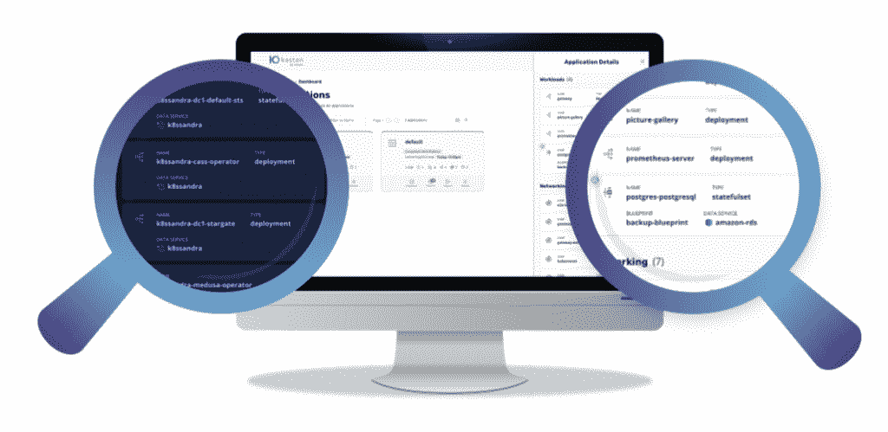

# Kasten K10 V4.5: Grafana 可观察性，更多边缘支持

> 原文：<https://thenewstack.io/kasten-k10-v4-5-grafana-observability-more-edge-support/>

云原生数据管理提供商 [Kasten](https://www.kasten.io?utm_content=inline-mention) 在其 K10 V4.5 版本中添加了许多新功能，并继续推动改善运营团队在 Kubernetes 上管理状态和有状态应用程序的备份、灾难恢复和安全性的体验。

主要的新特性是改进了 Grafana 和其他工具的可观察性，并支持 Kubernetes 上的 edge 部署。正如 Kasten 所指出的,[云本地计算基金会](https://cncf.io/?utm_content=inline-mention) (CNCF)最近的一份报告发现，2020 年超过 90%的被调查组织正在使用 Kubernetes 比前两年增加了 33%。

随着为各种应用程序执行数据采集和处理的边缘节点的数量不断增加，Kubernetes 边缘集群和容器的数量也在同时增加。当需要时，从不可变的来源访问和快速恢复 Kubernetes 上的数据和应用程序备份变得更加困难。

“需要的是正确的授权和访问级别。拥有这些权限的用户应该能够自己恢复应用程序或应用程序的一部分，而不需要依靠 IT 组织来完成，”Veeam 的 [Kasten 产品副总裁](https://www.kasten.io/veeam) [Gaurav Rishi](https://www.linkedin.com/in/rishigaurav) 告诉新堆栈。“这可能是为了在发生灾难时进行克隆，也可能是为了进行测试，但是对于他们想要复制的数据，他们需要能够在 Kubernetes 本机的应用程序环境中访问这些数据。”

对于边缘架构，Kubernetes 正在成为关键。为此，Kasten 的 K10 V4.5 的边缘应用备份功能包括支持 [K3s](https://k3s.io/) —一个专门适用于边缘应用的 Kubernetes 轻量级版本，并支持[亚马逊 EKS Anywhere](https://aws.amazon.com/fr/eks/eks-anywhere/) ，这是一个部署选项，允许用户创建和管理内部 Kubernetes 集群。Kasten 说，这种组合对于无人值守、资源有限和远程位置的生产工作负载特别有效，并为边缘端点的数据管理提供了单一“控制台”。

这个想法也是为了扩展 Kasten 的不变性功能，以支持云环境、内部环境和现在的边缘环境中的备份，以便 Kubernetes 上备份的应用程序和数据保持不变，并在基础设施中断或勒索软件或其他类型的攻击发生时立即准备好重新部署。

[企业管理协会(EMA)](https://www.enterprisemanagement.com/) 的分析师 [Torsten Volk](https://www.linkedin.com/in/torstenvolk/) 说，这种扩展的边缘功能和支持非常重要，因为将 Kubernetes 扩展到边缘“是数字化转型的下一个大课题，因为这将使开发人员和运营商能够实现一个统一的 API 层，以高效地合作提供一致的最终用户体验。”

“如今，在为 edge 应用做准备时，需要进行大量定制编码和架构设计。这是因为边缘应用需要能够处理间歇性连接中断、延迟峰值和安全挑战，这些挑战利用了对丢失或被盗设备的物理访问，”Volk 说。“支持 K3s、Kubernetes 的超级明星边缘发行版(在 2.5 年内从 0 到 18，000 名 Github 明星)和 EKS Anywhere 使 Kasten 能够在 Kubernetes 边缘用例升温的同时为边缘提供企业级 Kubernetes 服务。”

Kasten K10 V4.5 还旨在简化 Kasten 与 DevOps 团队首选监控和可观察性工具的流程和集成，例如与 Grafana 仪表板或 DataDog 仪表板一起使用。Kasten K10 V4.5 新的可观察性和可视化工具包括:

*   可以通过各种交付格式(电子邮件、Slack 等)设置和接收警报和指标。).
*   确认系统的整体健康状况。
*   预测存储支持，包括重复数据删除和压缩率。
*   环境中运行的策略数量分析。
*   确认执行的备份操作的成功率和失败率。

Kasten 改进了对负责管理 Kubernetes 上的应用程序和部署的 DevOps 团队的监控和可观察性的支持，这一点至关重要，因为“开发团队的分散化、云原生应用程序的分布式特征、可以创建的现代应用程序堆栈的产品选项数量，以及其他标准化 Kubernetes 服务之间的实施差异，使可观察性成为企业在 2021 年要担心的头号话题，”Volk 说。为跨团队、微服务和云的策略驱动的[声明性]数据管理提供一组通用的数据 API，为客户提供降低运营复杂性和独立于云或数据中心基础架构所需的运营控制级别

Kasten K10 V4.5 提供的其他新功能包括:

*   通过自动环境发现和与 Kasten K10 备份策略的无缝集成，原生 Amazon RDS 和 Cassandra 支持，Kasten K10 备份策略是 Amazon Web Services 提供的分布式关系数据库服务，K8ssandra 是 Apache Cassandra 的基于 Kubernetes 运营商的发行版，后者是一种开源的 NoSQL 分布式数据库。
*   遭遇勒索软件攻击时的不变性—继 4.0 版提供勒索软件 Kubernetes 数据保护平台，支持启用对象锁的[亚马逊网络服务](https://aws.amazon.com/?utm_content=inline-mention)S3 存储之后，Kasten K10 V4.5 版提供了额外的不可变对象存储恢复位置，并提供来自 Cloudian、Wasabi、MinIO 和 Backblaze 的经验证的 S3 对象锁不可变存储支持。
*   Veeam 备份和复制支持—对于运行在 [VMware](https://tanzu.vmware.com?utm_content=inline-mention) vSphere 上的 Kubernetes 集群，Kasten K10 V4.5 通过支持共享 Veeam 备份和复制(VBR v11a)存储库，扩展了客户现有 Veeam 投资的价值。

Kasten 将于本周在洛杉矶举行的 KubeCon+CloudNativeCon 上举行一系列会谈，以及周二在同一地点举行的[云原生数据管理](https://cndmday.com/events/cndm-day-2021-na/)会议。

<svg xmlns:xlink="http://www.w3.org/1999/xlink" viewBox="0 0 68 31" version="1.1"><title>Group</title> <desc>Created with Sketch.</desc></svg>