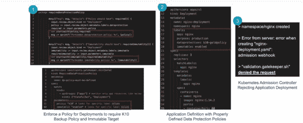
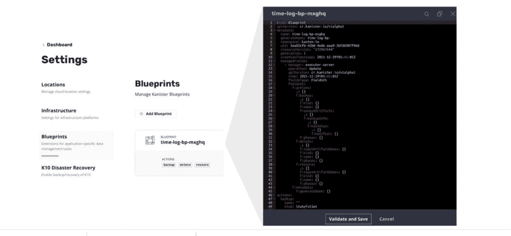

# Kasten 说 K10 V5.0 扩展了 CI/CD 的数据保护范围

> 原文：<https://thenewstack.io/kasten-says-k10-v5-0-extends-reach-for-data-protection-across-ci-cd/>

卡斯滕有一句营销口号，说安全应该无处不在。但也许更恰当的说法是，它的目的是使数据保护更简单甚至更智能，因为 Kasten K10 针对 Kubernetes 集群的存储和灾难恢复功能将其覆盖范围扩展到了整个 CI/CD 领域。

理想情况下，Kasten 等用于数据保护的工具和其他面向安全的平台越来越多地被设计为自动化程度更高，以便开发人员和运营人员可以在后台运行安全和策略检查时完成他们的工作。然后，当这些工具发出警告或阻止不良代码被集成到供应链中时，它们就会出现在非安全人员的雷达屏幕上。Kasten 称之为“无处不在的安全性”，它涵盖了生产周期的最开始，因此是经常被吹捧的“左移”趋势，并在部署后扩展到整个应用程序和数据生命周期。

然而，在实践中，许多(可能是大多数)组织缺乏在 CI/CD 开始时确保安全到位和符合策略(将策略作为代码实现，如下所述)的能力。

## 数据保护政策

在开发过程的早期阶段，数据保护策略尤其经常被忽视。在[提供的测试结果](https://bridgecrew.io/wp-content/uploads/state-of-open-source-terraform-security-2020.pdf) [中，Palo Alto Networks](https://www.paloaltonetworks.com/cloud-security?utm_content=inline-mention)Bridgecrew 将 Terraform 注册模块中的资源与 [Bridgecrew 的 Checkov、](https://github.com/bridgecrewio/checkov)中的数百个预定义检查进行了比较，Checkov 旨在防止云错误配置，并在构建时发现漏洞。在这些检查中，Bridgecrew 发现 81%的社区模块备份和恢复失败，而日志记录和加密分别以 73%和 71%的比例紧随其后。

为此，Kasten K10 V5.0 涵盖了生产过程早期数据保护的更广泛领域。“与数据保护是附加功能的世界相比，数据保护的左移需要成为一种默认选项，需要成为一种新趋势，”[Veeam Kasten 的产品和合作伙伴关系副总裁 gaur av Rishi](https://www.linkedin.com/in/rishigaurav)告诉 New Stack。"我们现在确保有一个勾号表示它已经完成了."

K10 V5.0 提供的用于改进数据保护的新左移功能的一个主要属性包括将 Kubernetes 环境的策略作为代码原则与开源工具的集成，如 [Kyverno](https://kyverno.io/) 和[开放策略代理(OPA)](https://www.openpolicyagent.org/) 。当开发人员在 Git 上发出一个 pull 请求时，代码集成策略就开始工作，并贯穿整个生产周期。它用于帮助实施运营最佳实践，如恢复点目标(RPO)，即在发生中断或攻击时可接受的数据丢失量，并阻止未正确配置的部署，如在 Git 上未启用不变性时。它还可以自动修改策略以满足法规遵从性要求，例如根据 HIPAA 法规设置六年的保留期。Rishi 说，Kubernetes 准入控制器也可用于该版本，以帮助防止 pods、部署或状态集被调度到 Kubernetes 节点上，如果违反策略的话。

## 一大块拼图

许多平台通常被设计为提供所谓的“单一平台”解决方案，这种解决方案覆盖了太多的领域，并且可能涉及供应商锁定。在 K10 V5 发布之前，Kasten 已经为数据保护和安全提供了针对勒索软件攻击的数据恢复，并为访问 Kubernetes 节点和有状态及无状态数据提供了更严格的 RBAC 控制。Kasten K10 的目的不是为 CI/CD 和 Kubernetes 集群管理的 DevOps 提供完整的解决方案，我也不希望它被吹捧成这样。这有助于解释 Kasten 如何寻求 K10 与流行的 DevOps 环境和流程更紧密地集成，如[亚马逊 Web 服务](https://aws.amazon.com/?utm_content=inline-mention) (AWS)，以便数据保护自动与亚马逊[亚马逊弹性 Kubernetes 服务(EKS)](https://docs.aws.amazon.com/eks/latest/userguide/what-is-eks.html) EKS 集群以及全面的容器和 Kubernetes 管理平台 [Red Hat OpenShift 集成。](https://www.redhat.com/en/technologies/cloud-computing/openshift)

Kasten K10 增加了与 EKS 的兼容性，包括 K10 如何将数据保护功能添加到亚马逊 EKS 蓝图，这有助于 Kubernetes 集群和容器的配置和部署。Kasten K10 add-on for Amazon EKS 蓝图还扩展到所有集群的数据备份，包括灾难恢复。

对于红帽 [OpenShift](https://www.openshift.com/try?utm_content=inline-mention) ，Kasten K10 的数据备份和容灾能力现已纳入红帽运营商框架，并拥有红帽三级运营商认证。Kasten K10 在 Red Hat Marketplace 上也有免费版或企业版。

随着与 EKS 和红帽的整合，我们可以假设更多的合作伙伴关系即将到来。DevOps 团队能够将策略的数据保护和可恢复性进一步融合为跨 CI/CD 的代码，并成为他们最喜欢的 Kubernetes 平台和环境的一部分。

Rishi 说:“我们正在帮助 DevOps 团队考虑策略，不仅是在纯安全属性的背景下进行补救，还包括数据和应用程序保护。

<svg xmlns:xlink="http://www.w3.org/1999/xlink" viewBox="0 0 68 31" version="1.1"><title>Group</title> <desc>Created with Sketch.</desc></svg>