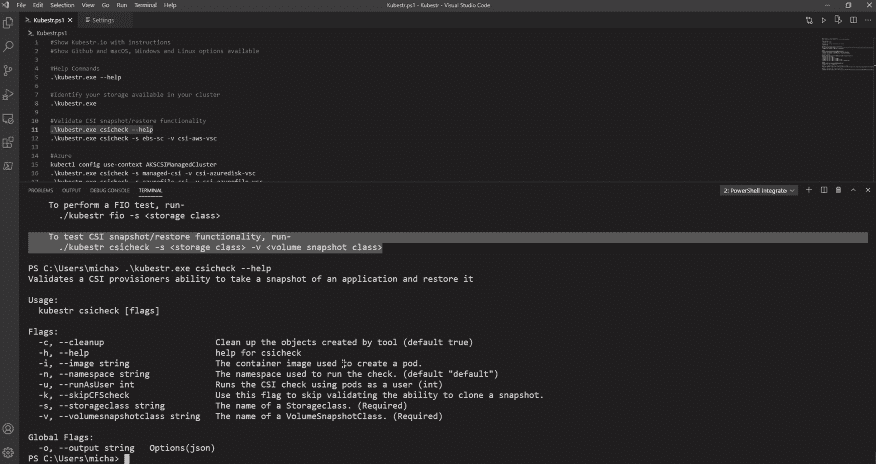

# Kasten 的 Kubestr:集群内存储验证的“简易按钮”

> 原文：<https://thenewstack.io/kastens-kubestr-an-easy-button-for-in-cluster-storage-validation/>

Kubernetes 上运行的有状态应用程序已经发展到这样的程度，它们的部署和管理——尽管仍然具有挑战性——已经变得更容易实现。存储就是属于这一类的有状态应用程序。但是，仍然缺少一些工具，这些工具可以提供关于哪些存储解决方案适用于特定的 Kubernetes 集群以及它们的性能如何的信息。

为此， [Kasten by Veeam](https://www.kasten.io?utm_content=inline-mention) 创建了 [Kubestr](https://kubestr.io/) 来为 DevOps 团队提供一个“简单的按钮”来“识别、验证和评估”在云原生环境中运行的存储系统，[Veeam 的高级全球技术专家 Michael Cade](https://uk.linkedin.com/in/michaelcade1) 在一次演示中说。

Kubestr 通过自动识别和验证在 Kubernetes 集成平台上运行的存储选项来实现这一点，并提供基准来衡量存储选项实施后的存储性能。

“Kubestr 非常注重确保您的生产存储得到验证和评估，以满足您的工作负载需求，”Cade 说。“对于任何打算部署 Kubernetes 并考虑有状态工作负载和利用存储的运营商来说，该工具可以为如何做到这一点提供一些见解。”

这项功能非常有用，因为“可预测性和一致的存储性能几乎是大多数 Kubernetes 运营商的最大愿望，尤其是在逐步迁移和现代化传统企业应用程序时，”企业管理协会(EMA)的分析师 Torsten Volk 告诉新堆栈。例如，在这种使用场景下，Kubernetes 的优势——通过抽象底层基础设施资源实现的应用可扩展性和可移植性——“可以反过来咬应用操作，”特别是在运行 IOPS 密集型工作负载时，如流数据分析、数据库操作或机器学习模型训练和推理，Volk 说。

根据 EMA 的研究，在云原生环境中保持持久的卷性能是一项重大挑战。

“因此，库贝斯特非常受欢迎，”沃尔克说。“它为开发人员提供了一种简单的方法来确定应用程序可以安全地放置、移动或扩展到哪里。”

## 开源魔术

继备份解决方案 Kopia T1 和 Kubernetes 数据管理框架 T2 Kanister T3 之后，Kasten 发布的 Kubestr 是其第三个主要的开源项目，用于支持在 Kubernetes 环境中运行的有状态应用程序，尤其是验证和评估存储。

“我们知道开源对我们的客户和更广泛的社区至关重要。云原生应用通常由许多服务组成，其中许多是基于开源的，”Cade 告诉新堆栈。“在为云原生工作负载提供解决方案的同时，Kasten 也在使用云原生方法和架构(即喝我们自己的香槟)。这样做，我们既使用开源，又通过贡献回馈社区。”

Kubestr 提供的 Cade 提到的“简单按钮”包括帮助 DevOps 团队更好地了解什么最适合他们的运营。这是众多存储选择中的一个，是针对云原生环境的大量有状态应用程序和工具选择的子集。

例如，现在可以在 Kubernetes 上部署 SAP、SQL Server、Oracle 和 Hadoop 等成熟供应商的 Kubernetes 工作负载管理平台，这反映了所提供的广泛的云平台选择。

前面提到的 Kasten 创建的另一个开源项目 Kanister 在 Kubernetes 中提供了应用程序级的数据管理。Cade 描述说，Kanister 允许 DevOps 团队在蓝图中捕获特定于应用程序的数据管理任务，这些任务可以很容易地共享和扩展。

对于存储，Kubernetes 环境选择的激增主要是由于容器存储接口(CSI)的创建，它允许为 Kubernetes 部署解耦存储解决方案。这意味着 Cassandra、Redis、MongoDB 和其他 NoSQL、MySQL 或 PostgreSQL 数据库等微服务的数据存储的存储系统不需要针对 Kubernetes 集群进行配置。

Volk 说，除了管理数据库，在这些复杂的云原生环境中，还必须考虑特定应用程序的性能、可扩展性和弹性。“既然我们不再能准确控制应用的部署位置，我们需要非常小心地让运营商安全地将性能要求与潜在的部署目标相匹配。

因此，平台和存储选项的广泛选择以及不同的用户和应用程序要求会对存储性能产生非常明显的影响——如上所述，创建 Kubestr 是为了帮助 DevOps 团队在 Kubernetes 环境中就存储管理做出更明智的决策。“我们希望运营商和开发者能够轻松地为他们的平台选择合适的存储，”Cade 说。

## 识别、验证、评估和热爱

云原生环境的存储选择通常包括首先评估 Kubernetes 环境中运行的不同应用程序，以及用户及其需求的子集。Kubestr 激活了“简单按钮”,首先识别 Kubernetes 集群中的存储节点。然后，它会在存储就绪的情况下验证配置。这样，它可以自动评估可用的存储性能并发现浪费的存储资源。为了评估，运行了一系列基准测试。

“当谈到基准测试时，Kubestr 有许多不同的选择，”Cade 告诉 New Stack。虽然 Kubestr 使用[灵活的 IO 测试器](https://fio.readthedocs.io/en/latest/fio_doc.html)进行默认测试，而“你可以使用自己的 FIO 配置来执行特定工作负载的基准测试，”Cade 说。

“我真的很想突出 Kubestr 的简单，”凯德说。“这实际上是为了简化开发商和运营商的生活，他们可能不太熟悉这些存储决策和环境，”Cade 说。“这给了我们简单的按钮来做到这一点。”

<svg xmlns:xlink="http://www.w3.org/1999/xlink" viewBox="0 0 68 31" version="1.1"><title>Group</title> <desc>Created with Sketch.</desc></svg>