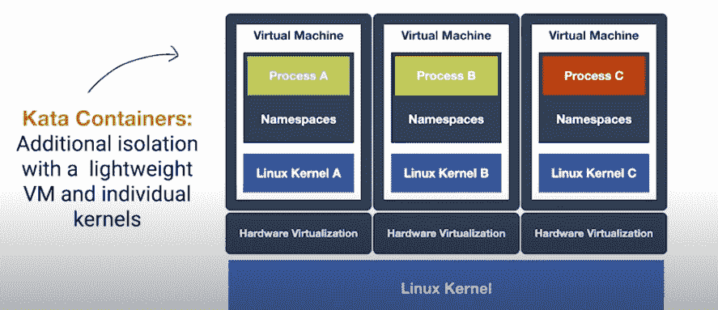

# Kata 容器演示:虚拟机安全的容器体验

> 原文：<https://thenewstack.io/kata-containers-demo-a-container-experience-with-vm-security/>

自 2017 年 12 月推出以来，你可能听说过 Kata Containers [，作为一种运行与容器环境完全兼容的虚拟机(VM)的方式。](/kata-containers-secure-lightweight-virtual-machines-container-environments/)

在这个演示中， [Ampere](https://amperecomputing.com/) 的首席系统软件工程师 [Eric Ernst](https://www.linkedin.com/in/eric-ernst-517bb34/) 和 [StackHPC](https://www.stackhpc.com/) 的软件工程师 [Bharat Kunwar](https://www.linkedin.com/in/brtknr/?originalSubdomain=uk) 解释了 Kata 容器是如何工作的，以及它们的性能和安全优势。他们还描述了一个用例场景和围绕该技术的新研究。

本质上，由 [OpenStack Foundation](https://www.openstack.org/foundation/) 管理的 Kata 容器感觉和运行起来像容器，但实际上是虚拟机。它们的优势之一是能够利用容器提供的大量计算优势，以及虚拟机提供的隔离和保护。Kata Containers 主页上的标语是这样描述的:“容器的速度，虚拟机的安全性。”

换句话说，Kata 容器集成在容器和 Kubernetes 基础设施中，没有在虚拟机中运行容器所带来的性能缺点。

[https://www.youtube.com/embed/uDh8UhOrR8I?feature=oembed](https://www.youtube.com/embed/uDh8UhOrR8I?feature=oembed)

视频

相对于集装箱和 Kubernetes 豆荚的安全优势是由于卡塔集装箱的隔离结构。它们不会通过 Linux 内核与运行它们的虚拟机之外的其他容器共享潜在的访问权限。这样，它们消除了容器可能带来的一些潜在的漏洞，同时继续提供容器实例的好处。

Ernst 说，Kata 容器也是一种[开放容器倡议](https://www.opencontainers.org/) (OCI)兼容技术，旨在从图像角度和运行时角度标准化 Kata 容器。Ernst 说，作为一个 OCI 兼容的运行时，这意味着你“只需插入并运行，就像你期望的普通 Docker 和 Kubernetes 体验一样”。

当然，Kata 容器的隔离能力是关键。例如，它们可以使组织能够运行和访问不可信的工作负载，这些工作负载需要与在下面运行的主机操作系统内核隔离。“因此，对于传统类型的容器，Linux 名称空间提供了一种虚构的隔离——然而，这是真正的交易，”Kunwar 说。

恩斯特说，基础设施提供商，包括云提供商，也可以将 Kata 容器视为保护基础设施免受“坏人”和“想拥有你的基础设施的攻击者”攻击的一种方式。“很多时候，如果你受到威胁，你会试图保护一些东西，你会在那东西周围放上一个笼子。但在 Kata 的情况下，我们实际上是为了保护主机基础设施，”恩斯特说。“因为我不信任你，所以我把你放在一个隔离性更强的容器里，所以我们继续这个动作。从威胁模型的角度来看，这就是我们要做的:保护主机基础架构，使其免受不可信人员、其工作负载或两者的侵害。”

除了隔离能力之外，在一个“漂亮的小包装工具”中包含依赖关系的能力也是 Kata 容器被采用的原因。“这是一个光滑的用户界面。启动一个容器、终止一个容器、扩大和缩小规模以及其他一切都非常简单。这就是人们关心容器的原因，”恩斯特说。

“没有人涌向集装箱，因为它们提供了隔离——在某种程度上，这更像是一种事后的想法，”他说。“但你知道，根据具体情况，隔离可能很重要。”

通过 Pikrepo 的特征图像[。](https://www.pikrepo.com/ffeln/painted-800-number-pavement)

<svg xmlns:xlink="http://www.w3.org/1999/xlink" viewBox="0 0 68 31" version="1.1"><title>Group</title> <desc>Created with Sketch.</desc></svg>