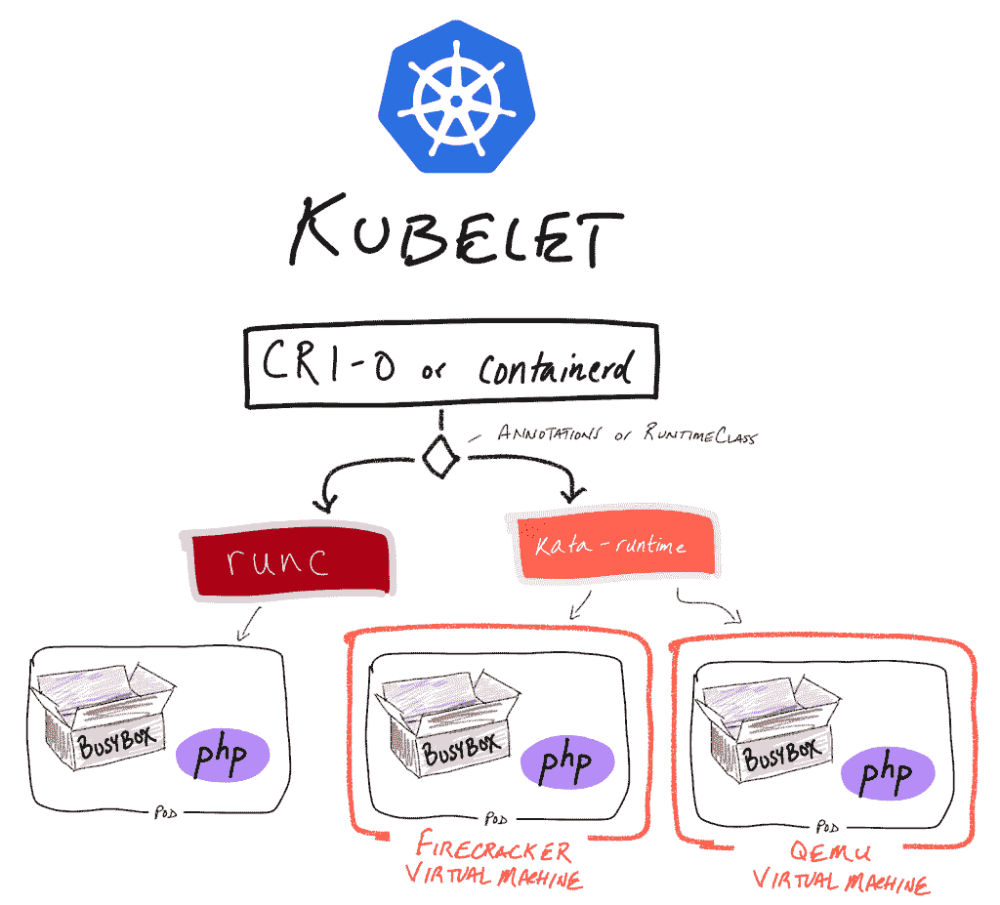

# Kata 容器现在可以和 AWS 鞭炮一起工作来处理短暂的工作负载

> 原文：<https://thenewstack.io/kata-containers-now-works-with-aws-firecracker-for-ephemeral-workloads/>

随着其最新 1.5 版本的发布，开源的轻量级虚拟机 T2 现在可以为亚马逊的鞭炮虚拟机管理程序 T3 工作。

“超大规模公共云，无论是亚马逊、谷歌还是微软，都有某种使用容器的经验，但没有一个能独立运行容器。“容器周围都有一些额外的隔离级别，某种虚拟化技术，”为 Kata 项目提供家园和支持的 [OpenStack Foundation](https://www.openstack.org/foundation/) 执行董事 [Jonathan Bryce](https://www.linkedin.com/in/jbryce) 说。“日常的 IT 商店和开发人员将容器视为完整的解决方案，但是运行世界上大多数容器的人并没有以这种方式使用它们。处于容器游戏顶端的人在其他技术中运行它们。”

因此，Bryce 说， [Kata Containers](https://katacontainers.io/) 的创建是为了帮助“在安全性和隔离性是重中之重的多租户环境中推动容器的采用”。

容器从来就不是一些人喜欢看到的终极解决方案。因此[我们最近就](https://thenewstack.io/this-week-in-programming-kubernetes-future-in-virtual-machines/)[虚拟机、多租户隔离和容器](/kubernetes-and-the-return-of-the-virtual-machines/)展开的整个辩论—嗯，这确实是一直以来的想法。

鞭炮真正擅长的是那些更短暂的工作负载，而 QEMU 可以处理可能需要设备或数据库支持的更高级的工作负载。宣布鞭炮支持的[博客文章](https://medium.com/kata-containers/kata-containers-1-5-release-99acbaf7cf34)提供了一个示例和解释图，写道“在单个集群中使用 runc、kata-qemu(kata-runtime 的 QEMU 配置)和 kata-fc(kata-runtime 的鞭炮配置)是很典型的。”

鞭炮虚拟机管理程序的添加现在允许 Kata 容器的用户在逐个工作负载的基础上选择他们想要运行特定容器的位置——无论是使用鞭炮还是更传统的 QEMU 虚拟机。Bryce 解释说，Bryce 是管理程序的重组，留下了 QEMU 机器模拟器附带的有时不必要的部分。

“QEMU 内置了支持如此多东西的遗留特性。卡塔在卡塔内部创造了一个不同的 QEMU 外形，对它进行了修剪，使它变得更轻，但它仍然基于 QEMU 的骨骼。布莱斯说:“鞭炮是基于 ChromeOS 虚拟化系统的。“AWS 没有回到许多虚拟机管理程序所来自的 QEMU 母公司，而是着眼于谷歌为 ChromeOS 构建的虚拟化系统。它从一开始就被设计成一个苗条的虚拟管理器。AWS 对此进行了修改，引入了一些服务器概念，而不仅仅是 Chromebook 概念。他们采用了开源软件，对其进行了修改，并以鞭炮的形式发布，这使得启动速度更快，开销更低，性能更好。”

除了鞭炮支持之外，Kata Containers 1.5 还包括对 s390x 体系结构的支持和 shim API 的引入，shim API 有可能简化 Kata Containers 与 containerd 的集成方式，并提供从 Kata 运行时直接访问容器级统计信息的能力，这在以前是无法从命令行获得的。

至于 Kata 容器的下一步是什么，Bryce 说，团队正在着手“无聊但重要的工作”,以确保一切都是稳定的，并适当地扩展。毕竟，“使用 Kata 容器的一些人是公共云提供商或中国最大的互联网公司，如百度，”Bryce 解释说，这不仅提供了可扩展性和稳定性很重要的另一个原因，也提供了容器和虚拟机携手并进的另一个证据。

OpenStack 基金会是新堆栈的赞助商。

通过 Pixabay 的特征图像。

<svg xmlns:xlink="http://www.w3.org/1999/xlink" viewBox="0 0 68 31" version="1.1"><title>Group</title> <desc>Created with Sketch.</desc></svg>