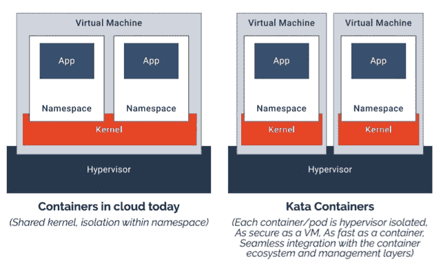

# Kata 容器:用于容器环境的安全、轻量级虚拟机

> 原文：<https://thenewstack.io/kata-containers-secure-lightweight-virtual-machines-container-environments/>

去年的这个时候， [Hyper.sh 容器平台作为 Docker 的替代部署环境出现了，Docker 寻求与虚拟机管理程序(保护和管理虚拟机的组件)达成和平。Hyper 的 **runV** 容器运行时生成在 KVM 兼容的虚拟机中运行的容器映像，使它们可以由 KVM、Xen 和](https://thenewstack.io/hyper-sh-mixes-containers-hypervisors-something-called-hypernetes/)[管理，正如一些人证实的那样，vSphere](https://news.ycombinator.com/item?id=12891584) ，同时提供与 CRI-O 等容器引擎的兼容性

现在，Hyper 不可思议的进化之路的下一阶段发现该平台正在与英特尔的 Clear Containers 架构合并，以生产 [Kata 容器](https://katacontainers.io/)。本月早些时候，在德克萨斯州奥斯汀的 KubeCon 大会上，Kata 收到了 OpenStack Foundation 的祝福和支持，这是该组织第一次支持自己架构之外的项目。

“这与 OpenStack 服务是分开的，”OpenStack 基金会执行董事 Jonathan Bryce 告诉新的 Stack。

“虽然我们支持围绕 Kata 开发技术的项目团队，”Bryce 继续说道，“但它实际上不是 Nova、Swift、Neutron 和 Cinder 等传统 OpenStack 云服务项目的一部分。这不是关于 OpenStack 给 Kata 增加了什么。这实际上是一个独立的项目，有独立的治理、独立的流程和独立的团队。”

布莱斯向我们明确表示，他的公司对新更名的 Kata 项目的财政支持和鼓励并不是为了将一个完整的容器平台纳入 OpenStack。相反，这是一个更广泛的战略的一部分，以确保安全的容器化基础设施的存在，更适用于 OpenStack 一直基于的面向虚拟机的架构。

换句话说，Kata 可能会在 OpenStack 和至少一个与 Kubernetes 有联系的可行容器平台之间保持一个开放通道。它可以在 OpenStack 不必彻底重组自身的情况下实现这一点，因为去年早些时候它似乎不得不这样做。

## 孤立的合并

正如现任 Hyper.sh 首席运营官 James Kulina 告诉新堆栈的那样，Kata——其 [GitHub 页面刚刚推出](https://github.com/kata-containers/community)——将使用 Hyper 的**runV**(*run**vee*)容器运行时，或它的一种形式来合并透明容器。从 Docker 等容器引擎的角度来看， **runV** 在功能上等同于**runC**——这意味着，任何希望与 **runC** 通信的引擎都不会感到意外。 **runV** 组件的主要的，也可能是唯一的区别(除了性能测量之外，对于 Kata 来说还有待确定)是，它适合于生成一个*微型虚拟机*——一个小的虚拟机，但不会小到虚拟机管理程序会将其视为外来对象。

Hyper 最初的使命是提供一个真正隔离但联网的容器，使用与虚拟机管理程序隔离虚拟机相同的技术。英特尔创造了这项技术，所以显然 Hyper 已经吸引了芯片制造商的注意。

“集装箱有什么问题？本质上，它使用基于软件的隔离——名称空间、cgroups，”Kulina 在 Kata 的一次初始工作组会议上说。“还有一个共享内核问题，如果在一台主机上有多个容器，如果其中一个容器被利用，您就有可能访问该主机上的所有其他容器。

“在公共云和其他环境中，人们通常会使用虚拟机管理程序和虚拟化，以及硬件强制隔离，”他继续说道。人们真的相信这一点。公共云全部基于虚拟机管理程序，全部基于虚拟化。没有人抱怨实际的虚拟化。他们真正抱怨的是 VM——你必须模拟整个机器的事实。有了容器，你不用模拟整个机器；您只是将您的应用程序代码发布并部署到一个[开放容器倡议](https://www.opencontainers.org/) (OCI)规范中，或者一个 Docker 映像中。我们采取的方法是，我们能否保护容器，而不增加传统虚拟机带来的所有负担？”

虽然 Kulina 暗示，英特尔和 Hyper 的项目并行解决了这个问题，但并不是完全孤立的。他们的结果有些相似。两人都继续解决他称为集装箱化环境中的一个关键问题:环境的分层，如 OpenStack 上的 Kubernetes，或 Kubernetes 上的 OpenStack，甚至 Kubernetes 上的 OpenStack——所有这些都在去年 5 月波士顿的 open stack 峰会上演示过(板着脸)。“容器编排是堆栈中的一层，Kata 所做的是移除整个层，”Kulina 告诉新堆栈。

“它们基本上是结合在一起的，而不是有一个容器编排层和一个基础设施即服务层，”他继续说道。“你拥有作为一等公民的容器，这是你唯一使用或关心的东西——这是实际上由 Kubernetes 或 Swarm 或你使用的任何引擎编排的东西。有了 Kata，您可以减少堆栈，创建真正的容器即服务系统。”

## 通用件

Bryce 告诉我们，他希望新平台能够利用现有的 OpenStack 社区项目为他们带来好处。他特别提到的一个这样的平台是 [Zun](https://github.com/openstack/zun) ，这是一个独立的努力，使 API 能够启动和提供由 OpenStack 管理的容器。他将 Zun 比作 [AWS 的 Fargate 服务](https://www.google.com/search?q=AWS%20Fargate)，后者从 AWS 客户那里完全抽象出虚拟机管理流程，这些客户在其公共云中旋转容器。

Clear Containers 是英特尔对容器化的实施，遵循 OCI 规范，但它利用自己的 VT 技术来实现虚拟机和虚拟机管理程序之间的直接链接，绕过操作系统。这样，通过浏览器渗入操作系统的恶意代码就无法劫持虚拟机，因为操作系统可以有效地容忍虚拟机，而无需直接管理它。

虽然英特尔正式为 Kata 项目贡献了 Clear，但英特尔对 Clear 的营销是否会被 Kata 所取代还是个疑问。Hyper 的 Kulina 告诉 New Stack，在接下来的几周或几个月内，Clear 平台和 Hyper 平台将继续被分开识别，直到他们各自的开发团队在他们的平台内容方面达到他所说的“对等”，那时他们将开始作为一个联合平台向开源社区展示。

Kata 项目启动的消息已经引起了一些混乱，这是第一印象中经常出现的情况。将并入 Kata 的超级运行时是 **runV** ，它实际上是运行命令的“执行者”。还有另一个容器运行时接收来自 API 调用的命令，对于大多数标准化容器来说，这就是**container d**—[Docker Inc .去年捐赠给云本地计算基金会](https://thenewstack.io/docker-spins-containerd-independent-open-source-project/)的组件。(刚刚发布了一个稳定的 1.0 版本的 **containerd** 。)在一个形系统中，**容器**会被*而不是*替换为 **runV** 。事实上，他们会一起工作，正如 Hyper 的 James Kulina 告诉我们的，他的团队已经与 CNCF 合作，以确保顺利运作。

更准确地说， **runV** 是 **runc** ( *run 参见*)的替代，后者是 Docker Inc .最初推出的容器运行时执行程序，并于 2015 年贡献给 Linux 基金会。

(同样值得重申的是，Hyper 的 runV 与微软的 Hyper-V——其 Windows 系统管理程序——毫无关系。)

Kata 平台将支持容器编排，但不会吸收编排器的功能——这意味着，它不会与 Kubernetes 竞争，也不会试图成为 Kubernetes。去年，Hyper 首席执行官[赵彭](https://www.linkedin.com/in/zhaopeng/)向他当时称之为“Hypernetes”的东西介绍了新的堆栈，将其描述为 Kubernetes 和 OpenStack 的中子组件之间的融合，用于管理软件定义的网络。

Hyper 的 Kulina 告诉我们，该元素将继续得到支持，但以 Stackube 的形式，现在是从赵的努力中分离出来的一个独立项目。Stackube 是 OpenStack 的一个发行版，它不把自己称为一个“分支”，将 Neutron 和 Cinder storage 服务与 Kubernetes 结合起来，代替 Nova 作为计算结构控制器。

## 独立

去年 5 月在 OpenStack 峰会上，Bryce 告诉观众，他认为云服务客户购买和供应的计算能力单位将比现在更小。他没有进一步说明细节，但他没有必要这样做。容器即服务(CaaS)将为这些客户提供在不考虑底层虚拟机的情况下提升应用程序的方法。换句话说，他们不会租赁主机，而是图像。

那么 Bryce 是否认为 Kata 是 OpenStack 交付 CaaS 的一种手段，是对已经成为并将继续成为云工具的实例的有效和完整的替代？

布莱斯回答道:“我认为这绝对是一种方法，我们看到这种方法正在开发新的应用程序，”他没有宣布 CaaS 是未来的记录系统。“我认为虚拟机将在未来许多年存在，因为它们提供了一个看起来和行为上都像服务器的标准环境，这意味着它可以运行任何工作负载。它不需要大量的定制[ *或* ]定制开发。虚拟机不会消失。但容器化的作用是让你考虑如何打包应用程序的元素，即你正在运行的特定代码，以一种在基础设施方面更易于管理的方式。”

OpenStack 基金会对 Kata 项目的投资可以有效地使 OpenStack 平台利用安全容器甚至 Kubernetes 的方式合法化，而无需创建新的 OpenStack 组件或对现有组件进行彻底检查。事实上，这可能是 Kata 对平台有价值的因素:它为 OpenStack 打开了大门，而 OpenStack 不必重新定位它已经建立的大门。

虽然 Kata 不会正式成为 OpenStack 平台的一个组件，但它将为 OpenStack 提供一条清晰的道路，使其成为一个在混合云上实例化和供应容器的自助式系统。虽然 Capital One、 [CERN](https://www.google.com/search?q=CERN%20Kubernetes%20site%3Athenewstack.io) 、易贝和其他 OpenStack 客户已经推出了他们自己的解决方案来集成 OpenStack 和 Kubernetes，但 Kata 可能会为其他组织提供一种替代方案，而不是跟随他们的脚步。

<svg xmlns:xlink="http://www.w3.org/1999/xlink" viewBox="0 0 68 31" version="1.1"><title>Group</title> <desc>Created with Sketch.</desc></svg>