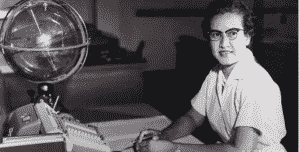
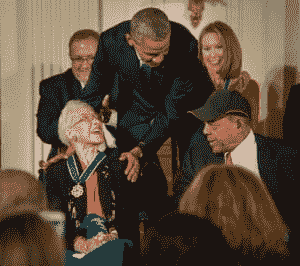

# 凯瑟琳·约翰逊是谁，为什么总统提名她为科技先驱？

> 原文：<https://thenewstack.io/katherine-johnson-president-namecheck/>

在上周二的国情咨文演讲中，美国总统巴拉克·奥巴马将大量注意力放在了技术上，甚至提名了一位大多数技术爱好者都不熟悉的先驱:凯瑟琳·约翰逊。

奥巴马总统说“探索精神存在于我们的 DNA 中”。“我们是格蕾丝·赫柏、凯瑟琳·约翰逊和萨莉·赖德。从波士顿到奥斯汀，再到硅谷，我们每一个移民和企业家都在为建设一个更美好的世界而努力。”

总统提到了一些美国科技先驱:大多数人都知道萨莉·赖德([第一个进入太空的美国女性](http://www.nasa.gov/audience/forstudents/k-4/stories/nasa-knows/who-was-sally-ride-k4.html))，他们可能知道格蕾丝·赫柏([早期的计算机先驱，他创造了“计算机虫”这个词](https://en.wikipedia.org/wiki/Grace_Hopper))，但是凯瑟琳·约翰逊呢？对许多人来说是个谜。

作为一名非裔美国数学家和物理学家，约翰逊在后来成为美国国家航空航天局(NASA)的关键科学和工程职位上工作，在计算机被广泛使用或信任之前，约翰逊帮助解决了行星间轨迹、航天器轨道和太空导航的挑战性问题。

NASA 网站上的一篇文章描述了她的工作:“她做了数学计算。”

她从美国国家航空航天局还被称为国家航空咨询委员会的时候就开始了，那时组织会雇佣女性来进行手工计算[(指的是“计算机”穿裙子的时代](http://www.nasa.gov/centers/langley/news/researchernews/rn_kjohnson.html))。她的工作包括计算飞机阵风减缓。

凯瑟琳·约翰逊坐在办公桌前，手里拿着一个地球仪，或称“天体训练仪”鸣谢:美国宇航局

作为一名在 20 世纪 50 年代工作的美国非裔女性，她无疑面临着种族和性别障碍。但是她在解析几何方面的技能非常扎实，她成为了美国宇航局最受信任的太空科学家之一。

她计算了艾伦·谢泼德 1961 年太空旅行的轨迹。她的声望如此之高，以至于约翰·格里恩在他成为第一个绕地球飞行的美国人之前，要求她重新检查新的电子计算机所做的计算。

“早期的轨迹是抛物线，很容易预测它在任何一点的位置，”约翰逊解释道。“早些时候，当他们说他们想让太空舱在某个地方降落时，他们试图计算它应该什么时候开始。我说，‘让我来吧。你告诉我你什么时候想要它，你想让它在哪里着陆，我会倒着做，然后告诉你什么时候起飞。那是我的强项。"

“我们编写了自己的教科书，因为没有其他关于太空的教科书，”她说。“我们只是从我们知道的开始。我们不得不回到几何学，把这些东西都弄清楚。因为我在开始，我是那些幸运的人之一。”

奥巴马总统问候凯瑟琳·约翰逊。

她还是 2015 年 11 月颁发的[总统自由勋章](https://www.whitehouse.gov/blog/2015/11/25/honoring-nasas-katherine-johnson-stem-pioneer)的获得者。

“凯瑟琳·约翰逊的领导力和影响力从全美的教室一直延伸到了月球，”在颁奖仪式上，[美国宇航局副局长达瓦·纽曼](https://www.nasa.gov/press-release/nasa-statements-on-katherine-johnson-s-medal-of-freedom)说(你可能错过了尤吉·贝拉、格罗丽娅·埃丝特凡和斯蒂芬·斯皮尔伯格之间的这一幕)。

“凯瑟琳……提供了一个有朝一日允许美国宇航局将宇航员送上火星的基础。她真的写了关于火箭科学的教科书。”

但是为什么是自由勋章和 STOU 大喊？

奥巴马总统在任期间一直非常积极地推动 T4 女性从事 STEM(科学、技术、工程和数学)工作，并在白宫网站上收集她们的故事。

“凯瑟琳，”纽曼继续说道，“已经选择在鼓励年轻人追求科学、技术、工程和数学的 STEM 学科教育方面发挥主导作用。”

也许值得一提的 STEM 女性不仅是对科技领域女性的鼓励，也是对他的女儿们的一种无声呐喊，其中一个女儿将于今年秋天进入大学。

特征图片: [NASA](https://commons.wikimedia.org/wiki/File:Katherine-johnson.jpg) 。

<svg xmlns:xlink="http://www.w3.org/1999/xlink" viewBox="0 0 68 31" version="1.1"><title>Group</title> <desc>Created with Sketch.</desc></svg>