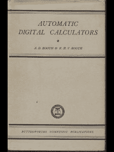
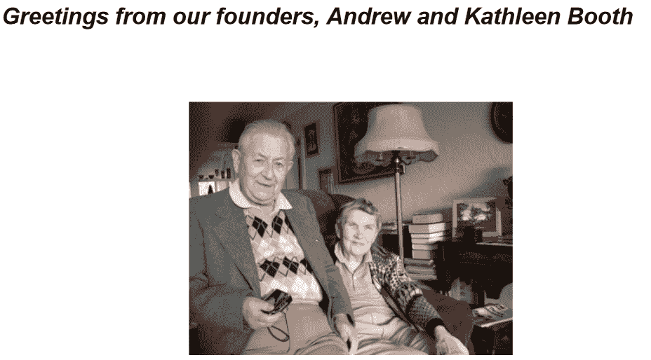

# 凯瑟琳·布斯，第一个汇编语言的创造者

> 原文：<https://thenewstack.io/kathleen-booth-creator-of-the-first-assembly-language/>

凯瑟琳·布斯去年 7 月庆祝了她的 100 岁生日，她的一生充满了历史性的里程碑。她参与设计了世界上第一台可操作的计算机。她被认为是第一个“汇编语言”，她写了两本最早的关于计算机设计和编程的书。

布斯于 9 月 29 日去世，她用富有成效的研究、有意义的创新、鼓舞人心的遭遇——以及与 20 世纪几个重大技术里程碑的关系——充实了自己的岁月。

简而言之，凯瑟琳·布斯漫长的一生将她带到了她那个时代的前沿，带到了现代研究的前沿——而且常常进入不仅仅局限于计算机器的领域。

## 自动化的激励措施

布斯在《每日电讯报》上的讣告指出，在获得数学本科学位后，布斯实际上参与了 DNA 双螺旋形状的发现。24 岁时，她加入了伦敦伯克贝克学院的一个数学家团队，为科学家们利用 X 射线图像确定晶体结构进行计算。

但是研究是通过计算来增强的，在这种情况下，“所涉及的计算极其繁琐，”T2 在伯克贝克学院的网站上回忆道，“而且有足够的动力来自动化这一过程。”(他们还指出，布斯是这个项目唯一的编程助理，而这个项目从来没有一个以上的工程师。)

据《每日电讯报》报道，这导致了一次命运多舛的跨大西洋旅行，从而引领了计算机新时代的前沿。布思未来的丈夫安德鲁·布思获得了洛克菲勒基金会的奖学金，这使得安德鲁和他 25 岁的编程助理凯瑟琳可以去拜访普林斯顿大学的曼哈顿计划物理学家/数学家[约翰·冯·诺依曼](https://en.wikipedia.org/wiki/John_von_Neumann)。冯·诺依曼最近与人合著了一篇有影响力的论文，提出计算机程序可以被*存储*(而不是使用开关和跳线的复杂组合将它们输入硬件)。“想象一下，你必须通过重新布线来给你的电脑编程……”hack aday2018 年的一篇文章打趣道。

“凯瑟琳·布斯开始从事计算机工作时，内部存储程序的想法正开始渗透到建造计算机的一小群人中。”

据一个名为[*信息历史*](https://historyofinformation.com/detail.php?id=652) 的网站称，在那里，安德鲁·布斯和凯瑟琳编写了一个可以充当翻译词典的程序(前提是它有足够的存储空间)。该网站认为，这个程序“可能是最早的机器或计算机翻译工作。”

访问归来后，安德鲁·布斯和凯瑟琳[准备了一份打字报告](https://www.dcs.bbk.ac.uk/site/assets/files/2955/1-568x791.jpg)，报告承认与冯·诺依曼“在理论和实践方面进行了许多富有成效的讨论”。(他们还对冯·诺依曼传奇的电子计算机项目[和美国陆军军械署提供的“款待和学习机会”表示感谢。)](https://www.ias.edu/electronic-computer-project)

但最重要的是，这份报告记录了他们对“通用电子计算机……一种能够对所有可能的计算进行编程，并以电子速度执行这种程序的机器”的兴趣。他们的最终目标是生产一台名为自动继电器计算器(“ARC”)的计算机，凯思琳和安德鲁·布斯一起致力于这项工作。

但是是凯瑟琳创造了识别操作的汇编语言——以及可以将其代码转换成计算器可以运行的机器语言的汇编程序。Hackaday 写道，指令用 0 和 1 表示，所以清除数学寄存器然后从内存中传入一个值的命令是 10011(在后来的 ARC2 上)。Hackaday 指出，这使得 Kathleen 成为世界上第一批编写软件的人之一。

“但她也参与了硬件工作，她设计的计算机有很大一部分是她自己制造的。”

《每日电讯报》报道称，凯瑟琳于 1950 年获得了应用数学博士学位(同年她也嫁给了安德鲁·布斯)。但更重要的是，伯克贝克学院网站补充说，“1952 年底，伦敦大学伯克贝克学院计算实验室的电子存储程序计算机全面投入运行。”

据《每日电讯报》报道，1953 年，这对夫妇合著了《自动数字计算器》一书，该书“包括了新的‘规划和编码’编程风格所涉及的一般原则”，是有史以来最早的计算机设计和编程书籍之一。(据 Hackaday 称，这本书还包括这对夫妇尝试用于自然语言处理的一些算法。)

自动数字计算器小册子的封面

写于近 70 年前，“这本书发生在晶体管、阴极射线管、打印机、软盘甚至存储芯片之前，”亚马逊上的一位评论家写道，称其为“过去的美丽闪光，当时每一个渐进的进步都只是革命性的。”

“有一些很棒的、不经意间提到了行业巨头，例如，当他们提到他们如何与计算机发明者匈牙利人约翰·冯·诺依曼聊天，讨论如何应用他的架构。”

## 机器、书籍和计算机科学系

《每日电讯报》回忆说，凯瑟琳和她的丈夫在学院一直呆到 1962 年，“从事其他计算机设计，包括通用电子(X)计算机(APEXC)……为此，凯瑟琳在 1959 年发表了自动数字计算器的开创性*编程。”*

Hackaday 认为 Kathleen 为这些机器编写了软件，而展台本身后来将 APEXC 誉为“世界上第一台可操作的计算机之一”。但半个多世纪后，他们在为该学院计算机科学与信息系统学院(这对夫妇于 1957 年共同创建了该学院的数字自动化系)50 周年纪念撰写的一篇特别论文中发表了上述言论。

“生产出机器后，我们需要教材，”文章补充道，“因此产生了第一本关于现代数值分析、编程和计算机设计的系统书籍。”

“在研究方面，我们开始研究机器翻译、用于数字存储的薄膜存储技术以及[磁鼓和磁盘存储](https://collection.sciencemuseumgroup.org.uk/objects/co62443/experimental-magnetic-drum-store-memory-devices)。”布斯的论文附有该部门的简短历史，其中指出，安德鲁·布斯创建了第一个旋转数据存储，“尽管是一个鼓，而不是现在无处不在的磁盘。”

布斯的文章以提醒下一代学生他们是“杰出血统的携带者”而结束

伯克贝克学院 2007 年计算机科学与信息系统学院“简史”文档的截图

一旦配备了这些新的计算机，就很自然地运用它们的能力来解决当时的问题。哈卡戴还发现了伯克贝克学院在 20 世纪 50 年代末的两份年度报告，这两份报告都承认凯瑟琳·布斯的模拟神经网络程序。(Hackaday 指出，“这仅仅是在计算机上首次运行神经网络的四年之后。”)

但是到了 1962 年，安德鲁·布斯对自己还没有被任命为教授感到“沮丧”——所以他们夫妇搬到了加拿大。(计算机系的“简史”补充道，“回想起来，这是学院的巨大损失，从今天的角度来看，鉴于他对计算机技术的关键贡献和巨大的研究成果，这是完全不可理解的。”)在加拿大，据《每日电讯报》报道，布斯成为了萨斯喀彻温大学的讲师/研究员。(“1965 年，一个关于语言机器翻译的国家项目的负责人。”)

更多的荣誉接踵而至——1972 年，布斯成为安大略省莱克海德大学的数学教授，1978 年，这对夫妇在温哥华岛创办了一家计算机咨询公司。

布斯一生致力于实用和重要的研究——所以令人鼓舞的是，它的大部分仍然可以在网上找到。你甚至还能找到 1993 年一篇论文的摘要，这篇论文是 71 岁的布斯和她的儿子伊恩·j·m·布斯博士合著的:*利用神经网络识别海洋哺乳动物。*(“已经构建了一个识别单个海豹叫声的软件神经网络模型，并已证明对可用集合中的所有哺乳动物的表现令人满意。事实证明，它在人造和自然噪音中都很稳定…”)

但也许最重要的是，凯瑟琳·布斯将因为她对计算机历史早期的开创性贡献而被人们永远铭记。当妇女工程学会(成立于 1919 年)庆祝其成立 100 周年时，他们创造了一个[100 位历史上最伟大的工程女性](http://www.magnificentwomen.co.uk/top-100-women.html)的名单。

果然，名单[中包括凯瑟琳·布斯](http://www.magnificentwomen.co.uk/engineer-of-the-week/39-kathleen-booth)，她被列为“世界上最早的三台运算计算机之一的联合设计者，以及两本最早的计算机设计和编程书籍的作者。”

<svg xmlns:xlink="http://www.w3.org/1999/xlink" viewBox="0 0 68 31" version="1.1"><title>Group</title> <desc>Created with Sketch.</desc></svg>