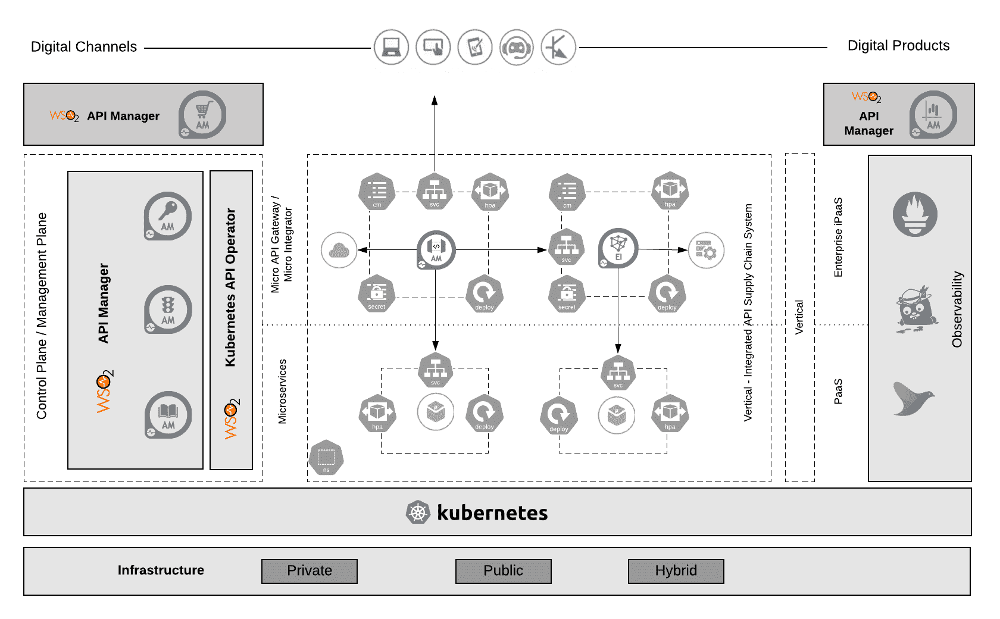

# 云原生数字企业的关键组件

> 原文：<https://thenewstack.io/key-components-for-a-cloud-native-digital-enterprise/>

 [拉克马尔·瓦鲁萨威塔纳

Lakmal 是 WSO2 开发者关系高级主管。Lakmal 在开源、云和 DevOps 技术领域有很长的工作历史，并且是 Apache Stratos PaaS 项目的副总裁。Lakmal 是 Ballerina 的容器化和部署编排的架构师，Ballerina 是一种云原生开源编程语言。他在许多活动中发表过演讲，包括 ApacheCon、CloudOpen、QCon 和 JaxLondon。](https://www.linkedin.com/in/lakmal-warusawithana-b8191450/) 

最近对企业的限制促使组织加快将运营转移到数字世界的计划，通常将时间表从几年缩短到几个月。在这个过程中，原料药已经成为 21 世纪的产品。

云原生技术和 API 主导的集成平台相结合，通过自动化和服务实现敏捷性、灵活性和可扩展性，从而提高工作效率。有关该方法的更多详细信息，请参考[云原生数字企业参考架构](https://github.com/wso2/reference-architecture/blob/master/reference-cloud-native-architecture-digital-enterprise.md)。

本文主要关注使用 Kubernetes 和 API 主导的集成平台实现云原生数字企业所需的重要组件。请注意，这些图展示了 WSO2 开源产品的参考实现，它们支持完整的 API 生命周期管理和集成。该平台在一份关于 API 管理软件的 [Forrester 报告中被评为领导者](https://wso2.com/resources/analyst-reports/the-forrester-wave-api-management-solutions-q3-2020/)。

Kubernetes 是一个开源的云原生编排平台，它提供了一套完整的云原生抽象和一个工具包来构建一个可扩展的、灵活的解决方案，以适应业务增长。

图 1:云原生数字企业架构。

## 对于企业集成和 API 管理

理想的解决方案应该有一个 API 设计者和发布者、一个开发者门户、一个密钥管理器、一个 API 分析服务器、一个 API 网关、一个企业集成商和一个 Kubernetes 运营商。该平台应该安装在 Kubernetes 之上，通过 Kubernetes 操作者提供本地支持。这种本地集成不仅提供了必要的自动化、可扩展性和操作，还提供了 API 主导的集成功能。

该平台还应该为 API 开发和管理提供一个 web 界面，即 API 设计者和发布者。它还应该 100%符合开放 API 规范，帮助 API 创建者开发、记录、扩展和版本化 API，同时还可以促进 API 管理相关的任务，如发布、货币化和推广 API。

图 2:一个 API 设计者和发布者。

另一个关键组件是 API 开发者门户，这是一个发现和接纳具有低摩擦体验的开发者的中心。开发人员 API 门户使开发人员能够找到 API，在订阅和消费前对其进行测试，使用特定指标计算货币化，通过论坛等方式查看消费者的反馈和功能请求。

图 API 开发者门户。

该解决方案应该具备促进微集成的能力，支持集中式(ESB 风格)和分散式(微服务、云原生)架构风格。它还应该使用户能够实现流式 ETL(提取、转换和加载)、变更数据捕获(CDC)以及处理大型文件和实时 API。

API 网关是主要的策略执行点。它应该理想地支持 OAuth 2.0、JWT、基本认证、相互 SSL 和基于 API 密钥的认证机制；此外，使 IT 团队能够实施速率限制和节流策略。通常，微服务不会单独行动，它们通过 API 调用相互连接。API 网关应该与云原生可观察性工具(如 Prometheus、Jaeger 和 Fluentd)一起工作，以分析这些捕获的指标、统计数据和数据，从而产生有意义的可视化效果来了解系统行为。

## 通过 Kubernetes 操作模式实现自动化

Kubernetes 操作员为云原生 API 管理提供了完全自动化的体验。定制资源有助于在 Kubernetes 中轻松部署和管理 API 主导的集成构件。

图 4:Kubernetes API 操作符。

Kubernetes 操作员应该能够通过读取 API 开发者/发布者提供的 Swagger 定义或集成定义来创建和部署 API 微网关和微集成。这些网关和集成器连同必要的 Kubernetes 部署构件一起自动部署到已定义的 Kubernetes 集群中。

## 带 GitOps 的 CI/CD

GitOps 是实现云原生应用持续部署的一种方式。它结合了 git 和持续部署工具的功能，并在操作基础设施时提供了以开发人员为中心的体验。

在数字企业中，发布 API 不仅仅是一个简单的过程。它包括创建 API，然后将它们部署在一个较低的 API 管理环境中，以通过不同的测试回合(开发人员测试、压力测试、QA 测试等)。).一旦这些测试成功，它们就会转移到生产环境中。

图 5:使用 GitOps 的 API CI/CD 自动化。

理想情况下，每个部署环境都应该有一个特定的 Kubernetes 集群，配置有 Kubernetes API 操作符和 API 管理组件。根据企业需求，可以配置 API 管理组件，如 API 发布器、API 流量管理器、密钥管理器和开发人员门户。

## 结论

通过成为数字化企业和数字化价值链，任何行业的公司都可以集成并将其业务能力作为 API 公开。这些 API 应该得到保护、管理、观察和货币化。一个 API 主导的集成平台对于数字企业来说是必不可少的，无论他们是从绿地项目还是棕地项目开始。

Kubernetes 提供了一套完整的云原生抽象和一个工具包来构建一个可扩展的、灵活的解决方案，以适应业务增长。您选择的平台应该具有本地 Kubernetes 集成功能，以提供成功的数字企业架构。如果您想了解有关此参考实施的更多信息，请阅读完整的云原生数字企业参考实施。

通过 Pixabay 的特征图像。

<svg xmlns:xlink="http://www.w3.org/1999/xlink" viewBox="0 0 68 31" version="1.1"><title>Group</title> <desc>Created with Sketch.</desc></svg>