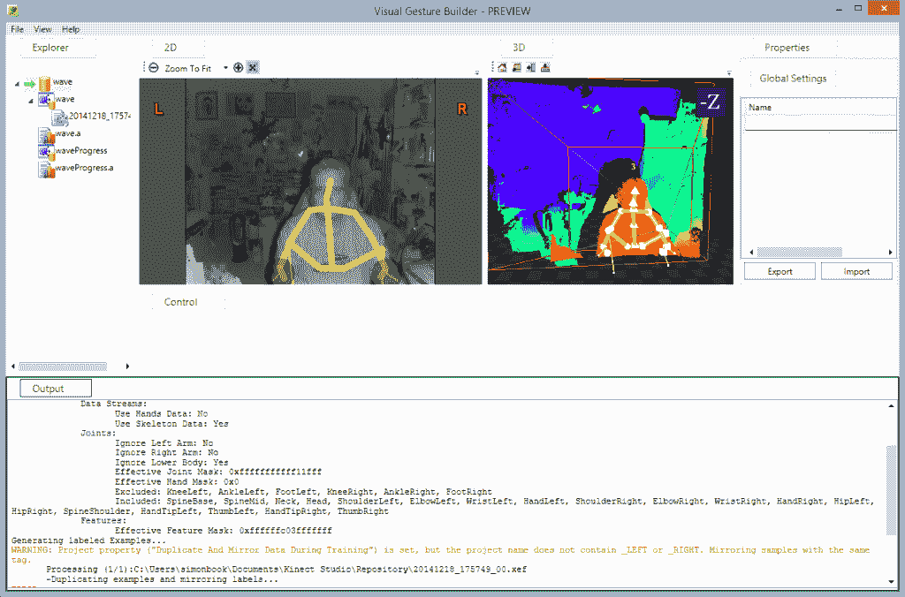

# 用于应用开发的 Kinect

> 原文：<https://thenewstack.io/kinect-for-app-development/>

随着我们远离台式电脑的世界，我们与电脑互动的方式也在改变。这一举动的一部分是为了移动和触摸的亲密世界，但我们需要考虑另一组交互:我们如何与新一代墙壁大小的显示器合作。

这就是深度相机的用武之地，这是一种成本相对较低的设备，可以跟踪手和身体，甚至是一整群人，让我们能够与大型显示器(LCD 面板或投影)进行协作互动。这些相机中最成熟的是微软的 Kinect 传感器。也许最出名的是作为一种在 Xbox 上与游戏互动的新方式，它也是一种为更传统的应用程序添加 3D 人体互动的工具，带来了只能被描述为少数报告风格的手势。

构建这些新应用应该很容易，而且不应该很贵。这是最近发布的 Xbox One 第二代传感器的低成本 Kinect-to-PC 适配器的信息。你不必再购买单独的 PC 版 Kinect 传感器，适配器将你现有的 Xbox Kinect 连接到 PC。下载 SDK，您就可以开始构建交互式应用了。

虽然 Kinect for Windows 的成本很低，但它仍然是一项要求很高的技术。在您的开发 PC 中，您不仅需要一块巨大的显卡，还需要一个专用的 USB 3.0 控制器。这是因为它推动了大量的数据。3D 图像将比同等的 2D 抓取大得多。然后，处理深度数据以提取面部点、手势或骨骼模型。

在我将 Kinect 连接到测试系统后不久，我与 Kinect 团队的 Chris White 进行了交谈，以了解 Kinect v2 及其 SDK 将为开发人员带来什么。“你可以使用传感器的核心功能，”怀特告诉我，“一直到骨骼追踪。”Kinect APIs 适用于在 C++中工作的低级 Windows 开发人员，以及基于的高级应用程序。NET，并通过 WinRT for Windows 应用商店应用。

怀特指出，Kinect APIs 的功能始于其面部识别功能。使用 Kinect v2 的彩色摄像头，它覆盖了一个 2D 网格，随着扫描的面部移动而变形。“我们使用的每个网格都明显更好，”他告诉我们，“最初的 Kinect 网格有 93 个顶点，而我们只有 1400 个。”这就是近在咫尺的扫描脸和来自恐怖谷另一端的令人毛骨悚然的复制品之间的区别。

这是一项微软已经在 Kinect Sports 等游戏中使用的技术，用于创建看起来像玩家的化身。在游戏世界之外，像这样的详细网格捕捉不仅可以用于面部检测，还可以用于创建对象的详细 3D 网格。一旦你有了一个网格，它就可以用来构建怀特所说的“动画单元”，为模型上的渲染项目提供一个框架；这种方法给在线商店提供了一面魔镜，让你可以看到衣服的样子，从而降低退货成本。

这导致了 SDK 内置的一个有趣的功能:Kinect Fusion。通过在物体周围移动传感器(也许是通过在固定的 Kinect 前面使用转盘)，您可以快速生成物体的 3D 点云，将单个 Kinect v2 变成 3D 扫描仪。好的显卡必不可少，而且越快越好。最快的卡将实时工作，较慢的卡将需要一些处理时间来建立 3D 模型。

随着 3D 打印机作为原型制作工具变得越来越普遍，很容易想象使用连接到 CAD 工作站的 Kinect 来快速捕捉物理对象以包含在草图中。扫描的对象可以转换为 3D 打印模型-由于 Kinect v2 可以捕捉颜色信息，因此可以在最新的 3D 打印机上进行彩色打印。微软最新版本的 Windows 8.1 3D Builder 打印工具使用 Fusion 来捕捉模型，这些模型可以直接发送到打印机，或用于建模应用程序。虽然在 carbonite 中把自己塑造成韩可能是一件新鲜事，但这是物理和数字开始融合的一个例子。

厨房电器制造商 Amana 提供了一个如何使用 Windows 最新版本 Kinect 的例子，该公司将 Kinect 作为其商店展示的关键组件。过去，展示设备经常需要修改以增加交互性，这使得它们无法销售。使用 Kinect 在显示屏上添加人物和手势识别功能，不仅意味着地面设备可供销售，还可以更容易地吸引顾客。

三种不同的 Kinect v2 用作深度传感器。一个在单元下面，向上看，两个在顶部，向下看。这种组合创建了一组 3D 热点，当人们穿过它们时触发事件；并且通过确保动作是故意的，给显示器后面的 PC 一个相对简单的机制来确定意图。如果一位潜在客户走向洗碗机并打开门，显示屏就会开始显示关于该设备的信息——就像一名专职销售人员与客户互动一样。为了将人们吸引到显示屏上，主屏幕使用了一群蝴蝶和 Kinect 的骨骼跟踪。步入热点的边缘，蝴蝶会飞入你身体的轮廓，引导你进入展示。

Kinect for Windows SDK 的一个功能是一个有趣的例子，说明了下一代技术是如何让开发人员的生活变得更加轻松的。视觉手势生成器使用机器学习技术来创建手势识别代码；例如识别波。

正如怀特指出的那样，“人们做手势的方式各不相同，这使得人们很难区分有意和无意的手势。我们已经做了大量研究，探索捕捉事物的正确方式，记录一群人做的事情，然后输出用于事件的代码。”这种方法对标志性的手势很有效，比如高尔夫挥杆或足球踢腿。机器学习捕捉手势的共同元素，并产生可用于广泛用户的通用代码。

还有其他问题，其中之一是在 3D 空间中处理手势的问题。将双手触摸手势引入 3D 似乎是合乎逻辑的，但用户会感到不舒服，软件也很难识别。我们需要的是一个足以适应自然行为的系统，这意味着一旦你有了目标，你需要给用户反馈——就像 Amana 系统中的蝴蝶一样。怀特把这种方法描述为“首先你要确立意图，然后你就进入了‘成功的深渊’”。

Kinect for Windows 如何处理这一问题的一个例子是它的手状态识别，它使用一只张开的手和一只握紧的拳头作为抓握物体的工具。SDK 增加了可以被认为是轨道的东西，用于将抓取的物体拉入和拉出飞机。这是一组比触摸 UI 更简单的交互，但是它可以让你处理相同的任务。

怀特认为 Kinect for Windows 开创了一套新的人机界面模式，“对于安装来说，这是一种吸引、参与和互动的模式，最终是一种交易。”虽然这在很大程度上是由最初的 Kinect 开创的，但新的硬件和新的 SDK 使该系统更易于使用。“我们提高了分辨率，并增加了更多的反馈回路”，怀特指出。“拿着骨骼定位工具。我们改进了关节建模的方式，这使得它更适合物理治疗应用。”

最新版本的另一个重大变化是可以同时使用传感器的应用程序的数量。有了 Kinect v1，只有一个应用程序可以访问摄像头。v2 改变了这种情况，任何数量的应用程序和组件都可以同时工作。像 Amana 这样的交互式商店显示器可以使用同一个传感器来分析商店流量和进行客户互动。

微软还将 Kinect v2 带出传统的 Windows 开发者生态系统，增加了对 Unity 游戏引擎的支持。使用 Unity 这样的高级工具来构建交互有很大的空间，正如 White 指出的，“许多交互体验看起来像简单的游戏。”随着 Unity 被用作可视化引擎，添加 3D 交互作为一种为新一代大型墙壁屏幕提供房间规模和多用户支持的方式非常有意义。

Kinect 不仅仅是一个新奇的东西。这是我们如何将开发模型和界面扩展到物理世界的标志。自然的用户界面是复杂的东西，建立在文化和个人的反应之上。他们依赖于新的硬件和新的开发方式，混合了自动化代码生成和熟悉的 API。微软首席执行官塞特亚·纳德拉谈论一个“无处不在的计算和环境智能”的世界。这是一个宏大的愿景，也是过去几十年来计算机研究的驱动力。正是这些技术奠定了未来的基础。

<svg xmlns:xlink="http://www.w3.org/1999/xlink" viewBox="0 0 68 31" version="1.1"><title>Group</title> <desc>Created with Sketch.</desc></svg>