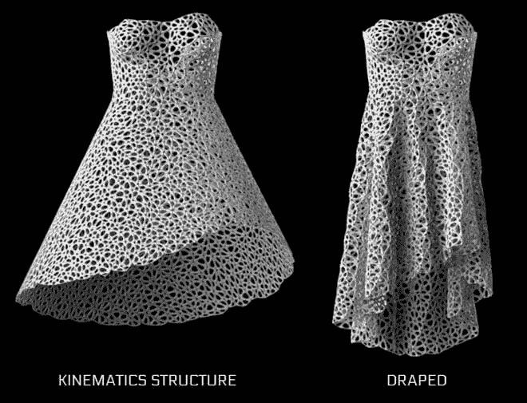

# 运动学:折纸艺术启发了 4D 印花服装，这种服装穿起来可能会很舒服

> 原文：<https://thenewstack.io/kinematics-origami-inspired-4d-printed-clothing-might-actually-comfortable-wear/>

精心定制的服装似乎在很大程度上已经成为过去，现在只保留给专属 t 台，体现一些设计师的高级定制理念。但是，随着 3D 打印机拥有了从 [定制假肢](https://thenewstack.io/robo-prosthetics-for-the-masses-is-a-future-ready-to-happen/) 到负担得起的 [为每个人量身定制的基因药物](https://thenewstack.io/autodesks-project-cyborg-is-a-cloud-based-platform-for-programming-matter-bio-engineering/) 的一切承诺——所有这些都有可能在家里打印出来——想象一下，能够在你的桌面上打印出定制的、预先组装好的流体服装。

> 在不久的将来，我们会在家里打印舒适的、定制的、不需要组装的服装吗？

位于马萨诸塞州萨默维尔的设计工作室[neurosystem](http://n-e-r-v-o-u-s.com/)是这种被称为“ [4D 打印](https://thenewstack.io/shapeshifted-things-4d-printed-materials-programmed-for-self-transformation/)”服装的新开发的先驱，这种服装是动态生成的，完全可定制的，并且可以在打印机上自行组装——不需要缝合或手工组装。

https://www.youtube.com/watch?v=wdRswasftfI

## 灵感来自折纸镶嵌

神经兮兮给他们的软件冠以 4D 印刷[运动学](http://n-e-r-v-o-u-s.com/blog/?p=4467)的称号。灵感来自折纸，折叠镶嵌，这是一个系统，“创造复杂的，由铰接模块组成的可折叠形式。”这项技术并不完美，但它与早期的 3D 打印服装相比已经有了很大的进步，早期的 3D 打印服装似乎更适合 t 台，而不是日常穿着。直到最近，多种材料和多种颜色的 3D 打印才允许设计师进行更多的实验，并摆脱了许多以前设计中的硬质白色塑料。设计师的下一步是探索如何让 3D 打印的服装更加自然地移动，更有效地打印，因为你在时装秀上看到的许多定制服装令人惊讶地需要数小时艰苦的手工组装。

然而，运动学系统有几个相对的区别:它“将计算几何技术与刚体物理学和定制相结合”，这意味着它可以使用 3D 打印将任何三维形状转化为灵活的结构，同时还使用基于碰撞的模拟来压缩结构，以便可以使用桌面打印机创建它。设计师解释道:

> 运动学产生由 10 到 1000 个独特的组件组成的设计，这些组件互锁以构建动态的机械结构。每个组件都是刚性的，但总的来说，它们就像一个连续的织物。尽管由许多不同的零件组成，这些设计不需要组装。相反，铰链机构是 3D 打印的，直接在机器上工作。

> 它几乎就像一套 3D 打印的锁子甲，通过计算神奇地预先组装起来，并从一整块粉状材料中考古发掘出来。

这与人们所能获得的传统时尚感相去甚远。但是，神经系统进入自我组装 4D 印花服装的举动源于一系列特殊的环境，始于 2012 年与摩托罗拉的合作。这家电信公司要求 neurosystem 的创始人杰西卡·罗森克兰茨(Jessica Rosenkrantz)和杰西·路易斯·罗森伯格(Jesse Louis-Rosenberg)为他们的一款新手机创建一个应用程序，让用户在不到一个小时的时间内使用低成本 3D 打印机创建和打印定制的对象，该公司将在一辆货车上环游美国。

从这些具体参数中，Rosenkrantz 和 Louis-Rosenberg 旨在最大限度地提高低成本 3D 打印机在速度方面的限制，并消除产品打印后的手动组装需求。使用折叠的想法，折纸一样的镶嵌作为他们图案化产品的正式基础，他们开发了一种算法，根据任意复杂的图案自动生成铰链机制，允许计算过程更快，更独立地按需生产。这些早期实验的结果是用 JavaScript 编写的两个基于浏览器的 WebGL 应用程序: [Kinematics](https://n-e-r-v-o-u-s.com/kinematics/) 和 [Kinematics @ Home](http://n-e-r-v-o-u-s.com/kinematicsHome/) ，这两个应用程序都允许用户定制自己的项链、耳环或手镯，要么在家里打印，要么通过在线订购。

Rosenkrantz 和 Louis-Rosenberg 意识到了这一框架的巨大潜力，于是他们继续改进软件，并将其与 3D 人体扫描相结合，以生产出更大、更复杂和个性化的物品，例如一件紧身胸衣，最后是一件看起来足够舒适的全尺寸自由造型连衣裙。值得称赞的是，Rosenkrantz 会连续几个小时亲自测试每件产品，以进一步完善每件设计。

新版本的运动学软件允许用户操作参数曲线，这些曲线可以随他们的移动而细化。Louis-Rosenberg 说:[选择使用选择性激光烧结(SLS)来制造礼服为创造更大更复杂的作品打开了大门](http://n-e-r-v-o-u-s.com/blog/?p=4516)

从基于挤压的印刷转向基于粉末的印刷最令人兴奋的事情是，我们现在可以设计出非自支撑的物体。虽然运动学最初是为了打印平面的三维物体而开发的，但允许物体在空间的任何地方都开辟了新的可能性。[..]然后，这些结构可以数字化地折叠成更压缩的形状，从而能够构建比 3D 打印机的构建体积大得多的物体。

## 复杂的连衣裙

运动学服装的第一个版本由 2279 个独特的三角形面板组成，由 3316 个铰链相互连接，所有这些都是由纽约的[Shapeways](http://www.shapeways.com/)3D 制作的统一尼龙结构。这件独一无二的衣服是在基于网络的应用程序[运动学布料](http://n-e-r-v-o-u-s.com/kinematicsCloth/)(它也允许用户定制衬衫和裙子)中创建的，最近[被现代艺术博物馆](http://www.dezeen.com/2014/12/09/moma-acquires-first-4d-printed-dress-nervous-system-kinematics/)收购，让我们了解到这一发展对于 21 世纪的时尚可能具有多么重大的意义。

> 想象一下:不再有纺织废料，不再有血汗工厂，不再有不合身的衣服。这可能意味着手工服装的衰落，但它可能是未来的时尚，非物质化。

当然，仍然有一些东西需要调整:运动学礼服花了整整 48 个小时和 3000 美元来打印，这意味着它还没有做好商业化的准备。这并不完全是我们习惯的时尚，但无论如何，除了不断地将被视为前卫的东西重新构建成平凡和习惯的东西，还有什么是时尚呢？

<svg xmlns:xlink="http://www.w3.org/1999/xlink" viewBox="0 0 68 31" version="1.1"><title>Group</title> <desc>Created with Sketch.</desc></svg>