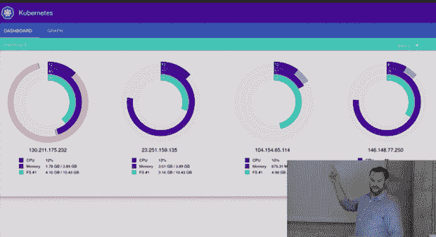

# Kismatic 模仿 Docker 成为 Google Kubernetes 平台的锚

> 原文：<https://thenewstack.io/kismatic-hopes-foster-ecosystem-contributing-webui-code-kubernetes-project/>

初创公司 Kismatic 采取了雄心勃勃的战略，将自己打造为新兴的 Kubernetes 开源项目的核心商业开源公司。首席执行官 Patrick Reilly 开玩笑地将 Kismatic 称为“不是谷歌的 Kubernetes 公司”和“中间层对 Mesos 来说是什么，我们希望成为 Kubernetes。”

Reilly 的商业模式是让 Kismatic 成为 Google 的开源容器集群管理器 Kubernetes 的首选分发服务提供商。为了做到这一点，Kismatic 已经开始(与谷歌合作)向 Kubernetes 贡献一个核心可视化项目，以使最终用户更容易使用，并且正在以一种试图模仿 Docker 成功的模式建立生态系统资源。

为了展示他们的诚意，并在处于非常早期阶段的生态系统中赢得潜在企业客户的尊重和兴趣，Kismatic 通过向开源项目贡献 web UI 代码，致力于为 Kubernetes 框架做出实质性贡献。

Reilly 说:“代码现在可以公开访问，并且[在合并请求中被合并到 Kubernetes](https://github.com/GoogleCloudPlatform/kubernetes/pull/5834/commits) 。这将是默认的 web 用户界面:您可以看到图形可视化，基本上可以获得有关群集的统计信息

## 通过图形界面管理 Kubernetes 集群

Reilly 最初在二月底举行的 Kubernetes 谷歌云平台会议上展示了这个概念和正在进行的工作:

[https://www.youtube.com/embed/k_J5trNqpoQ?list=PL69nYSiGNLP2FBVvSLHpJE8_6hRHW8Kxe](https://www.youtube.com/embed/k_J5trNqpoQ?list=PL69nYSiGNLP2FBVvSLHpJE8_6hRHW8Kxe)

视频

最终，Kismatic 希望能够向企业销售 Kubernetes 集群管理解决方案，但在 Reilly 看来，Kubernetes 首先需要更容易访问。Reilly 说:“第一步是能够在界面中完成所有工作，然后满足企业对集群端到端安全性的要求。

因此，Kismatic 团队构建了 web UI，以便 Kubernetes 用户可以可视化地管理他们的集群:

“我们发现，当你转向集装箱化时，用户开始注意到‘这个过程需要这种类型的资源’，等等。，如果我们能看到那些特征，我们就能为它们建立更好的设置。这是真正高度优化的东西，占用空间小得多。有了 web UI，您可以更有效地使用硬件。子流程可能已经占用了 100%的空间，但是转移到容器使用的资源更少，所以我们可以限制资源，我们可以使用有趣的技巧，比如运行并行状态。

> “对我们来说，最主要的是一个标准的着陆点，以便观察您的集群。这些选项卡是可加载的组件。web UI 位于 Kubernetes 的核心，但如果你有专有组件，你可以把它们放到 web UI 中，但永远不要把代码发布到你的实验室之外。”

赖利说，当他第一次构思如何创建显示 Kubernetes 集群健康状况的可视化时，谷歌用户体验设计师肯·摩尔(Ken Moore)为他认为这样的网络用户界面可能的样子勾勒了一个“天上掉馅饼，完美的条形图”。12 个小时后，Reilly 的团队用 D3 编码，创建了这个解决方案，它现在被合并到开源项目中，作为任何 Kubernetes 用户的默认图形界面。

## Kismatic 的业务增长战略

Kismatic 已经在娱乐和金融这两个最感兴趣的垂直领域与一些“灯塔客户”合作。

对于金融行业，大多数用例正在考虑测试模型的容器化，因为运行该垂直行业的应用程序的许多更困难的方面尚未解决，尤其是在法规遵从性方面。“我们在金融公司身上看到的是对冲基金，他们想测试理论，不想碰真金白银，”赖利说。“他们做事效率更高，比如对照传统模型测试模型。然后再看 10 年的数据，这个模型会比之前的模型表现更好吗？他们更愿意尝试这样的事情，而不是处理可能存在合规问题的 ATM 交易。”

Kismatic 的商业模式目前专注于为想要加入的企业提供不同的服务水平协议(SLA ),从基本的客户服务和机票响应时间，到 Kismatic 在 Kubernetes 基础上开发定制应用程序的支持。

虽然这带来了一些客户收入，但 Reilly 的开发团队也可以专注于最后一英里企业功能。“我们已经在所有主要发行版上发布了 Kubernetes 包。我们正在提供用户可以运行的测试包。

“现在我们正在考虑端到端加密，并确保有审计跟踪。”

## 企业采用集装箱化的挑战

Kismatic 面临的两个最大挑战都来自于新兴基础设施技术的尖端。首先，Kismatic 经常需要解释容器化。即使在容器化方法被迅速采用的商业环境中，如果企业当前的工作负载在虚拟机中，仍然需要大量的 101-ism 来提供转向容器化的令人信服的理由。如果他们能让客户相信这一点，那么他们就需要展示为什么采用容器集群管理模型和 Kubernetes 的非常早期的最小工具生态系统，而不是 Docker 更广泛的生态系统景观和更多企业就绪产品，符合他们的利益。

Kismatic 认为 Kubernetes 生态系统将迅速扩张，并正在采用 Docker 的一些技术来实现这一目标，从 Kubernetes 周刊开始，与 Docker 周刊保持一致。“真正关心 Kubernetes 的人就在那里。赖利说:“我们希望尽可能地帮助影响产品，让它更适合企业。”。

图片来源于[通过](https://www.flickr.com/photos/128591394@N08/16004498904/in/photolist-qogeWh-nHaWrN-fte6xb-faWyF1-6pXBvD-dTdcHQ-cz4YuG-4ad758-jhpDkR-fN4B2t-pSaZgy-oVis12-7NX1NY-6Mb1yE-37ziFR-fte6tj-eVacxy-dKqcZu-jcHdNY-jcHdem-pEWc5X-9qwmgp-poFCMx-gCYRQN-e6JkbU-e6Jj2Y-oJjGtf-jc27Zo-7j8pm4-842nTf-oJjujL-dr8WCf-nae1xJ-aR8grp-oUg8jB-aCFsGh-jcHygf-jcHxvh-pD5vhE-pFfqs3-poJwV4-9FCdYS-aR8m7x-aR8eEz-aR8gUn-aR8hi2-aR8f5X-aR8fwx-aR8k4i-aR8kPc "Server cluster") Flickr 知识共享。

<svg xmlns:xlink="http://www.w3.org/1999/xlink" viewBox="0 0 68 31" version="1.1"><title>Group</title> <desc>Created with Sketch.</desc></svg>