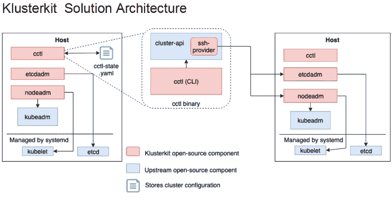

# Klusterkit 结合了 3 个开源工具来管理 Kubernetes

> 原文：<https://thenewstack.io/klusterkit-combines-3-open-source-tools-for-managing-kubernetes/>

Kubernetes 服务提供商 [Platform9](https://platform9.com/) 结合了三个开源的 Kubernetes 工具，如 [Klusterkit](http://klusterkit.platform9.com/) ，使得在内部部署环境中部署 orchestrator 变得更加容易。

*   受流行的 [kubeadm](https://kubernetes.io/docs/reference/setup-tools/kubeadm/kubeadm/) 开源项目的用户体验的启发， **[etcdadm](https://github.com/platform9/etcdadm)** 是一个简单的命令行工具，可以在任何地方部署和管理安全的 etcd 集群。它为恢复和可伸缩性提供了内置支持。Platform9 去年 10 月在 GitHub 的 Apache v2.0 许可下开源了这个项目。
*   **[nodeadm](https://github.com/platform9/nodeadm)** 是一个基于 CLI 的节点管理工具，它部署 kubeadm 需要的依赖项，比如 kubelet 二进制文件。这是在任何运行 Linux 的机器上部署 Kubernetes 控制平面或节点的简单方法。
*   集群生命周期管理工具 **[cctl](https://github.com/platform9/cctl) ，**使用 Kubernetes 集群 API，与 nodeadm 和 etcdadm 一起管理高可用性的 Kubernetes 控制平面和 etcd 集群。它使用法兰绒(vxlan)集装箱网络接口(CNI)后端，并计划支持其他 CNI 后端。

尽管有将应用程序推向云的趋势，但许多组织仍然在他们自己的数据中心运行它们，有些根本没有连接到互联网，即所谓的空气间隙实例。这是微软和 Docker 去年 12 月在微软的 [Connect()](https://www.microsoft.com/en-us/connectevent/) 开发者大会上推出的开源[云原生应用捆绑包](https://www.youtube.com/watch?v=26e5-UK4YRA)中的[场景之一。](/microsoft-cnab-simplifies-container-deployment-to-distributed-applications/)

使用 Klusterkit，您可以从 etcd 快照中恢复完全故障的集群控制平面。它还打包了在云管理的集群不可行的情况下，在一个有空隙的环境中部署 Kubernetes 所需的所有工件。

[Klusterkit 使用](https://platform9.com/blog/introducing-klusterkit-an-open-source-toolkit-to-simplify-kubernetes-deployments-on-premise-air-gapped-environments/)一个文件 cctl-state.yaml 来存储 Kubernetes 集群的元数据。cctl CLI 可用于在任何包含该状态文件的机器上编排 Kubernetes 集群的生命周期。

Cctl 实现并调用上游社区集群 api 接口，作为集群上 CRUD 操作的库。它使用开源裸机集群 api 提供者“ [ssh-provider](https://github.com/platform9/ssh-provider) ”，进而调用 etcdadm 和 nodeadm 来执行集群操作。

过去一年，一些 Platform9 客户一直在大规模使用 Klusterkit，在高度安全、隔离、空气间隙的环境中为关键任务 Kubernetes 应用提供支持。

Kubernetes platform 9 的技术主管 Arun Sri Raman[表示，这使他们能够标准化他们在开源上的云原生工作，同时大规模简化对第二天运营的支持，跨越复杂的部署目标矩阵。](https://github.com/sarun87)

Kubernetes platform 9 技术主管 Daniel Lipovetsky 将在周二(4/16)美国东部时间上午 10 点/下午 1 点举行的云计算原生计算基金会网络研讨会上深入解释 etcdadm 设计，并展示其从部分和完全故障中恢复的能力。在这里注册。

云计算原生计算基金会是新堆栈的赞助商。

通过 Pixabay 的特征图像。

<svg xmlns:xlink="http://www.w3.org/1999/xlink" viewBox="0 0 68 31" version="1.1"><title>Group</title> <desc>Created with Sketch.</desc></svg>