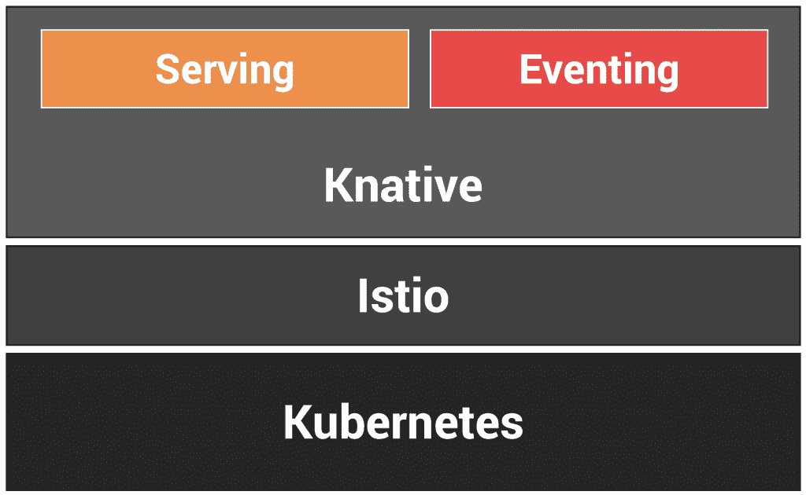
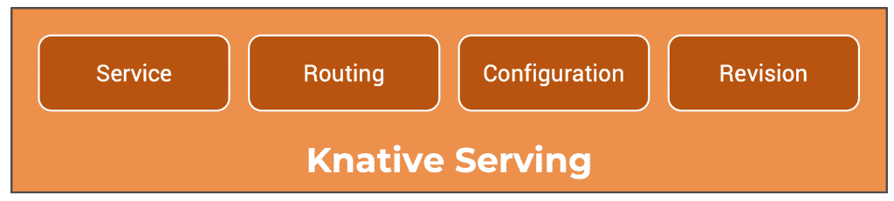
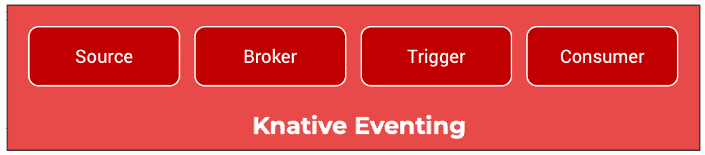

# Knative 为 Kubernetes 带来了事件驱动和无服务器计算

> 原文：<https://thenewstack.io/knative-brings-event-driven-and-serverless-computing-to-kubernetes/>

Kubernetes 是一个构建平台的元平台:在过去的几年中，Kubernetes 获得了业界的认可，这使它成为了现代基础设施的基础。

当代的应用程序依赖容器作为部署单元。大部分代码被打包成容器映像，并作为 pods 部署在 Kubernetes 上。

Kubernetes 为扩展和管理部署的生命周期提供了出色的支持。它简化了大规模管理虚拟机中存在的许多挑战。

除了容器，另一个加速发展的重要趋势是无服务器计算。AWS Lambda、Azure Functions、Google Cloud Functions 和 IBM Cloud Functions 是一些商业上可获得的运行代码的无服务器环境。它们基于无服务器计算的功能即服务(FaaS)交付模型，在该模型中，开发人员将代码片段直接部署到平台上。

基于 Kubernetes 的容器即服务(CaaS)和功能即服务(FaaS)遵循不同的方法来部署和执行代码。FaaS 建立在按需执行、每秒计费和事件驱动调用的理念之上，而 CaaS 旨在提供应用程序的规模和可靠性。虽然 CaaS 可以部署在企业数据中心内，但 FaaS 仍然局限于公共云。

现代应用程序使用多种模式和实践来实现规模、可靠性、效率和安全性。他们结合使用 CaaS 和 FaaS 来利用云提供商提供的交付模式。鉴于这两种交付模型之间的差距，开发人员将不得不处理非常不同的过程和工作流，这些过程和工作流容易出错且成本高昂。无论代码在哪里执行，开发人员都不能将容器映像标准化为标准的部署单元。

还需要将无服务器计算引入内部和企业数据中心。它应该基于大多数开发人员使用的经过验证的基础设施。

## 输入 Knative

Knative 是由 Google、IBM、Pivotal、Red Hat 和 SAP 开发的开源项目，旨在使 Kubernetes 成为运行微服务和无服务器应用的最佳平台。它也成为 Kubernetes 的一个抽象层，隐藏了打包和部署应用程序所涉及的复杂性。

Knative 是一个 PaaS，构建在 Kubernetes 元平台之上，使开发人员更高效。它公开了两种执行模型:长时间运行的工作负载和事件驱动的代码。

开发人员将 Knative 包代码作为容器映像，而不考虑执行模型。这消除了管理两个并行执行环境(CaaS 和 FaaS)的负担。DevOps 可以使用统一、一致的 CI/CD 管道来构建和部署代码。

从技术上来说，Knative 可以部署在任何 Kubernetes 环境中，这使得在企业数据中心内公开无服务器环境成为可能。

在幕后，Knative 依靠 Istio 这样的服务网络来管理流量路由、修订和指标。

面向 Knative 的开发人员不需要理解 Kubernetes 的复杂性，比如 pods、部署、服务和入口。他们将容器映像打包为微服务，并将其部署到 Knative，后者将处理其余部分。

谷歌是首批通过 Cloud Run 提供 Knative 商业实现的云提供商之一。对于云运行的详细演练，请参考我以前的[教程](https://thenewstack.io/tutorial-deploying-a-web-application-on-google-cloud-run/)。

为了实现 PaaS 的承诺，Knative 提供了两个核心构件——服务和事件。让我们仔细看看这些组件。

## **致命发球**

Knative 的服务组件为 Kubernetes 带来了一个熟悉的类似 PaaS 的执行模型。它负责展示、托管、扩展和管理打包为容器映像的微服务的生命周期。

当以 Knative 为目标时，开发人员定义一个管理整个部署生命周期的服务。他们还可以定义路由，有选择地将流量发送到同一应用程序的不同版本。配置定义在代码和配置之间提供了清晰的分离。修改配置将导致新的修订。最后，Knative serving 管理应用程序的修订，这是特定应用程序的代码和配置的时间点快照。

这些资源——服务、路线、配置和版本——在 Kubernetes 中被实现为自定义资源定义(CRD)。他们负责将 Knative 命名法翻译成标准的 Kubernetes 原语和对象。

Knative serving 支持扩展到零的特性，当一段时间内没有请求时，服务会自动终止。在终止之后，如果服务收到新的请求，服务资源将立即启动一个新的 pod 来处理该请求。超时、冷却期和最大实例数等参数可以通过与服务相关的 Knative 配置来定义。

## **突发事件**

Knative eventing component 提供了必要的基础设施，用于基于后期绑定连接事件发布者和事件消费者。

像在其他事件驱动的环境中一样，事件生产者甚至消费者都是相互独立的。生产者可能会在活动的事件消费者侦听之前生成事件。任何事件消费者都可以表达对一个事件或一类事件的兴趣，甚至在生产者开始发布这些事件之前。

Knative 带有一个代理，充当事件生产者和消费者之间的渠道。生产者将代理视为一个中心，向其发布所有消息。触发器通过代理将消费者绑定到发布者。这种松散耦合的架构使得部署高度可伸缩的事件基础设施成为可能。

由于多种类型的事件可以发送到同一个代理，触发器中的过滤器配置选项可以订阅特定类型的事件。

【T2

也有可能不通过经纪人直接将消费者与生产者联系起来。

Knative 支持像容器、cron 作业、Kubernetes 控制器这样的事件源。Kafka、Google Cloud Pub/Sub 和 NATS 等其他源可以注册为外部事件源，这些事件源可以通过代理发送 deliver 消息。

开发人员可以编写代码来响应事件，这些事件被打包成一个容器映像并部署为一个 Knative 服务。

## **总结**

如果 Kubernetes 是基础设施，Knative 就是栈的平台组件。它旨在增强开发人员的体验，提供无服务器执行模型，并在 Kubernetes 中运行事件驱动的代码。

在本系列的下一部分中，我们将通过一个端到端教程更深入地了解 Knative 服务。敬请关注。

贾纳基拉姆·MSV 的网络研讨会系列“机器智能和现代基础设施(MI2)”提供了涵盖前沿技术的信息丰富、见解深刻的会议。在 [http://mi2.live](http://mi2.live/) 上注册参加即将举行的 MI2 网络研讨会。

<svg xmlns:xlink="http://www.w3.org/1999/xlink" viewBox="0 0 68 31" version="1.1"><title>Group</title> <desc>Created with Sketch.</desc></svg>