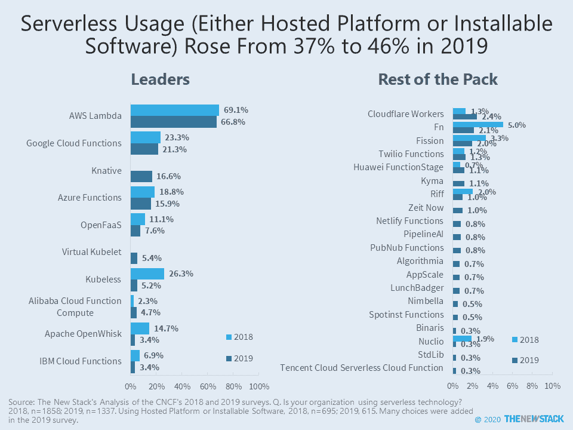
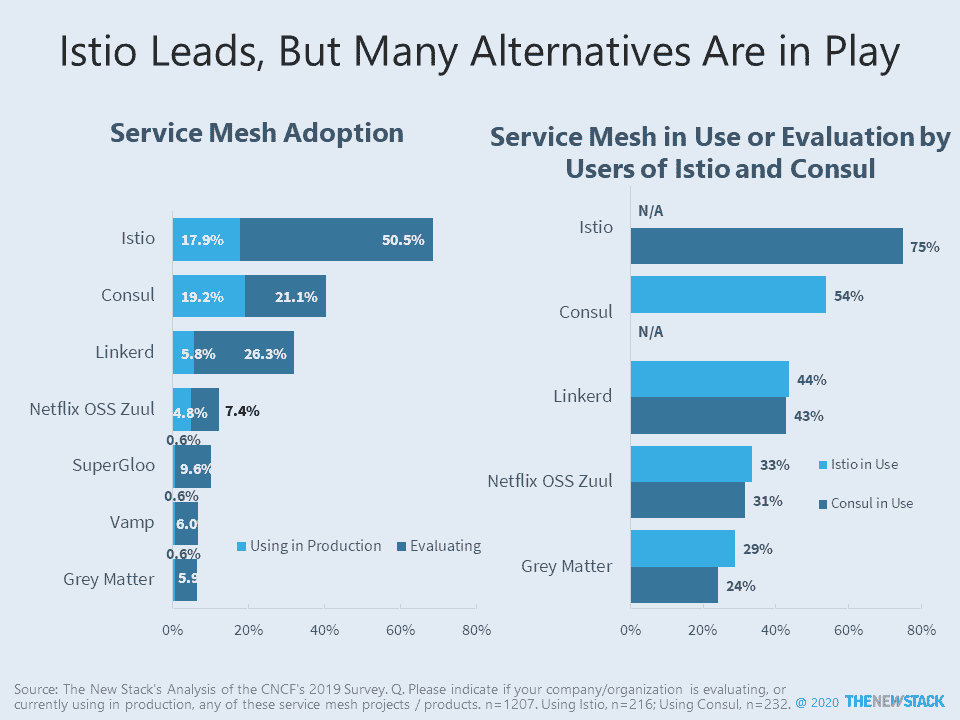
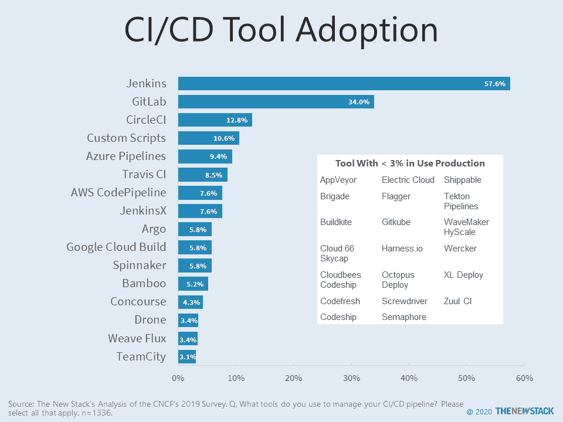
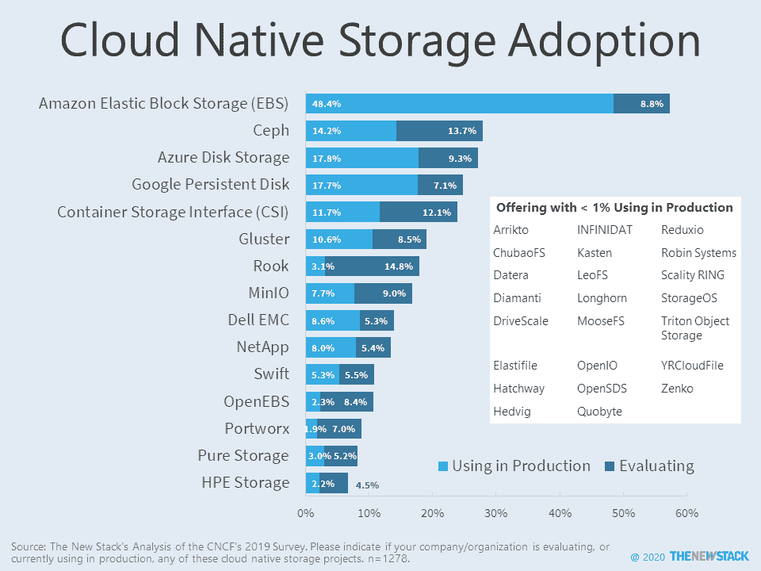
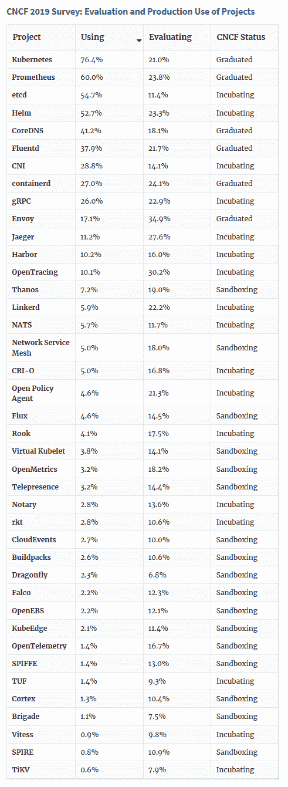

# Knative 挤走了其他无服务器软件(和其他 CNCF 调查外卖)

> 原文：<https://thenewstack.io/knative-crowds-out-other-serverless-software-packages-and-other-cncf-survey-takeaways/>

感谢云原生计算基金会(CNCF)提供其调查数据，我们正在跟进[最近一篇关于云原生技术采用的文章](/cncf-survey-snapshot-tech-adoption-in-the-cloud-native-world/)中的几个问题。这里有几个快速外卖。

首先:

1.  **特使和 Istio 一起部署。**尽管 Envoy 远远落后于 Kubernetes ingress 的领先者(19%对 NGINX 的 62%)，但在将 Istio 用于生产作为服务网格的 18%的研究中，这种情况发生了变化。在这一群体中，几乎有一半(47%)的人使用 Envoy for Kubernetes ingress。从另一个角度来看，39%的 Kubernetes ingress 用户也部署了 Istio 产品。
2.  Knative 的流行伤害了无服务器的可安装软件替代品。新加入调查的 Knative 被 17%的使用托管平台或无服务器可安装软件的受访者采用。Kubeless、Apache OpenWhisk、Oracle 的 Fn 和裂变都出现了采用率和社区活动的大幅下降。在可安装软件播放器中，只有 OpenFaaS 保持了它的人气。

虽然方向上与 CNCF 发表的报告相似，但我们分析的实际数字在几个问题上与 CNCF 的不同。出现差异是因为对如何处理无回应和调查逻辑的不同假设。例如，CNCF 经常根据正在使用的产品总数而不是回答问题的总人数来计算解决方案的采用率。在被问到的 17 个无服务器托管平台中，受访者描述了 817 个独特的部署，其中 CNCF 报告称，AWS Lambda 的 432 个用户占 53%。相比之下，在过滤掉说他们不使用无服务器的人之后，我们发现 67%的无服务器采用者使用 AWS Lambda(615 人中的 411 人)。

根据我们的分析，39%的受访者正在生产中使用服务网格技术，另外 46%的受访者正在进行评估。深入研究这些数据，我们发现了一些有趣的趋势。如上所述，Envoy 和 Istio 经常被同时使用和考虑。这可能预示着更多的供应商将这两种技术打包到他们的产品中。此外，虽然 Istio 目前处于领先地位，但用户仍在考虑许多其他选择。值得注意的是，开源项目的经验并不一定意味着它将被应用到特定的用例中。

## 评估云原生失败者和新兴竞争者

CNCF 询问了 200 多项技术和项目，其中大部分没有被许多调查者引用。该调查问卷提供了 109 个关于管理集装箱的选项，即调查撰写时 CNCF 的所有平台。CNCF 的报告强调了前十名，总的来说，至少有 1%的受访者(1377 人中的 14 人)使用过其中的 31 个。许多剩下的选择被少数大型企业客户使用，一些可能是一个公共供应商产品的很少使用的变体，而其他技术可能最终被放弃。

很难知道为什么一项技术在调查中很少得到回应，但糟糕的表现会让产品经理非常焦虑。这就是为什么像 CNCF 这样的会员制组织通常不公布可以被解释为宣布赢家和输家的结果的原因之一。新的堆栈避免计算市场份额，特别是在解释非随机样本的调查时。然而，在评估营销团队的宣传是否与最终用户的潜在需求相匹配时，查看未被提及的技术是有帮助的。

下面的图表详细介绍了 CI/CD 工具和云原生存储选项的采用情况。在这两种情况下，领先的选择似乎是准确的，即使在其他研究中排名可能不同。更有趣的是嵌入框中的选项。如果在下一次衰退中削减技术投资，这些技术和公司中哪一个会有持久的力量？

文章最后列出了正在使用和评估的 CNCF 项目。我们希望这些数据能够为关于 CNCF 指导方针有效性的讨论提供信息，这些指导方针是关于哪些项目被沙盒化、孵化并最终毕业。

只有 3%的受访者没有 CI/CD 渠道。

## 

这张图表更新于 2020 年 3 月 26 日。

<svg xmlns:xlink="http://www.w3.org/1999/xlink" viewBox="0 0 68 31" version="1.1"><title>Group</title> <desc>Created with Sketch.</desc></svg>