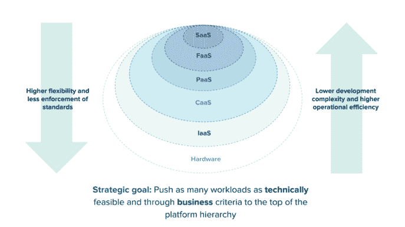
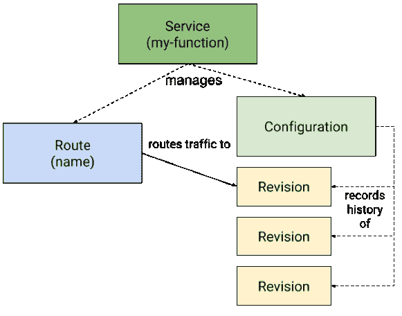
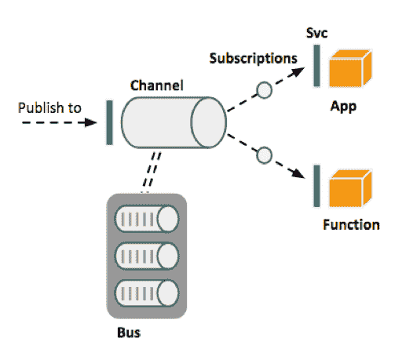

# Knative 在 Kubernetes 上为任何云提供可移植的无服务器平台

> 原文：<https://thenewstack.io/knative-enables-portable-serverless-platforms-on-kubernetes-for-any-cloud/>

[Dan Baskette](https://tanzu.vmware.com/)

[Dan 是 Pivotal Software 的技术营销总监，拥有 20 多年在 Sun Microsystems、EMC Corporation 和 Pivotal Software 担任各种职务的经验。除了他的技术营销职责之外，Dan 经常被要求卷起袖子准备各种各样的“这能行吗？”项目类型。丹是一个狂热的漫威漫画装备收藏家，你通常可以发现他穿着他的漫威面包车。在业余时间，丹喜欢打网球和在烟雾弥漫的山区徒步旅行。](https://tanzu.vmware.com/)

最近，Kubernetes(K8s)受到了很多关注。该项目已经成为容器的主要抽象。而且理由很充分！Kubernetes 擅长容器调度，并为自动化基础设施提供了有用的原语。

但是我们注意到，开发团队在使用普通的 Kubernetes 进行应用程序部署时经常会遇到困难。无论如何，用 Kubernetes 推一整天的集装箱。但是如果你想推送应用程序代码或者功能，Kubernetes 本身是不够的。

这就是为什么许多供应商都把 K8s 作为更高层次抽象的基础技术。这就是 [Knative](https://github.com/knative) 的用武之地。

## 函数是你需要关心的下一个抽象

您可能已经注意到了分布式系统世界中的一个新成员:功能即服务(“功能”或“无服务器”)。函数已经成为一种新的抽象概念，它允许开发人员轻松运行和部署代码片段，这些代码片段可以根据事件的变化而快速伸缩。

对于开发者来说，这是一个非常有吸引力的提议。为什么？抽象掉所有的基础设施和事件处理(直到他们触发该函数)意味着开发人员可以将 ***完全集中在*** 他们的函数代码上来处理事件。没有辛劳，没有无差别的重活！

当然，天下没有免费的午餐，那么函数的复杂性在哪里呢？

市场上有几十种功能即服务选项。就函数的触发方式、它们可以处理的事件格式、扩展能力以及它们从开发人员那里抽象出来的复杂性而言，每种产品都是独一无二的。

当有一个有用的抽象时，您可以依靠公共云供应商将其打包并作为服务为您运行。这些是 Azure 函数(微软)、Lambda (AWS)和谷歌云函数。每个服务运行功能代码来响应事件，并根据当前需求进行扩展。产品有公用事业式计费；每次调用该函数时都要付费。

开源开发者已经加入了无服务器一方，比如 OpenFaaS、裂变、Kubeless 和 Project riff。所有这些都是构建在 Kubernetes 之上的功能即服务的例子。但这种共同的基础是相似之处的终点。

每个项目在三个核心领域的实现略有不同:

*   每一个都有一个构建服务，或者一种用功能代码构建然后部署容器的方法。
*   每一个都有一个向上扩展(和向下扩展)的实现，以响应函数调用的需求。
*   每一种都提供了一种基于事件调用函数的方法，比如使用事件代理的 http 或 pub/sub。

这些细微的差异实际上是采用的巨大障碍。企业开发者看到了市场的分裂和大量新进入者。因此，他们袖手旁观，等待一个事实上的标准出现。

## 这就把我们带到了今天的新闻——kna tive

Google 看到了这种碎片化，并认识到需要公共工具来帮助开发者在 Kubernetes 上构建功能。那是 [Knative](http://pivotal.io/knative) (发音为 kay-nay-tiv)。

[Knative](https://content.pivotal.io/blog/knative-powerful-building-blocks-for-a-portable-function-platform) 是一个开源软件层，帮助云服务提供商和企业平台运营商为任何云上的开发者提供无服务器体验。

对于我们 Pivotal 来说，我们已经将我们的事件模型从 [Project riff](https://projectriff.io/) 贡献给 Knative。此外，我们还在 Knative 项目的其他几个领域与 Google 合作，包括开发人员和代码。我们对这个项目的未来感到非常兴奋，因此我们将项目 riff 和 Knative 结合起来，为我们即将推出的产品 [Pivotal Function Service](https://pivotal.io/platform/pivotal-function-service) 奠定基础。

那么关于 Knative 你还应该知道什么呢？该项目将 Kubernetes 用于容器编排层。它在熟悉的 Kubernetes 原语(pod、副本集、部署)的基础上构建功能。Istio 呢？是的，Knative 使用 Istio 进行集群内的网络路由，以及集群的入口连接。

但是 Kubernetes 和 Istio 还不够。这就是为什么 Knative 添加了三个松散耦合的组件来为 ***提供一个完整的无服务器平台*** :构建、事件和服务。

*   **Build** 提供了一个从源代码构建容器的可插拔模型。
*   **事件**允许应用/功能发布和订阅事件流，如 Google Cloud Pub/Sub 和 Apache Kafka。
*   **服务**提供轻松运行应用程序/功能的能力，并将其放大或缩小至零。

这些是 Knative 的成分。结果如何呢？部署和运行功能的更简单方法，包括以下模式:

*   从源代码构建应用程序/功能
*   支持多种构建方法(Cloud Foundry Buildpacks、Bazel、Kaniko、Dockerfiles 和其他可扩展性)
*   允许开发人员轻松部署新的(可路由的)应用程序/功能
*   允许应用程序零停机升级
*   自动化应用程序实例的扩展。
*   将事件绑定到函数、应用程序或容器。
*   通过 HTTP 请求调用时触发函数。

让我们仔细看看构建、事件和服务。

### 构建:灵活且可扩展的容器自动化源代码

开发人员编写源代码。Kubernetes 与集装箱打交道。你如何调和这种不匹配？通过从开发者源代码构建容器。(听着耳熟？Cloud Foundry 在这种情况下使用构建包。)Knative 提供了一个专门用于从源代码构建容器的可插拔模型。这个模型是通过定制资源定义实现的，定制资源定义是 Kubernetes API 对象的集合。这种方法提供了构建块，有助于将源代码构建为更大系统的一部分，如 CI/CD 管道。

Knative 的构建有 4 个主要元素:

*   描述在哪里可以找到生成的源代码。该位置存储在/workspace 卷中，然后在后续步骤中使用。如您所料，源代码存储在源代码控制系统中(即 GIT、GCS 或可用于访问源代码的自定义容器)。
*   **步骤或模板。**这是构建容器的实际工作。该过程是一系列遵循构建器规范的步骤。或者，它是一个构建模板，由专门为从源代码构建容器而设计的可插拔构建器组成。目前，该模型支持五个可共享构建过程的构建模板:前面提到的 [Cloud Foundry Buildpacks](https://docs.cloudfoundry.org/buildpacks/) 、 [Google Container Builder](https://cloud.google.com/container-builder/docs/) 、Bazel、Kaniko 和 Jib。
*   **服务账户。**将用于运行构建的帐户。
*   **卷**。提供定义在构建步骤中可用的多个卷的能力。这些卷可以有多种用途，例如共享机密或为多个步骤提供缓存。

### 服务:基于需求的扩展和版本控制支持高级操作

自动化改进了开发人员的工作流程。服务自动化了从容器到运行函数的流程。它还支持容器的快速部署，并基于传入的请求执行到 N 的扩展，以及到零的扩展。Istio 在修订版(函数的版本)之间路由流量，这支持零停机更新、蓝绿部署、部分负载测试和代码回滚等活动。

服务有四个自定义资源定义:

*   管理应用程序/功能生命周期并提供单点控制的资源。它处理对象的创建，以确保应用程序/功能具有网络路由、配置和对服务的任何更新的修订。
*   代码及其配置的不可变快照。修订版将引用一个容器映像和创建它的版本。多个修订可以存在于一个历史中，这允许更高级的操作，如蓝绿色部署或回滚。
*   网络端点到一个或多个功能版本的映射。
*   定义部署所需的最新状态，以及该状态更新时的修订状态。

### 事件:从开发人员那里抽象出发布/订阅的细节

函数的存在是为了响应事件。跨 FaaS 项目和托管服务的实现之间的区别在于获取和使用这些事件的方式。Knative Eventing 组件旨在从开发人员那里抽象出处理事件的后端细节。所以，开发人员不需要担心使用什么消息平台，数据如何复制等等。

Knative 为开发人员提供 Kubernetes 定制资源，用于事件的生产和消费。有两类自定义资源定义是事件的一部分:

*   **频道**
    *   这些是发布者向其发送消息的发布/订阅目的地(主题)。基本上，通道是获取或放置事件的地方的目录。
    *   **公交车**。通道的后台提供程序。这是平台中事件的消息传递平台，可以是 Google Cloud PubSub、Apache Kafka、RabbitMQ 等。
    *   这指定了应用程序/功能的 Knative 服务，消息将从通道发送到该服务。这是应用程序/功能的入口地址。
*   **供稿**。将事件源中的单个事件附加到操作。

### 尽可能使用最高的抽象

Knative 是全新的，但是有很多资源可以用来学习更多关于它是什么，以及如何使用它:如今企业正在编写比以往更多的软件。这意味着一个典型的公司将拥有应用程序平台、容器编排器和功能。Pivotal 希望推动所有这些不同抽象的开源创新。随着大公司将构建和运行软件的方式现代化，Cloud Foundry、Kubernetes 和现在的 Knative 都将发挥重要作用。

*   这些文档是项目信息的重要来源。每个组件在 repo 中都有一个部分，可以让您了解最新的功能。
*   你可以看看 Ryan Morgan 的 Pivotal 博客,了解 Pivotal 对 Knative 的贡献。他谈到了在企业中释放更多的无服务器用例。
*   阅读更多来自 Google Cloud 朋友的信息:
*   如果你想了解更多关于 [Project riff 的信息，projectriff.io 网站](https://projectriff.io/)是最好的起点。它有所有的文档和指向[项目 riff repo](https://github.com/projectriff/riff) 的指针。
*   想了解更多关于 Knative 的信息吗？ [SpringOne 平台全程无服务器赛道](https://springoneplatform.io/2018/sessions)。在 7 月 31 日之前注册，您将获得一个酷炫的 Pivotal 乒乓球拍！

<svg xmlns:xlink="http://www.w3.org/1999/xlink" viewBox="0 0 68 31" version="1.1"><title>Group</title> <desc>Created with Sketch.</desc></svg>