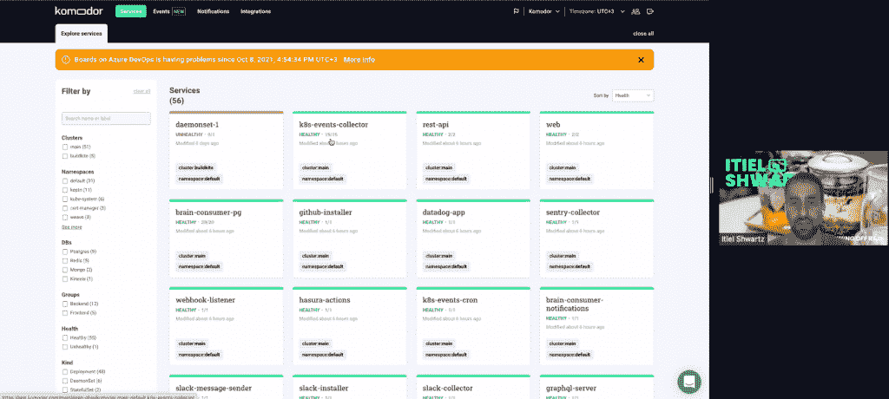

# Komodor 工作流程扩展了 Kubernetes 故障排除

> 原文：<https://thenewstack.io/komodor-workflows-extend-kubernetes-troubleshooting/>

Kubernetes 原生故障排除平台 [Komodor](https://komodor.com/) 承诺将减轻查找您的 [Kubernetes](https://thenewstack.io/category/kubernetes/) 集群内部问题的极其痛苦的过程。本周在 [KubeCon+CloudNativeCon](https://www.cncf.io/kubecon-cloudnativecon-events/?utm_content=inline-mention) 北美，该公司发布了一个工作流功能更新，以进一步简化故障排除。

“Komodor 的一个非常好或不太好的地方是，当我们去问客户今天的故障排除是如何进行的，谁是负责人时，我们遇到的每个组织都在努力找出 Kubernetes 集群中发生了什么问题。Komodor 首席技术官和联合创始人 [Itiel Shwartz](https://twitter.com/itielshwartz) 在接受 New Stack 采访时表示:“有太多移动部件和可能的故障场景可以解释他们正在经历的问题，他们只是迷失了方向。

## Kubernetes 故障排除

Shwartz 说，Kubernetes 停机解决方案——或任何真正的停机——至少需要三个步骤来解决:

1.  明白自己有问题，原因在哪里。
2.  管理和沟通，让更多人采取行动。
3.  防止再次发生。

目前，Komodor 专注于第一个，跟踪 Kubernetes 集群内的所有东西以及可能影响它的外部任何东西。该平台会跟踪您的集群的行为方式，以及这种行为方式可能会随着时间的推移而发生的变化。当您的 pods 或集群中发生问题时，它会让您知道大约在同一时间发生了什么——例如，如果有人更改了 Github 中的副本号或源代码——因此，希望您能够更快地查明是什么导致了错误。

## 库伯内特和 SRE

越来越多的组织拥有一到两名 Kubernetes 专家或站点可靠性工程师。但这还远远不够。尽管被广泛采用，但对于这些更资深、更有经验的角色来说，Kubernetes 仍然存在巨大的人才缺口。

“人们不知道该做什么，甚至不知道该问什么问题或者去哪里找，”施瓦茨解释说。他说，即使他们有正确的问题，也仍然需要花很多时间来挖掘他们的 Jenkins 管道或检查他们所有的功能标志。Kubernetes 系统的极端复杂性意味着，即使他们知道可能的错误是什么，也要花很多时间来检查。

即使你是一个了解 Kubernetes 的专家，消化这些数据仍然需要大量的时间和认知负荷。这意味着一个组织中的一两个专家自然会被问题轰炸，冒着精疲力竭的风险。

“没有成功排除故障是非常令人沮丧的，但是，日复一日地成为英雄也是非常令人沮丧的，”Shwartz 说。

这种发现故障原因的困难也会影响 KPI，因为停机持续的时间要长得多。

Komodor 希望回答第一轮问题，让那些资历较浅的人在向他们的 Kubernetes 专家咨询之前，对任何问题都有更多的了解。他们的目标受众是那些快速而敏捷的公司，他们试图让开发者做出改变。Komodor 为初级工程师提出了一个全新的问题，提出了一个非常资深的 SRE 或 DevOps 人员会提出的问题。

“我们对 Kubernetes 有着非常深刻的理解，了解 Kubernetes 的结构应该是什么样子，我们开箱即用。你会更快得到答案，”施瓦茨说。

他还指出，在 Kubernetes 中查看当前发生的事情已经很容易了，但是要找到系统变化的历史数据几乎是不可能的。Komodor 不仅可以解决知识匮乏和极度复杂的问题，它还允许人们回溯一天甚至一周的时间，以跟踪可能导致问题的变化。

## Komodor 的新功能

Komodor 今天推出了一项新的工作流程功能，以帮助用户更好地了解根本原因。

“我们希望我们的用户了解集群中正在发生什么，当出现问题时，我们希望他们有一个有趣的结晶视图，”Shwartz 说。

新的工作流功能对根本原因可能在哪里运行不同的检查，然后找到结果发送给用户，以便可以用于诊断。

假设您的应用程序正在崩溃。它有三个不同的垂直豆荚，每个豆荚位于不同的 Kubernetes 节点上。你知道有问题，所以你用 Komodor 检查它，结果发现三个复制品中有一个是不健康的。它提醒你某个节点有问题。然后，您就知道您的基础架构和如何配置节点可能有问题。

到目前为止，Komodor 已经有了十几个工作流程，可以自动处理常见的故障诊断场景。工作流程从检查和分析 pod、入口、负载平衡器、PersistentVolumeClaims (PVC)、服务和端点的状态开始，以便为您提供问题所在的详细视图。

很快，他们将允许用户根据自己的需求定制这些工作流，“但我们在他们不做任何事情的情况下就带来了很多价值。”

<svg xmlns:xlink="http://www.w3.org/1999/xlink" viewBox="0 0 68 31" version="1.1"><title>Group</title> <desc>Created with Sketch.</desc></svg>