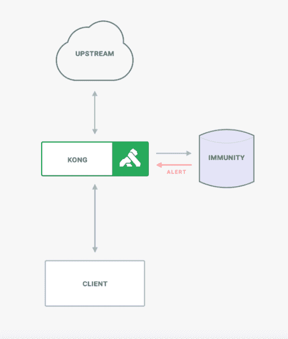
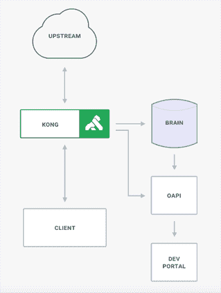

# 孔将机器学习应用于微服务管理

> 原文：<https://thenewstack.io/kong-applies-machine-learning-to-microservice-management/>

Kong 是一家基于开源的 Kong API gateway 建立服务控制平台的公司，该公司将人工智能和机器学习(Kong Brain 和 Kong Immunity)添加到组合中，以帮助提供大规模的可见性、安全性和治理。

“企业正在转向微服务，但没有合适的平台来从这些微服务执行的流量中学习，”Kong 首席技术官 Marco Palladino 表示。

“我们正在处理一系列新的事情。当我们只有少数几个服务时，我们保护服务的方式在我们处理成百上千个 API 时不可能奏效。”

Kong Immunity 基于为每个服务交换的数据异步地创建机器学习模型，该数据来自作为每个不同服务的副车或代理运行的 Kong，而不影响性能。

它首先为每个服务设置一个“正常”基线，然后标记偏离预期模式的流量。然后，它会自动向指定的人发送警报。它允许用户调整设置，以允许与预期标准有一定的偏差。

Palladino 说，随着流量模式的不断变化，API 不断被创建、版本化、连接和停用。

“我们无法预测谁将是发出请求的客户端，因此我们无法知道哪个请求可能是潜在的恶意请求。所以我们必须建立机器学习模型来确定哪些流量是有效的，哪些是无效的。”

他指出，它不仅警告用户外部威胁，也警告用户内部威胁。

借助微服务，这些服务的客户端越来越多地位于组织内部。它可以防止团队做一些可能导致微服务崩溃的事情，并在仪表板上提供组织中是否有人发出可能是威胁的请求的可视化信息。

“我们会自动这样做。只需一种配置，就可以对任何微服务实施这一点。你不必为每个微服务创建特定的规则集，”他说。

Kong Brain 使用 OpenAPI 规范文件来自动配置 Kong 企业部署。它使用实时收集器接收文档和数据流，分析变化并采取措施。

一旦一个团队向 Kong Enterprise 推送一个新的或更新的服务，Kong Brain 就会向开发者门户生成新的 OpenAPI 文档。它还关心跨团队、区域和平台的实时可视化服务地图。

随着对环境的不断了解，它将标记潜在的冗余、瓶颈和其他问题。

“微服务失败的原因之一是因为文档不是最新的，所以团队不知道如何使用其他团队的 API。当这种情况发生时，你会失去信任。当他们失去信任时，他们不再依赖他人的工作，而是一遍又一遍地创建相同的微服务。这违背了微服务架构的目的，”帕拉迪诺说。

“文档也在快速变化。如果组织正在创建所有这些服务，然后对它们进行修改、版本化、退役，那么文档必须相应地进行更改。否则就成了一团乱麻，没人知道怎么用这些微服务。”

Kong Brain 自动生成文档，将其推送到开发者门户，成为可用微服务的目录。

“文档现在已经成为企业内部值得信赖的权威。这给了那些不得不使用其他团队 API 的开发者信任，”他说。

### 明智的决定

Kong 首席执行官兼联合创始人 Augusto "Aghi" Marietti 在之前为新堆栈发布的帖子中提到，需要一个新的服务控制平台来管理 API。他说，它不仅仅是传输信息，它将理解信息并做出明智的决定，不管环境、部署模式、语言或使用的传输方法如何。

Kong 构建在 NGINX 反向代理服务器之上。它[提供服务](/mashape-opens-kong-a-microservices-proxy-built-on-nginx/)，包括一个 RESTful API 接口，用于在一种注册表中注册 API，以及一个插件平台，提供微服务经常借用的公共函数的基础。

该公司原名 Mashape，去年 9 月发布了支持服务网格的[Kong 1.0](https://thenewstack.io/kong-at-1-0-a-service-control-platform/)。上周，它发布了具有声明式配置和无数据库部署功能的 Kong 1.1。

它还刚刚宣布了由 Index Ventures 牵头的 4300 万美元的 C 轮融资，总融资额达到 7100 万美元。

通过 Pixabay 的特征图像。

<svg xmlns:xlink="http://www.w3.org/1999/xlink" viewBox="0 0 68 31" version="1.1"><title>Group</title> <desc>Created with Sketch.</desc></svg>