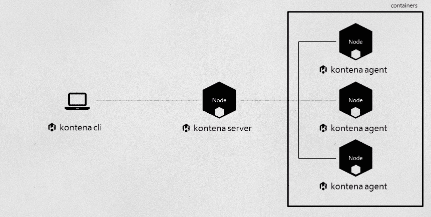

# Kontena 提供了一个 Kubernetes 替代方案，有望更易于部署

> 原文：<https://thenewstack.io/kontena-offers-kubernetes-alternative-promises-easier-deploy/>

最近在纽约举行的一次 Kubernetes 会议上，大约 150 名观众被问到，“你们中有多少人在生产中使用 Kubernetes？”萨米·阿文涅米讲述这个故事时，只有两个人举了手。

芬兰公司 Kontena 的联合创始人利用这个故事强调了这样一个观点，尽管有好处，但许多公司很难使用 [Kubernetes](/category/kubernetes/) 容器编排引擎。他并不是唯一有这种担忧的人:其他人指出 Kubernetes 生产项目需要很长的准备时间。

“Kubernetes 是一个很棒的系统，但它需要大量的人力来安装和维护。这需要大量的资源。当你看到[原因]时，不是起飞更快，而是有一个学习曲线。……我们认为,[学习曲线]是需要消除的，”Ahvenniemi 说。

自去年以来，Kontena 提供了一个用于编排 Docker 容器操作的开源平台。考虑到【Kubernetes 在这一领域取得的势头——以及容器管理领域越来越多的其他参与者——该公司期待为其完成工作，这是 451 分析师 Jay Lyman 就竞争对手创业公司 [ContainerX](https://thenewstack.io/containerx-will-offer-container-infrastructure-enterprise/) (思科正在[收购](https://blogs.cisco.com/news/cisco-announces-container-news-%E2%80%8E))指出的问题。

“我们真的在接近开发商。…我们的任务是构建开发人员和运营人员喜欢使用的容器平台，”Ahvenniemi 说。

## 总是开源

Kontena 的团队，包括首席执行官[Miska kaipainen](https://www.linkedin.com/in/miskakaipiainen)和首席技术官 [Jari Kolehmainen](https://github.com/jakolehm) ，在大约一年半前成立了公司。它的开源[代码从一开始就在 GitHub](https://github.com/kontena) 上。

“他们有点挠头想，‘作为一名软件开发人员，我真的想用什么样的平台来运行容器和微服务？’……我们的目标是尽可能简化……配置、安装、管理 Kontena 的一切都变得非常自动化和简单，”Ahvenniemi 说。

与 Kubernetes 相比，Kontena 拥有更简单的架构和更小的代码库。它是用 Ruby 而不是 Go 编程语言编写的。

该公司专注于小型团队——无论是初创公司还是企业内部的应用程序团队——他们需要快速启动并运行。

到目前为止，它支持 Docker，但计划增加对其他技术的支持，包括 [Windows 容器](https://thenewstack.io/microsoft-secures-the-windows-docker-container/)和 CoreOS rkt。

它可以安装在任何公共云上运行 Linux 的任何云基础设施上，也可以安装在您自己的私有数据中心内；虚拟化或裸机混合环境。

像 Kubernetes 一样，Kontena 在比容器更高的抽象层次上工作。Kontena 的原始构建组件被称为服务。网格是 Kontena 系统的最外层容器。它使用 Weave 和 [OpenVPN](https://openvpn.net/) 提供了一个覆盖网络，允许跨主机的服务间通信。

用户从命令行代理开始，构建控制一个或多个网格的主服务器，甚至可以运行网格中的单个节点；网格可以分布在不同的计算机上——例如，分布在几个可用性区域。您可以在 Google Cloud、AWS、Azure 或本地部署节点。Ahvenniemi 说，它成为生活在其上的服务的一种计算资源。

“当你运行我们的软件时，你实际上控制了服务。容器构成了服务，以及每个服务运行多少个容器，这些基本上都是由我们的软件自动完成的。您给我们可扩展的限制，我们根据收到的指令保持这种状态。负载平衡和所有这些事情都只是引擎盖下，”他说。

您可以通过一个命令在裸机上进行部署。“当你需要类似谷歌的扩展时，我们有 API，你可以直接挖掘和管理更多的资源，而不是让我们像现在这样自动化，”Ahvenniemi 说。

Lyman 告诉新的 Stack，Kontena 提出了一种更完整、更自动化的容器，包括更多功能，如调度、编排、网络覆盖、负载平衡和秘密管理，这样使用容器的开发人员就不必自己搜索和绑定许多单独的组件以供企业使用。

“Kontena 了解虚拟机中容器的现实，以及裸机上容器的逐渐增长，”Lyman 说。该公司的软件支持这两者。

## 寻找替代方案

他说，该公司的一些客户曾试图使用 Kubernetes，但不知所措，然后开始“四处搜索，找到了我们”。

虽然 Kontena 迄今为止一直保持相当低调——该软件尚未达到 1.0 版本，尽管它已被用于生产——但来自 Lifeline Ventures 的 200 万美元种子期意味着该公司正在扩张，在纽约和硅谷增加办事处。

其中之一是赫尔辛基的移动应用开发平台 AppGyver。

据首席技术官[马蒂·帕克苏拉](https://github.com/matti)称，该公司正在寻求取代其 Heroku 部署——在三个环境中提供 10 个 Ruby on Rails 应用——它在客户的私有云和内部提供。

例如，Heroku 对于一个 14 人的初创公司来说已经变得过于昂贵，而且它无法经济高效地开发需要网络套接字的服务。

虽然它接近使用 Deis 进行部署，但它有一些无法解决的问题。

“在我们看来，像 T4·弗林这样的其他解决方案还不成熟，像 Kubernetes 这样的解决方案过于面向计算，”他说。

Kontena 拥有 AppGyver 在 2015 年末所需的几乎所有功能，并同意添加功能来匹配 Heroku，例如开发人员只需 git 推送代码而不是 Docker 构建/推送工作流的能力。

“Kontena 已经被证明可以安装到任何运行 CoreOS 或 Ubuntu 的硬件上，我们目前只需要几个命令就可以进行部署和扩展。对于其他解决方案，我们需要更多地了解相当复杂的 Docker 编排场景中实际发生的事情，”他说。

他说，由于成本原因，Heroku 未能做到的事情之一是为每个客户部署专用应用程序运行时的能力

“如果我们需要改变什么，Kontena 也很容易扩展，”他说。

Docker 是新堆栈的赞助商。

特征图片:[Á·阿尔瓦罗·维加 F.](https://www.flickr.com/photos/alvazer/) 的[容器](https://www.flickr.com/photos/alvazer/9483602522/in/photolist-fs2WCj-a3NYdi-pnSzL-4LGK2-2UrVHv-2UrYz4-2Us2tK-Eeqeo-85HX8j-hD9cR2-nS6Sax-rF6SGG-dcGZAo-3EK4k-FTawmg-2AzAVJ-aoHuTF-r8PNMA-boaQy8-FPJXa2-u8Bei-f3ZCWg-He19d1-fJYrjR-89kD1f-QWgZH-axYxm-fKfUKQ-2h42pU-2h42w7-4Xcg61-61fNWq-5aGWYj-7YmaKY-e72FNu-FXpFZ-QWh8x-9Kh1LY-6hWA8m-527bPg-62JAWa-ryzH6L-6TdaJA-476esX-dvQoQw-bE83qB-4U7q5f-diPqb8-dUhYPW-FPec9)，根据 **CC BY-SA 2.0** 获得许可。

<svg xmlns:xlink="http://www.w3.org/1999/xlink" viewBox="0 0 68 31" version="1.1"><title>Group</title> <desc>Created with Sketch.</desc></svg>