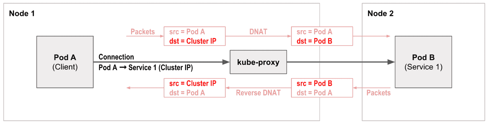
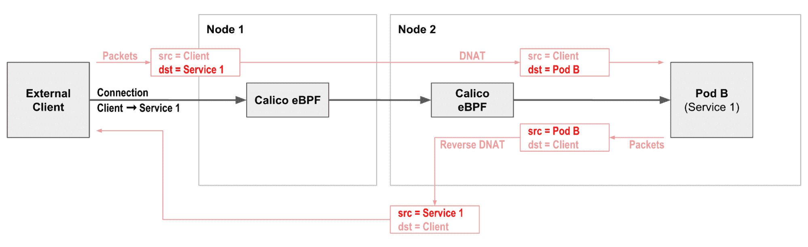
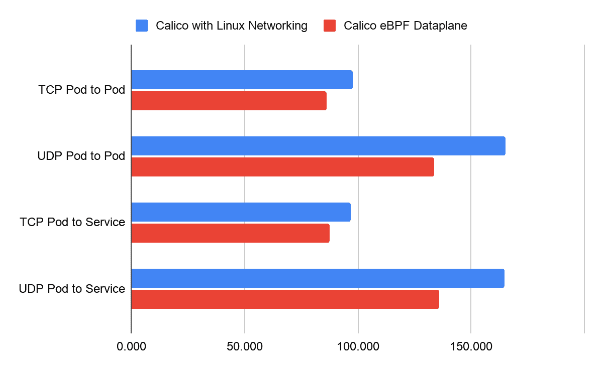
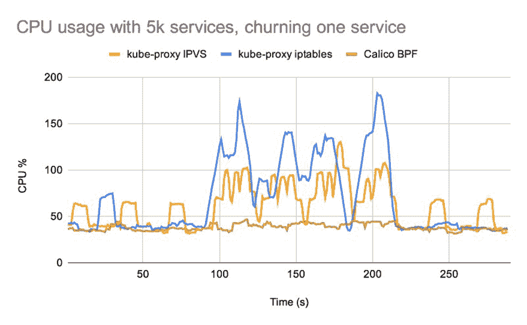

# KOps 增加了对 Calico eBPF 数据面板的支持

> 原文：<https://thenewstack.io/kops-adds-support-for-calicos-ebpf-dataplane/>

[](https://www.linkedin.com/in/cdtomkins/)

[Reza Ramezanpour](https://www.linkedin.com/in/cdtomkins/)

[Reza 是 Tigera 的一名开发人员，致力于促进 Calico 项目的采用。在加入 Tigera 之前，Reza 是一名系统工程师和网络管理员。](https://www.linkedin.com/in/cdtomkins/)

[](https://www.linkedin.com/in/cdtomkins/)[](https://www.linkedin.com/in/cdtomkins/)

Kubernetes operations([kOps](https://github.com/kubernetes/kops/))是官方 [Kubernetes](https://kubernetes.io/) (K8s)项目之一。kOps 项目允许在多个云平台上快速部署生产级 K8s 集群。通过利用 YAML 清单，kOps 为使用过 kubectl 的用户提供了熟悉的体验。与流行的云平台中的 K8s 集群类似，kOps 帮助设置自我管理的集群，以轻松提供高可用性。鉴于它的易用性，当用户想要部署自托管的 Kubernetes 集群时，它是一个受欢迎的选择。

随着 kOps [v1.19](https://kops.sigs.k8s.io/releases/1.19-notes/#cni) 的最新发布，该实用程序增加了对 [Calico eBPF 数据平面](https://docs.projectcalico.org/about/about-ebpf)的支持。除了上面提到的功能，最新的 kOps 更新提供了一种轻松的方式来自动部署 K8s 集群，使用 [Project Calico](https://www.projectcalico.org/) 进行联网和 Calico eBPF 数据平面。Calico eBPF 数据平面实施取代了 kube-proxy，并提供了等效的功能。它还利用了流量的最佳数据路径。这些变化为您的集群提供了网络性能提升和源 IP 保护。

在这篇博文中，我们将展示部署使用这些新特性的集群所需的步骤。

## eBPF 是什么？

eBPF 是嵌入在 Linux 内核中的虚拟机。它允许将小程序加载到内核中，并附加到钩子上，当某些事件发生时，钩子就会被触发。这允许内核的行为被(有时是大量的)定制。虽然 eBPF 虚拟机对于每种类型的挂钩都是相同的，但是挂钩的功能却有很大的不同。因为将程序加载到内核会有安全风险，所以内核通过非常严格的静态检验器运行所有程序。验证程序用沙箱保护程序，确保它只能访问允许的内存部分，并确保它必须快速终止。

Calico 的 eBPF 数据面板利用 eBPF 功能来保护源 IP、直接服务器返回(DSR)和更好的性能。让我们更详细地探讨这一点。

## 源知识产权保护

在默认网络设置中，kube-proxy pods 负责使用网络地址转换(NAT)技术将入站(入口)流量路由到目标 pods。NAT 可能是传递数据包的一个好选择。然而，在传送过程中，NAT 取代了原始的客户端源 IP 地址，使得故障排除和安全实施变得困难，因为数据包并不代表它们的原始来源。



kube-代理群集 IP

作为使用 Kubernetes 标准 kube-proxy 的替代方案，Calico 的 eBPF 数据平面也支持本地服务处理。这保留了源 IP 以简化网络策略，提供 DSR 以减少返回流量的网络跳数，甚至提供独立于拓扑的负载平衡，与 kube-proxy 相比，减少了 CPU 和延迟。



Calico 本地服务处理

## 表演

Calico eBPF 数据平面模式是我们基于 iptables 的标准 Linux 数据平面模式的替代方案，进一步提升了性能极限。在 eBPF 数据平面模式下，Calico 利用 eBPF 程序快速有效地处理数据包，而无需离开 Linux 内核的数据包处理上下文。这种方法实现的效率接近于内核中本地编译的代码。



*使用 kubernetes 网络基准项目生成的性能数据。

Calico 的 eBPF 数据面板将 eBPF 程序连接到每个 Calico 接口以及数据和隧道接口。这允许 Calico 尽早发现工作负载包，并通过绕过 iptables 和内核通常会做的其他包处理的快速路径来处理它们。

## 替换 kube 代理

Calico 的 eBPF 数据面板包含本地服务处理，因此您不再需要运行 kube-proxy。Calico 的本地服务处理在网络和控制平面性能方面都优于 kube-proxy，并支持源 IP 保留等功能。

如果您的工作负载对网络延迟特别敏感，或者如果您正在运行大量服务，则性能差异会非常明显。您可以在 Calico 团队的博客中阅读更多关于这些性能优势的信息，并找到一系列不同的基准测试图表，比较 kube-proxy 性能与 Calico 的本地服务处理。



5K 服务的 CPU 使用率(越小越好)

## 演示

### 在我们开始之前:安装 aws-cli 和 kubectl

为了在 AWS 公共云中填充集群，kOps 使用 aws-cli 命令行功能。因此，在遵循下面的操作方法部分之前，需要在您的计算机上安装和配置 aws-cli。您还需要 kubectl 来与您的 K8s API 服务器进行交互。如果您不确定如何安装这些要求，请查看以下链接:

## 操作方法

kOps 可以在几秒钟内轻松创建自我管理的 K8s 集群。成功部署 kOps 集群需要一些配置。

### S3 铲斗(特定于 AWS)

亚马逊 S3 桶是一个存储服务器，用于在 AWS 云中存储对象。kOps 利用这个存储系统来存储集群配置和部署状态。

首先，执行以下命令创建一个新的 S3 存储桶:

```
aws s3api create-bucket  --bucket calico-kops-demo  --region us-east-1

```

您应该会看到类似于
的结果

```
{
 "Location":  "/calico-kops-demo"
}

```

在创建了 S3 桶之后，我们需要使用下面的命令将名称存储在一个环境变量中，供 kOps 使用:

```
export KOPS_STATE_STORE=s3://calico-kops-demo

```

如果您在 Windows 中使用此演示，请使用以下 PowerShell 命令:

```
$KOPS_STATE_STORE="s3://calico-kops-demo"

```

如果您不想创建环境变量，[使用`--state`参数](https://kops.sigs.k8s.io/getting_started/aws/#prepare-local-environment)来定义您的 S3 商店名称。

然后，使用以下命令在您的 S3 存储桶中创建所需的配置文件:

```
kops create  -f  -  <<EOF
apiVersion:  kops.k8s.io/v1alpha2
kind:  Cluster
metadata:
  name:  demo.k8s.local
spec:
  api:
 loadBalancer:
 class:  Classic
 type:  Public
  authorization:
 rbac:  {}
  channel:  stable
  cloudProvider:  aws
  configBase:  s3://calico-kops-demo/demo.k8s.local
  containerRuntime:  docker
  etcdClusters:
  -  cpuRequest:  200m
 etcdMembers:
 -  instanceGroup:  master-us-east-1a
 name:  a
 memoryRequest:  100Mi
 name:  main
  -  cpuRequest:  100m
 etcdMembers:
 -  instanceGroup:  master-us-east-1a
 name:  a
 memoryRequest:  100Mi
 name:  events
  iam:
 allowContainerRegistry:  true
 legacy:  false
  kubelet:
 anonymousAuth:  false
  kubernetesApiAccess:
  -  0.0.0.0/0
  kubernetesVersion:  1.19.7
  masterPublicName:  api.demo.k8s.local
  networkCIDR:  172.20.0.0/16
  kubeProxy:
 enabled:  false
  networking:
 calico:
 awsSrcDstCheck:  Disable
 encapsulationMode:  vxlan
 bpfEnabled:  true
 bpfExternalServiceMode:  DSR
  nonMasqueradeCIDR:  100.64.0.0/10
  sshAccess:
  -  0.0.0.0/0
  subnets:
  -  cidr:  172.20.32.0/19
 name:  us-east-1a
 type:  Public
 zone:  us-east-1a
  topology:
 dns:
 type:  Public
 masters:  public
 nodes:  public
---
apiVersion:  kops.k8s.io/v1alpha2
kind:  InstanceGroup
metadata:
  labels:
 kops.k8s.io/cluster:  demo.k8s.local
  name:  master-us-east-1a
spec:
  image:  099720109477/ubuntu/images/hvm-ssd/ubuntu-focal-20.04-amd64-server-20210119.1
  machineType:  t3.medium
  maxSize:  1
  minSize:  1
  nodeLabels:
 kops.k8s.io/instancegroup:  master-us-east-1a
  role:  Master
  subnets:
  -  us-east-1a
---
apiVersion:  kops.k8s.io/v1alpha2
kind:  InstanceGroup
metadata:
  labels:
 kops.k8s.io/cluster:  demo.k8s.local
  name:  nodes-us-east-1a
spec:
  image:  099720109477/ubuntu/images/hvm-ssd/ubuntu-focal-20.04-amd64-server-20210119.1
  machineType:  t3.medium
  maxSize:  1
  minSize:  1
  nodeLabels:
 kops.k8s.io/instancegroup:  nodes-us-east-1a
  role:  Node
  subnets:
  -  us-east-1a
EOF

```

让我们看一下用于创建集群的一些参数。

通过在我们的配置中添加以下代码行，我们禁用了 kubeproxy pods，并防止它们安装在我们的集群上，因为我们将在 eBPF 模式下实现 Calico 来承担引导网络流量的责任。

```
kubeProxy:
 enabled:  false

```

kOps 中的网络部分声明了应该在集群中使用哪个容器网络接口(CNI)。

我们可以使用 kOps 中可用的参数来配置 Calico。例如，打开 eBPF 数据面板就像用一个`true`变量设置`bpfEnabled`参数并将其附加到清单的网络部分一样简单。

我们还可以使用以下参数进一步定制我们的安装:

```
awsSrcDstCheck:  Disable
encapsulationMode:  vxlan
bpfExternalServiceMode:  DSR

```

现在我们已经创建了集群，我们需要提供一个 SSH 公共密钥。注意 kOps 和 AWS 只能导入 RSA 密钥，不能导入其他密钥类型:

```
kops create secret  --name demo.k8s.local sshpublickey admin  -i  ~/.ssh/id_rsa.pub

```

使用以下命令创建集群资源:

```
kops update cluster demo.k8s.local  --admin  --yes

```

发出该命令后，将在 AWS 中创建 EC2 和其他所需的资源。这需要一些时间。

由于集群创建可能很耗时，您可以使用以下命令来确定创建何时完成:

```
kops validate cluster  --wait  10m

```

一段时间后，您应该会看到类似于
的结果

```
Your cluster demo.k8s.local is ready

```

就这样；现在您有了一个自我管理的 K8s 集群，它配备了一个 Calico eBPF 数据面板。

## 打扫

如果您想删除我们刚刚创建的资源，请使用以下命令:

```
kops delete cluster  --name demo.k8s.local  --yes
aws s3api delete-bucket  --bucket calico-kops-demo

```

## 结论

正如我们在这篇博文中所提到的，使用 eBPF 数据面板运行一个配备了 Calico 的自我管理的 K8s 集群是一项使用 kOps 部署工具的简单任务。kOps 抽象掉了大部分复杂性，但仍然支持 eBPF 和 Calico 以获得出色的性能。由此产生的集群不仅优于传统的集群网络，还提供了额外的功能。

你知道你可以成为一个认证印花布运营商吗？在这个[免费的自定进度认证课程](https://academy.tigera.io/course/certified-calico-operator-level-1/)中，使用 Calico 学习 Kubernetes 网络和安全基础知识。

如果你喜欢这篇文章，你可能也会喜欢:

<svg xmlns:xlink="http://www.w3.org/1999/xlink" viewBox="0 0 68 31" version="1.1"><title>Group</title> <desc>Created with Sketch.</desc></svg>