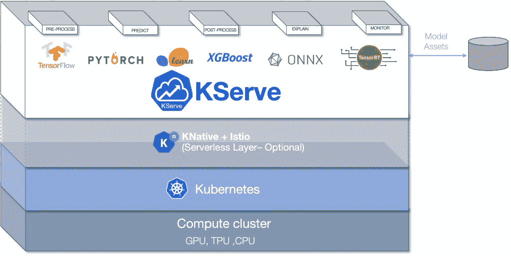
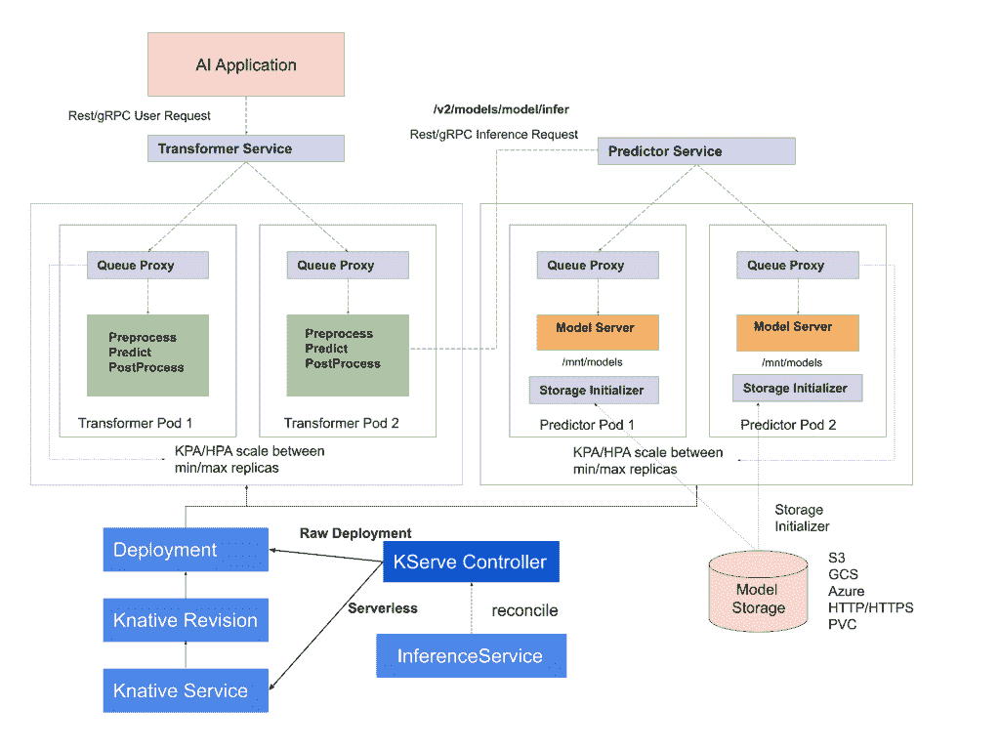
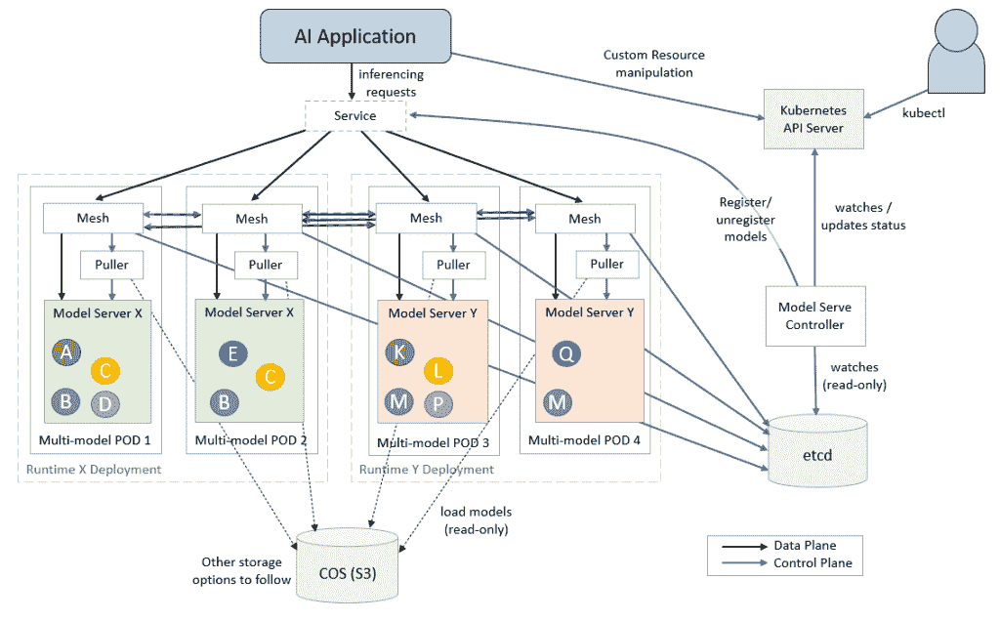

# KServe:健壮且可扩展的云原生模型服务器

> 原文：<https://thenewstack.io/kserve-a-robust-and-extensible-cloud-native-model-server/>

如果你熟悉 [Kubeflow](https://www.kubeflow.org) ，你就会知道 [KFServing](https://www.kubeflow.org/docs/components/kfserving/kfserving/) 作为平台的模型服务器和推理机。去年九月，KFServing 项目已经完成了转型，成为 [KServe](https://kserve.github.io/website/0.8/) 。

KServe 现在是从 Kubeflow 项目中分离出来的一个独立组件，只是名称有所改变。这种分离允许 KServe 发展成为一个独立的云本地推理引擎，作为独立的模型服务器部署。当然，它将继续与 Kubeflow 紧密集成，但它们将被作为独立的开源项目来对待和维护。

对于模型服务器的简要概述，请参考我以前的文章之一。

KServe 是由 Google、IBM、彭博、Nvidia 和 Seldon 合作开发的，作为 Kubernetes 的开源云原生模型服务器。最新的版本 0.8 直接关注于将模型服务器转换成一个独立的组件，并对分类法和命名法进行了修改。

先来了解一下 KServe 的核心能力。

模型服务器对于机器学习模型就像应用程序对于二进制代码一样。两者都为部署提供了运行时和执行上下文。KServe 作为模型服务器，为大规模服务机器学习和深度学习模型提供了基础。

KServe 可以部署为传统的 Kubernetes 部署，也可以部署为支持零扩展的无服务器部署。对于无服务器，它利用了无服务器的 Knative 服务，该服务具有自动扩大和缩小的功能。Istio 被用作向 API 消费者公开服务端点的入口。Istio 和 Knative 服务的结合实现了令人兴奋的场景，例如模型的蓝/绿和金丝雀部署。

RawDeployment 模式允许您使用 KServe 而无需 Knative Serving，它支持传统的扩展技术，如水平 Pod 自动缩放(HPA ),但不支持零扩展。

## KServe 架构

KServe 模型服务器有一个控制平面和一个数据平面。控制平面管理和协调负责推理的定制资源。在无服务器模式下，它与 Knative 资源协调管理自动缩放。

KServe 控制平面的核心是 KServe 控制器，它管理推理服务的生命周期。它负责创建服务、入口资源、模型服务器容器、用于请求/响应日志记录的模型代理容器、批处理以及从模型存储中提取模型。模型存储是向模型服务器注册的模型的存储库。它通常是一种对象存储服务，如亚马逊 S3、谷歌云存储、Azure 存储或 MinIO。

数据平面管理以特定模型为目标的请求/响应周期。它有一个预测器、转换器和解释器组件。

AI 应用程序向预测器端点发送 REST 或 gRPC 请求。预测器充当调用转换器组件的推理管道，转换器组件可以执行入站数据的预处理(请求)和出站数据的后处理(响应)。可选地，可能有一个解释器组件来为托管模型带来人工智能的可解释性。KServe 鼓励使用可互操作和可扩展的 V2 协议。

数据平面也有端点来检查模型的准备情况和运行状况。它还公开了用于检索模型元数据的 API。

## 支持的框架和运行时

KServe 支持广泛的机器学习和深度学习框架。深度学习框架和运行时可与现有的服务基础设施配合使用，如 TensorFlow Serving、TorchServe 和 Triton Inference Server。KServe 可以通过 Triton 托管 TensorFlow、ONNX、PyTorch、TensorRT 运行时。

对于基于 SKLearn 的经典机器学习模型，XGBoost、Spark MLLib、LightGBM KServe 依赖于 Seldon 的 MLServer。

KServe 的可扩展框架使得插入任何符合 V2 推理协议的运行时成为可能。

## 使用模型网格的多模型服务

KServe 为每个推理部署一个模型，将平台的可伸缩性限制在可用的 CPU 和 GPU 上。当在昂贵且稀缺的计算资源 GPU 上运行推理时，这种限制变得很明显。

借助多模式服务，我们可以克服基础设施的限制—计算资源、最大数量的 pod 和最大数量的 IP 地址。

[ModelMesh Serving](https://github.com/kserve/modelmesh-serving) ，由 [IBM](https://www.ibm.com/cloud?utm_content=inline-mention) 开发，是一个基于 Kubernetes 的平台，用于 ML/DL 模型的实时服务，针对高容量/密度用例进行了优化。与管理流程以优化利用可用资源的操作系统类似，ModelMesh 优化了部署的模型，以便在集群中高效运行。

通过跨部署的 pod 的集群的内存中模型数据的智能管理，以及随着时间的推移这些模型的使用，系统最大化了可用集群资源的使用。

ModelMesh 服务基于 KServe v2 数据平面 API 进行推理，这使得它可以作为类似于 NVIDIA Triton 推理服务器的运行时进行部署。当一个请求到达 KServe 数据层时，它被简单地委托给 ModelMesh 服务。

与 KServe 服务的 ModelMesh 集成目前处于 Alpha 阶段。随着这两个项目的成熟，将会有更紧密的集成，使得混合和匹配两个平台的特性和功能成为可能。

随着模型服务成为 MLOps 的核心构建块，KServe 等开源项目变得非常重要。KServe 使用现有和未来运行时的可扩展性使其成为一个独特的模型服务平台。

在接下来的文章中，我将向您介绍在基于 GPU 的 Kubernetes 集群上部署 KServe 的步骤，以便在 TensorFlow 模型上执行推理。敬请关注。

<svg xmlns:xlink="http://www.w3.org/1999/xlink" viewBox="0 0 68 31" version="1.1"><title>Group</title> <desc>Created with Sketch.</desc></svg>