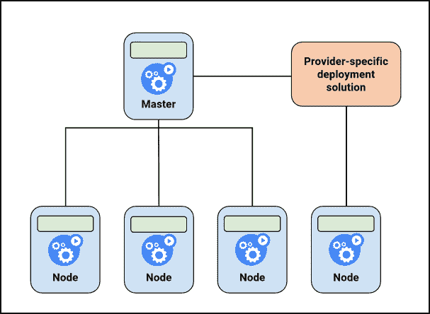
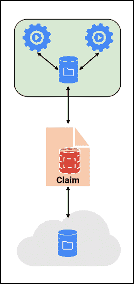
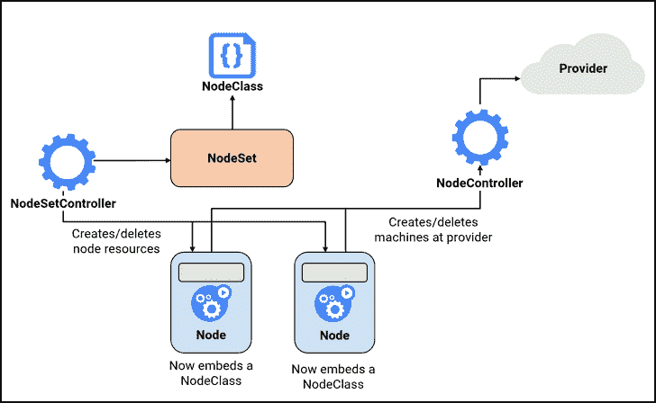
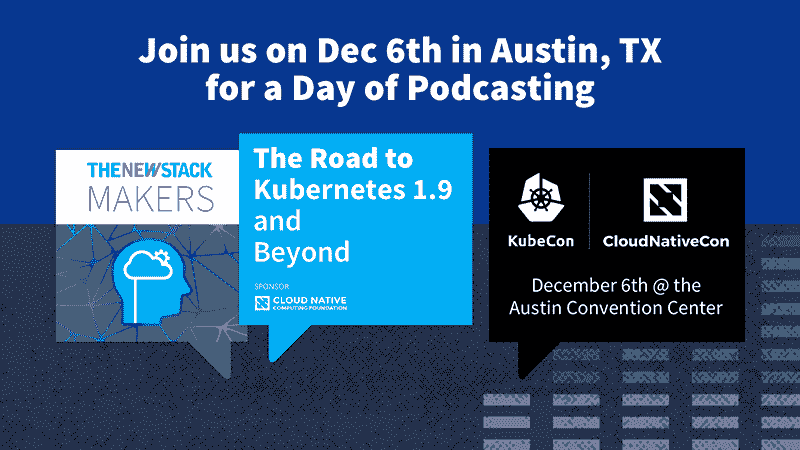

# Kube-Node:让您的 Kubernetes 集群自动管理它的节点

> 原文：<https://thenewstack.io/kube-node-let-k8s-cluster-auto-manage-nodes/>

 [亨里克·施密特

亨里克·施密特是 Loodse 的高级开发人员。施密特对 Kubernetes 和云原生技术的潜力充满热情。他是开源项目 nodeset 和 kube-machine 的主要贡献者。](https://www.loodse.com/) 

正如 Michelle Noorali 在今年三月的 KubeCon Europe 的主题演讲中所说的那样:Kubernetes 开源容器编排引擎对开发者来说仍然很难。从理论上讲，开发人员对 Kubernetes 和容器技术非常着迷，因为他们只需编写一次应用程序，就可以在任何地方运行，而不必担心底层基础设施。然而，在现实中，他们在许多方面仍然依赖运营，这(可以理解)挫伤了他们对这些技术的颠覆性潜力的热情。

对开发人员来说，一个主要的缺点是 Kubernetes 不能自动管理和自动扩展自己的机器。因此，每次部署或删除工作节点时，操作人员都必须参与进来。显然，有很多节点部署解决方案，包括 Terraform、 [Chef](https://www.chef.io/) 或 [Puppet](https://puppet.com/) ，让 ops 活得轻松多了。然而，它们都需要特定领域的知识；不需要 ops 干预的跨各种平台的通用方法并不存在。

图表:当前的 Kubernetes 节点部署方法。

Kubernetes 节点部署和管理的主要问题是，节点(或机器)生命周期与一般的 Kubernetes 资源生命周期之间没有 Kubernetes 本机一致性。在当前的节点生命周期中，节点资源是在机器加入集群后创建的。然而，一般的 Kubernetes 生命周期的工作方式正好相反:首先是节点资源，然后是机器的添加。

图形:持久卷抽象。

我们认为需要挑战这种不令人满意的现状。为了解决这个问题并实现通用节点管理，我们决定启动一个社区项目 [kube-node](https://github.com/kube-node/kube-machine) 。我们的目标是为 Kubernetes 开发一个本地节点集成，类似于 [PersistentVolumes](https://kubernetes.io/docs/concepts/storage/persistent-volumes/) 系统。

PersistentVolumes 系统从如何使用存储中抽象出如何提供存储的信息，并提供一个与任何云环境隔离的高级 API。这种抽象使得卷的生命周期独立于其消费者，因此可以动态地分配和管理它们。

## 我们如何建立 Kube-Node

与 PersistentVolumes 的设置类似，kube-node 是一个抽象的高级系统，其中:

*   管理员定义配置
*   开发人员可以通过简单的**ku bectl create node-f node 1 . YAML**来扩展集群
*   Kubernetes 控制节点的生命周期

为此，我们引入了两个新的 API 资源，NodeClass 和 NodeSet，并辅以配置实例:NodeController 和 NodeSetController。

*   NodeSet 确保任何时候都有指定数量的节点在运行。与 ReplicaSet 非常相似，NodeSet 确保一个节点或一组同类节点始终处于可用状态。每个节点集指的是一个节点类，详细信息在节点模板中描述。
*   NodeClass 为管理员提供了为他们提供的节点设置配置的可能性。NodeClass 包含云提供商和操作系统特定的详细信息，包括(可能)凭据、机器类型以及配置数据。此外，集群管理员可能决定服务质量级别或任意策略。Kubernetes 本身并不热衷于 NodeClass 代表什么。
*   NodeSetController 监视节点集，并负责创建和删除节点。在其当前的参考实现中，这意味着它要么创建节点资源，要么与谷歌容器引擎(GKE)节点池同步。
*   NodeController 监视节点对象，并在云提供商处提供机器。在机器加入集群之后，kubelet 更新节点资源。同样，当删除节点对象时，NodeController 也会删除提供者中的机器。

图表:kube 节点

## 总结和路线图

kube-node 是一个社区项目，支持 Kubernetes 的通用节点管理。目标是为开发人员提供一种简单的方法来扩展集群，而无需操作干预，也不考虑底层基础架构。它包括基于 CustomResourceDefinition 的类型、基于 client-go 的客户端以及 NodeController 和 NodeSetController 的参考实现。

NodeSetController 的第一个参考实现与 NodeController 协同工作，第二个参考实现将节点集与 GKE 节点池集成在一起。两者都显示了概念的灵活性，以覆盖不同的用例。NodeController 的第一个参考实现 [kube-machine](https://github.com/kube-node/kube-machine) 重用 docker-machine 的部分库来为许多不同的云提供商启动机器。

下一步，我们计划将 NodeSet 与 Kubernetes 自动缩放器集成在一起，使 NodeController 能够根据 NodeSet 中指定的副本自动创建节点对象——由集群上的负载控制。通过这种集成，Kubernetes 将能够在不同平台上自动扩展其节点。除此之外，我们将建立更多的 NodeController 实现，包括例如 Terraform、Python 或一个利用实例组的 Amazon Web Services 实现。

*在 Kubecon 2017 上，Loodse 的 Sebastian Scheele 和 SysEleven 的西蒙·皮尔斯[将讨论](http://events.linuxfoundation.org/events/kubecon-and-cloudnativecon-north-america/program/schedule)如何通过在 Kubernetes 上运行 Kubernetes 来创建高可用性集群。* 

<svg xmlns:xlink="http://www.w3.org/1999/xlink" viewBox="0 0 68 31" version="1.1"><title>Group</title> <desc>Created with Sketch.</desc></svg>