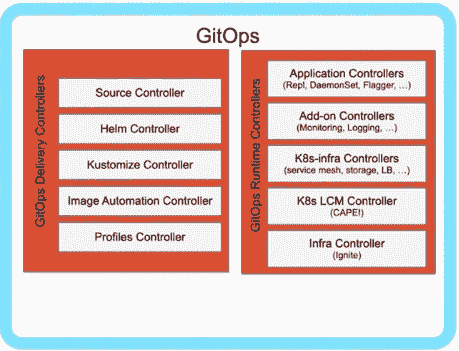

# kube con:GitOps 管道的云原生模式

> 原文：<https://thenewstack.io/kubecon-cloud-native-patterns-of-the-gitops-pipeline/>

[Honeycomb](https://www.honeycomb.io/) 正在赞助新 Stack 对 Kubecon+CloudNativeCon 北美 2020 的报道。

模式识别是让我们成为人类的原因之一。从很小的时候起，模式就帮助我们做出预测，理解关系和过程的复杂性。

作为一名技术战略家，[Cornelia Davis](https://twitter.com/cdavisafc)30 年职业生涯的一部分一直是强调复杂分布式系统中的模式。毕竟，她[在上面写了书](https://www.manning.com/books/cloud-native-patterns)。作为 [Weaveworks](https://www.weave.works/) 的 CTO，她与开源和商业合作伙伴一起利用这些云原生模式。

在 KubeCon North America，Davis 揭示了 GitOps 的新模式——可重复性、从失败中恢复和减少劳动——并为观众提供了利用它们所需的实践、模式和工具。在今年[kube con+CloudNativeCon North America](https://events.linuxfoundation.org/kubecon-cloudnativecon-north-america/)的一次技术演示中，她建议您将这些模式串联到一个安全的 GitOps 管道中，该管道利用了她所谓的 Kubernetes 协调循环平台。

## 你是怎么停止的？

在这个从运营角度看待云原生的演讲中，Davis 将 [GitOps](https://thenewstack.io/what-is-gitops-and-why-it-might-be-the-next-big-thing-for-devops/) 定义为“一套用于部署和管理云原生基础设施和应用的现代最佳实践”

她列举了 GitOps 的优势，包括:

*   审计跟踪的合规性和安全性
*   可重复性
*   从失败中恢复
*   可靠性
*   通过更多部署和更快的反馈循环提高工作效率
*   减少辛劳
*   多云和内部部署
*   一个平台来统治他们

戴维斯指出:“我们开展 GitOps 的方式将对我们享受的利益产生直接影响。”。

GitOps 是 git 的一个组合体，git 是一个分布式的代码库，可以作为真理和操作的单一来源。Davis 说不仅仅是实践和模式，还包括实现它们的工具。而且，像大多数技术与文化的结合一样，她强调 GitOps 的主要用户界面在整个过程的左边。

Davis 解释说，GitOps 的真正好处来自于适当的组织，尤其是如何在设计的中心规划自动化。

## 是 CI。和 CD。不是 CI/CD。而且是拉不是推。

Davis 说，您可能首先会在最可靠的领域——持续集成中寻求增强自动化。毕竟，CI 在很长一段时间内都有成功的自动化。为什么不把部署放在那里？戴维斯说没那么快。

她认为，“持续集成不同于持续交付和部署。有理由将它们分离出来。”

首先，Davis 说有必要保持关注点的分离——开发人员编写和发布代码，但操作员必须保持对安全部署到生产环境所需的严格流程的控制。她还指出了将 CI 和 CD 分离的内在需求，以便可以轻松地将运营部署到不同的环境中。此外，如果有一个失败，重新创建一个部署应该能够发生，而不需要新的构建。

“没有 CI/CD。不是一个词。有 CI 也有 CD，但是将它们分开绝对有好处，”戴维斯说。

至关重要的是，如果您将 CD 放在您的 CI 流程中，您将使其成为一种攻击服务，进入 CI 环境的人可以进入运行时环境。

这就是为什么她说，为了最大限度地利用 GitOps，您必须将部署从持续集成循环中抽出来。

然而，一旦分开，你就会面临大规模网络连接的挑战。您可以持续部署到一个点、几个点，如开发、试运行和生产，许多点，如工厂咖啡厅的边缘部署，或数以万计的移动塔。

Davis 说，解决这个问题的简单方法是将连续部署过程从集中式环境中翻转到数十或数千个运行时环境中。然后，不是将配置推到那些运行时环境，而是将配置拉到那些运行时沉积中。

## 协调循环的力量支持其他 GitOps 模式

怎么需要知道什么时候拉？你不需要。相反，您可以在 Kubernetes 集群中运行协调循环，这样可以不断地从这些存储库中提取没收的数据。

“Kubernetes 创造了这个和解平台，”戴维斯承认。

期望的状态在存储库中，协调器正在观察系统的实际状态。

戴维斯说，这种强大的协调模式允许其他 gitop——或云原生操作模式——出现。

她确定的下一个模式是:漂移、检测和补救。重要的是，Git 有一个版本历史。如果你遇到了某种灾难性的事件，想要重建你的环境，只要没有任何漂移，你可以很容易地做到这一点。但是 Davis 问道:如果有人应用了 Kubectl——她称之为现代版的[SSHing](https://thenewstack.io/choke-points-ticketmasters-take-containerization-integration-change/)——而你的 git 让我们偏离了期望的状态，会发生什么？由于该协调器一直在运行，它可以执行补救，如撤销更改以返回到存储库中表示的状态，或者您可能不想走那么远，而只是 ping 某人。

接下来，Davis 介绍了图像更新自动化模式。对您的映像存储库的任何更新都可以在 YAML 代码本身中自动完成，利用另一个协调器通过直接推送或生成拉取请求来自动更新它，有人可以批准或可以自动批准该请求。然后，协调器部署该映像的更新版本。

GitOps 管道还允许通过 [kustomize](https://github.com/kubernetes-sigs/kustomize) 定制环境，这允许定制 YAML 文件。当不同的部署端点之间存在差异时，使用 Kustomize，应用基本配置，然后覆盖该基础。同样，协调器可以允许这些覆盖，并允许这些不同的运行时环境得到不同的对待。

Davis 指出，“在从映像注册表中获取这些应用程序配置和映像，并将它们组合成将在我的运行时环境中运行的实际声明状态的过程中，需要一大堆细节。我喜欢称那套控制器，那套调解器，交付控制器。”

## 渐进式交付的 GitOps 模式

在戴维斯参观稳定的 GitOps 管道的这一点上，她说我们已经到了将配置绘制到 Kubernetes 的地步，但还没有完全部署 running pods。当然，这将通过其他 Kubernetes 协调器或 Davis 所谓的“运行时控制器”来完成，如副本集和守护进程集。

> “当我们将所有这些不同的协调器、所有这些不同的控制器汇集在一起时，整个范围内的真实情况就会发生。”—科妮莉亚·戴维斯，纺织厂

詹姆斯州长创造了一个总括术语[渐进式交付](https://thenewstack.io/the-rise-of-progressive-delivery-for-systems-resilience/)，用于在更广泛地部署之前将流量路由到特定的用户子集。[渐进式交付](https://thenewstack.io/progressive-delivery-for-distributed-systems-with-canarying-service-meshes-and-chaos-engineering/)包括 A/B 测试、[蓝绿部署和金丝雀发布](https://thenewstack.io/primer-blue-green-deployments-and-canary-releases/)、[服务网格](https://thenewstack.io/what-the-numbers-say-about-how-service-meshes-are-used-today/)、[混沌工程](https://thenewstack.io/chaos-engineering-can-give-distributed-systems-stability/)和[可观察性](https://thenewstack.io/observability-a-3-year-retrospective/)。

Davis 说，您可以应用协调循环来促进不同的渐进式交付部署场景。Kubernetes 允许您扩展 API，这样您就可以创建一个识别部署何时发生的协调器，并在其上添加一些额外的逻辑。

Weaveworks 开源了 [Flagger](https://github.com/weaveworks/flagger) ,作为在 GitOps 管道中定义部署策略的一种方式。通过在 Kubernetes 中作为一组控制器实现的 Flagger，您可以选择是要运行 canary、A/B 测试还是蓝绿色部署，然后它会与入口或服务网格连接以提供流量路由。Flagger 然后可以为这些策略运行运行时分析、提升和回滚。

## 推动您的 GitOps 渠道的六种云原生运营模式

对于 Davis 来说，GitOps 最好被定义为在声明配置的 Kubernetes 基础上提供的连续交付和连续操作，总是带有 git 的“不变性防火墙”。

您将代码存储在 git 的声明性配置中。然后，您有一组交付控制器来促进您的管道。然后你有运行时控制器，让它进入生产。这都是用户体验在左手边。这样，git 就扮演了 UX 和可回滚或前滚的分布式不可变数据存储的角色。

戴维斯说:“你将这些控制器连接到与你的组织和需求相关的管道中，这就是将 GitOps 聚集在一起的原因。”

云原生运营模式总结

1.  CD 与 CI 分开
2.  拉动配置
3.  漂移检测和补救
4.  图像更新自动化 PIC
5.  环境定制
6.  渐进式交货

“中间的自动化必须是云原生的。“云原生操作就是 GitOps 的全部，”戴维斯说。

<svg xmlns:xlink="http://www.w3.org/1999/xlink" viewBox="0 0 68 31" version="1.1"><title>Group</title> <desc>Created with Sketch.</desc></svg>