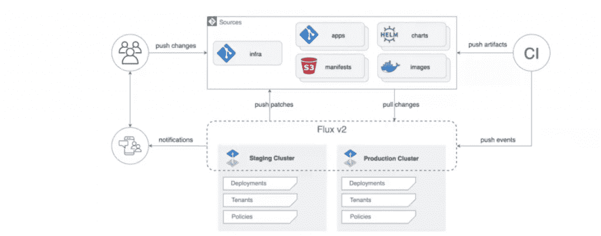

# KubeCon + CloudNativeCon EU 面临巨大的应用交付挑战

> 原文：<https://thenewstack.io/kubecon-cloudnativecon-eu-confronts-the-great-app-delivery-challenge/>

今天，[Cloud Native Computing Foundation](https://cncf.io/?utm_content=inline-mention)的大多数沙盒项目都属于运行时和应用交付的广泛类别，这反映了 DevOps 团队在云原生环境上构建和部署应用程序时，尤其是那些基于 Kubernetes 构建的应用程序时，如何继续寻求改善开发人员和运营体验的方法。DevOps 团队通常乐于尝试新的解决方案，例如那些仍处于早期开发阶段的 CNCF 沙盒项目，因为他们试图找到降低通常巨大的复杂性的方法，以帮助缓解他们面临的与部署应用程序和以前所未有的速度将代码投入生产相关的压力。

这是周三举行的 [KubeCon + CloudNativeCon EU](https://www.cncf.io/kubecon-cloudnativecon-events/?utm_content=inline-mention) 主题演讲和会谈的主要收获之一。

CNCF 沙盒项目的最大份额属于应用程序交付类别，其中 API 充当开发和部署周期中改进自动化和降低复杂性的管道。在她的主题演讲中， [Isovalent](https://isovalent.com/) 的首席开源官和 CNCF 技术监督委员会主席[利兹·赖斯](https://uk.linkedin.com/in/lizrice)，定义了应用交付类的工具如何被用来“弥合开发者在键盘上编写代码和代码被打包并交付为可以在云中运行的应用之间的差距”

换句话说，围绕 CNCF 沙盒项目的大多数活动都与改善云原生生产管道的开发人员体验有关。赖斯说，因此，带有运行时标签的项目是“我们看到最多实验的地方”，以“使开发者和运营商更容易构建和运行云原生应用程序”，沙盒类别中有 11 个这种类型的项目。

## 具有更多 Kubernetes 范围的 GitOps

考虑到 GitHub 和 GitLab 等 git 解决方案被用作超越代码库的平台，改善 CI/CD 的追求不可避免地涉及到寻找最佳 git 流程(或 GitOps)。为此， [Weaveworks 的](https://www.weave.works/) Flux 扩大了其作为平台的覆盖范围，以帮助维护 Kubernetes 集群的状态，使其与 Git 中的配置相匹配。Flux 的框架功能最近也在 Flux 从沙盒类别毕业前推出，成为几天前 CNCF 孵化的[项目。](https://www.cncf.io/projects/)

Weaveworks 的开发人员体验工程师斯蒂芬·普罗丹(Stefan Prodan)在他的主题演讲“CNCF 项目更新:Flux”中描述了该框架的功能如何帮助“弥合源代码控制访问和 Kubernetes 访问之间的差距”，从而允许验证创建提交的用户的身份。"

“你可以验证那个人有权利修改你的生产集群上的东西，然后工具包可以通过模拟 Kubernetes 帐户来运行这些更改和操作，”他说。他还说 Kubernetes 集群访问仍然受到限制，这取决于集群管理员如何配置访问控制。

## Kubernetes 管理计划'假设'

对于 CI/CD 以及一般的 DevOps 团队来说，一个具有挑战性的领域是如何开发、部署和管理通常分布在不同云环境中的应用程序。当然，服务网格和控制平面将继续发挥关键作用。但是 Kubernetes 的管理能变得多简单——或者像许多人猜测的那样多无聊？

在他的演讲“Kubernetes 作为混合云的控制平面”中，Kubernetes 和 OpenShift 的架构师 [Red Hat](https://www.openshift.com/try?utm_content=inline-mention) 和 Kubernetes 委员会成员 [Clayton Coleman](https://www.linkedin.com/in/claytoncoleman) 描述了一个没有“数千个服务”的控制平面，而是拥有“1000 个小集群，每个运行一个服务”“如果我们逆转方向呢？”科尔曼说，“如果我们能让 Kubernetes——API——带头，会怎么样？”

科尔曼描述了 Kubernetes 最终“没有 pod 的样子”和“在我们的无 pod 工具箱中”的工具的原型配置这些工具将提供名称空间来细分工作负载，提供 RBAC(基于角色的访问控制)来保证安全性，并提供可以接受通用配置的秘密和配置映射。

科尔曼说:“所以你看到的是一个类似立方体的控制平面可能如何表现的真正简单的原型:一个没有 pods 容器或节点的 Kubernetes API，以及集成描述一个更加集成的世界的声明性 API 所需的所有可扩展性客户端支持和工具。”“我们如何改变我们的应用程序和 API”来实现它？团队 A 和团队 B 在不知道对方的实现细节的情况下就一项服务进行协作。"

## 将 CNCF 的作品放在适当的位置

在去年首次实现 Kubernetes 后，运动解决方案提供商 [Peloton](https://www.onepeloton.com/) 的平台副总裁 Jim Haughwout 在他的演讲“云原生技术如何帮助 Peloton 实现指数级增长”中描述了 Peloton 的健身应用程序在去年从零开始运行后，现在如何完全在 Kubernetes 上运行。

下一步:实现一个服务代理，比如[特使。](https://www.envoyproxy.io/)为了做到这一点，Haughwout 描述了他的 DevOps 团队是如何回顾“CNCF 和其他人是如何解决与服务发现边界管理相关的问题的”,改善安全性和服务之间的通信管理,“不仅仅是在云中或移动设备中，而是一直到边缘，以及我们的连接健身设备。”

“这不仅仅是一个流行词，我知道这将成为今天一个非常流行的术语，这是我们联网健身以及将我们的联网健身设备连接到我们所有技术的核心角色。豪夫沃特说:“我们可能会发现一些真正有趣的特使案件，或许还有特使手机案件。”。“我认为这里的事情是，在移动、边缘和云之间，在云原生、移动原生之间，有如此多的挑战，这是我们利用 CNCF 和其他开源技术挑战的绝佳机会。”

<svg xmlns:xlink="http://www.w3.org/1999/xlink" viewBox="0 0 68 31" version="1.1"><title>Group</title> <desc>Created with Sketch.</desc></svg>