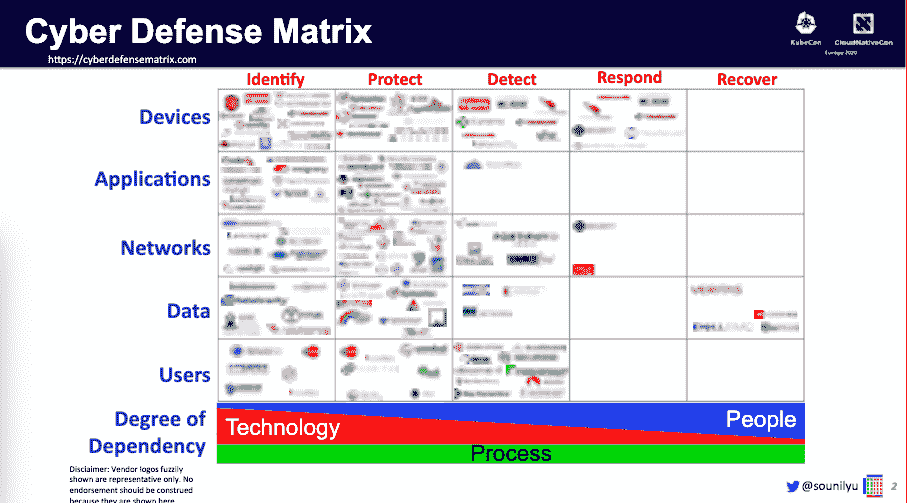
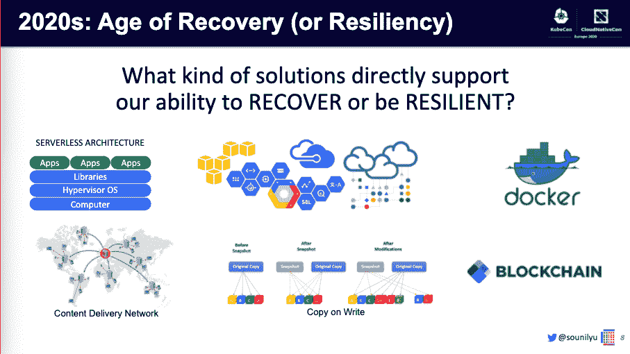
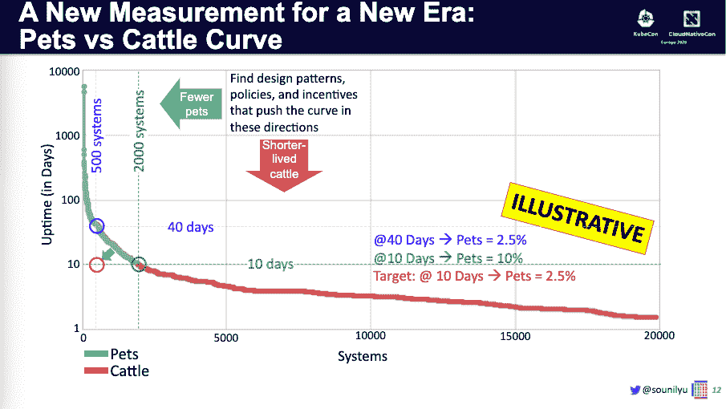
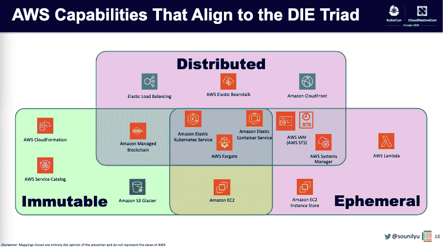
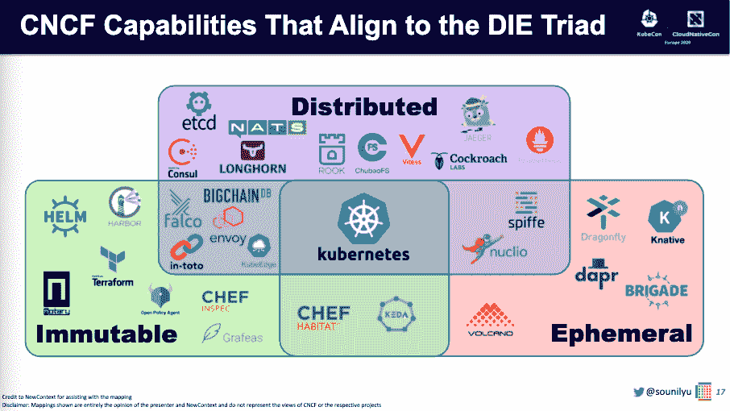

# KubeCon EU:未来十年的云原生安全工具将专注于恢复

> 原文：<https://thenewstack.io/kubecon-eu-cloud-native-security-tools-for-the-next-decade-will-focus-on-recovery/>

今年是 2020 年，安全专家 [【苏尼尔】](https://twitter.com/sounilyu) 将未来十年称为复苏时代并不令人惊讶。

在上个月的 KubeCon + CloudNativeCon EU 云原生安全日的演讲中，Yu 探讨了安全技术领域如何发展，以及如何适应新的云原生世界。他提供了这种固有的分布式、不可变和短暂的基础架构，作为 IT 团队(包括首席信息官和 CISO)能够在我们面临的接二连三的攻击中避免不可挽回的损失的真正方式。

## **你如何开始组织所有的网络安全技术？**

在担任美国银行(Bank of America)首席安全科学家之前，Yu 的任务是了解安全技术领域，即成千上万的安全技术和供应商，以及它们如何融入功能组合。

考虑到这一挑战，余创造了他所谓的 [**网络防御矩阵**](https://owasp.org/www-project-cyber-defense-matrix/)——这也是他即将出版的书的名字。

在这个矩阵中，y 轴代表你关心的五件事。在这种情况下，考虑到银行巨头的系统，他选择了:

*   设备
*   应用程序
*   网络
*   数据
*   用户

x 轴突出显示了 [NIST 网络安全框架](https://www.nist.gov/cyberframework/online-learning/five-functions) 的五个功能:

*   识别
*   保护
*   发现
*   作出反应
*   恢复

这种二维可视化使他能够比较产品，并找出企业安全基础设施和实践中的差距。

正如你在上面看到的(品牌被故意模糊)，有一个很强的模式:左边拥挤——识别、保护和检测的工具——右边几乎没有。如果你看看矩阵的底部，你还会看到在识别方面有很大程度的技术依赖，但这一过程转向面向服务的公司，利用人来检测，响应，特别是恢复。

这让于不禁要问:网络安全行业真的在解决正确的问题吗？

## **回顾过去，了解网络安全如何发展到今天的地步**

为了回答这个问题，俞回顾了首席信息安全官及其团队的发展历程。以下是反思，以及迄今为止每个十年都映射到他的网络防御矩阵类别的认识——也许解释了在不久的将来要填补的空白。

20 世纪 80 年代:识别我们的资产 — IT 产品变得越来越便宜，因此企业开始大量购买。然后这些企业开始问自己:我们为什么要买这个？它是如何支持业务的？它们对我们的业务有多重要？解决方案是 IT 资产管理系统。俞指出，首席信息官和团队之间没有紧张关系，因为根本没有专门的 IT 安全团队。

**20 世纪 90 年代:保护我们的资产** —系统受到黑客攻击，很容易在 IT 环境中获得立足点。这导致了安全配置指南，反病毒软件和臭名昭著的网络防火墙。安全团队的成立是为了花大部分时间告诉 IT 关闭有风险的部分。紧张就这样开始了。Yu 在这一点上提到安全团队“只是一个专注于漏洞管理的业余爱好者”

**2000 年代:检测针对我们资产的入侵** —这十年充满了太多需要调查的日志、警报和客户端攻击。由此产生了安全入侵、事件管理和入侵检测系统，这些系统有助于定义异常活动的警报，如黑客越过防火墙。CISO 获得了更多高管的认可，并被正式任命负责安全管理。

**2010 年:应对我们资产的违规行为**——意识到上世纪 90 年代制定的许多保护措施很容易被规避，并以假阳性淹没了分析师。首席信息官和 CISO 角色之间的紧张关系形成了一种看似永久的分裂。

“首席信息官和 CISO 之间有太多的利益冲突。因此，在许多组织中，CISO 职能部门、安全职能部门分离出来，成为一个专门的业务部门，”于说。

他说，所有这些导致这十年要么成为复苏时代，要么成为恢复时代，或者两者兼而有之。

## **这十年是复苏的时代吗？**

俞继续他的谈话:我们将面临什么样的挑战会影响我们的恢复能力？哪些问题会造成不可逆、不可挽回的伤害？

他认为这将受到三种传统安全范式的攻击，这三种范式通常被称为中央情报局三位一体:

1.  **保密性**——像维基解密和 Doxxing
2.  **完整性** —如勒索软件和#FakeNews
3.  **可用性** —如 PDO、MBR Wiper 和 bricking 固件

Yu 表示，当行业寻找新的安全供应商时，他们得到的只是更多的保护、检测和响应。

> “在每个时代，我们都面临着新的挑战，这些挑战直接削弱了我们识别、保护、检测或响应的能力。因此，我们必须开发新的解决方案来帮助我们克服这些挑战。以前的 era 解决方案没有解决当前的 era 问题。”— Sounil Yu，网络防御矩阵

他发现的适用于恢复和弹性的工具有:

*   [内容传递网络。](https://thenewstack.io/the-new-stack-context-serverless-web-content-delivery-with-jamstack/)
*   设计原则，比如 [Copy on Write](https://en.wikipedia.org/wiki/Copy-on-write) 其中于说你永远不会擦除任何东西，而是让它保持为待定状态。
*   码头集装箱。
*   云基础设施。
*   无服务器功能。

他继续说，即使是“像区块链这样的流行语”也适合这个有弹性的未来。

Yu 指出，这些技术都有三个共同的核心设计原则来对抗新的攻击机制:

*   高度**分布式**解决方案意味着您不再需要担心单个系统的可用性。
*   **如果你有**不可变**的服务，你不需要帮助维护系统完整性。**
***   短暂意味着你不必担心服务的可用性或保密性。**

 **他的**骰子三元组**完全消除了对安全性的需求。

“如果我们朝着‘死亡三人组’所代表的新范式设计，我们就不必担心‘中央情报局三人组’。换句话说，如果我们可以让我们的资产死去，为什么我们需要中情局来保护它们？”余问道。

他认为，我们应该进一步重新审视我们的风险分析。传统上，风险是通过*风险=可能性 x 影响*来衡量的。但是，当我们看到一组永无止境的漏洞，这些漏洞不断被更聪明的攻击者利用时，这就相当于不可逾越的指数增长。

> “漏洞像牛奶一样老去，而攻击者的技能像葡萄酒一样老去。这两者的结合意味着可能性会随着时间的推移而增加，不幸的是，这超出了我们的控制。然而，我们能控制的是影响。”— Sounil Yu，网络防御矩阵

这意味着不要把重点放在降低可能性上——因为它将会发生——而是要把重点放在降低影响上。

## **云原生天生减少攻击影响，增加弹性**

余提到了宠物和牛的概念——你可以给你的宠物命名、爱护和照顾它们，但你不应该长期依恋你的牛。他说，在云出现之前，几乎所有的东西都是宠物。

“我们喜欢拥抱我们的机器，像我们的个人笔记本电脑或国民身份证号码这样的东西都是宠物，”他说。

但是不断变化的容器、信用卡号和 lambda 函数更像牛。

所以你仍然照顾你的宠物，但是你对待你的牛就像它已经准备好要死了一样。

因此，如果一切都在向云原生芯片三元组发展，那么围绕这一点构建数据和衡量标准非常重要。例如，如果您希望事物是短暂的或暂时的，您会想要测量事物的寿命——即正常运行时间。然后，如下图所示，您可以创建一个正常运行时间阈值的示例。门槛越低，宠物越少。

从那里你可以设定目标来减少宠物的数量和牲畜的寿命。这反过来使您的组织更有弹性。

最终，宠物是不可避免的，但俞说，你只需要知道什么时候新的宠物被创造出来，有意识地用 CIA 保护这些宠物，并战略性地建立云第一，以牛为先，准备死亡。

## **新的文化和技术能力**

这当然既是一种技术变革，也是一种文化变革。创建提醒，提醒同事他们即将创建一个宠物，并让他们选择退役。然后在您的组织中发现类似宠物和牛的设计模式。

他指出，一旦你有了宠物，就很难摆脱它们，这就是为什么你要确保你没有把牛变成宠物。这意味着避免以下行为:

*   塞进一个容器里。
*   允许资产比需要的寿命更长。
*   就地修补。

最后，俞相信这种生死攸关的运动将最终缓解过去 40 年来脆弱的首席信息官和坚韧不拔的之间的紧张关系。

到 2020 年，什么会真正使系统具有弹性或抗脆弱性？俞说，混沌工程的创造性应用使系统更像“死亡”，找出脆弱的宠物，把它们变成牛。然后，确保你越来越少的宠物仍然得到高度保密性、完整性和可用性的特殊照顾。

亚马逊网络服务和云计算原生计算基金会是新堆栈的赞助商。

<svg xmlns:xlink="http://www.w3.org/1999/xlink" viewBox="0 0 68 31" version="1.1"><title>Group</title> <desc>Created with Sketch.</desc></svg>**