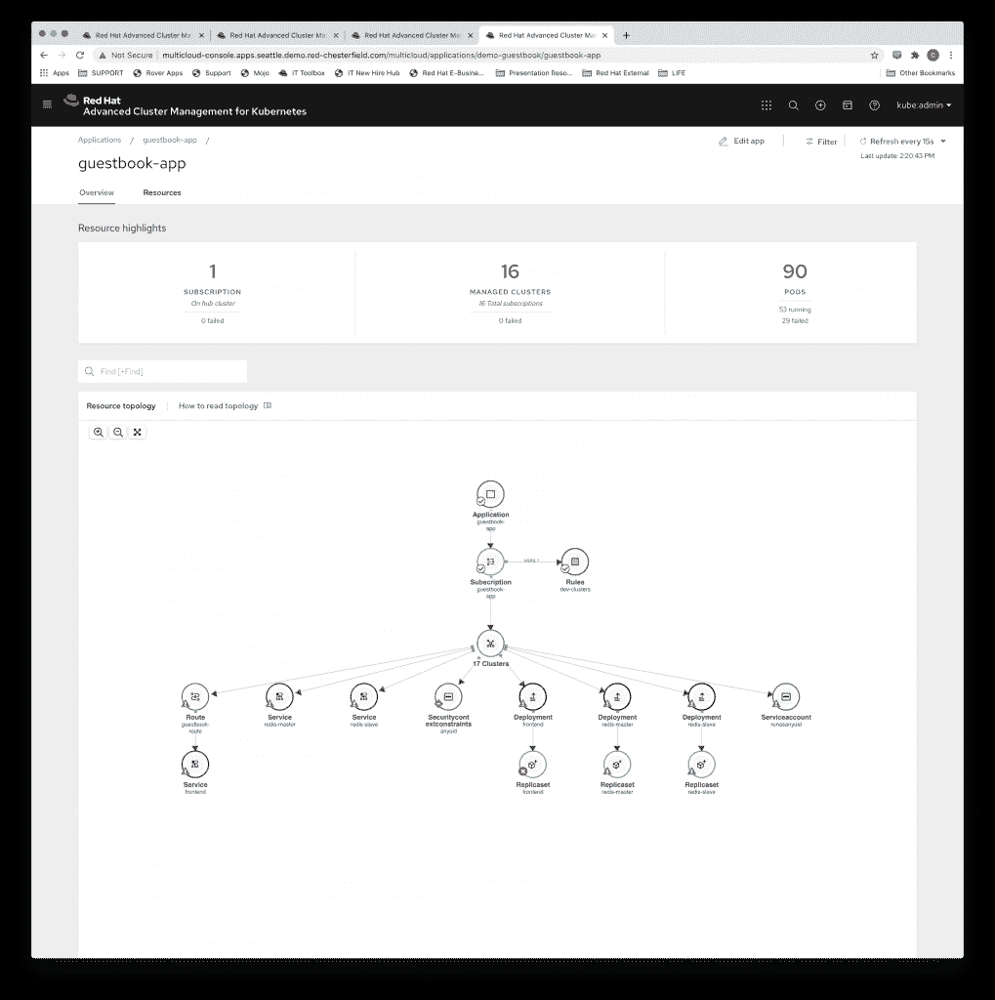

# KubeCon EU: Red Hat 通过高级集群管理将 OpenShift 扩展到边缘

> 原文：<https://thenewstack.io/kubecon-eu-red-hat-expands-openshift-to-the-edge-with-advanced-cluster-management/>

仅仅因为你在边缘操作——在文明边缘的仓库或信号塔中——并不意味着你希望你的技术像它周围的环境一样质朴和偏远。认识到这一事实，红帽在本周的 KubeCon + Cloud NativeCon Europe 虚拟会议上发布了 [Red Hat OpenShift 4.5](https://www.redhat.com/en/technologies/cloud-computing/openshift) 和[Red Hat Advanced Cluster Management for Kubernetes](https://www.redhat.com/en/technologies/management/advanced-cluster-management)的新功能，根据公司声明，“旨在帮助企业推出基于开放混合云主干的边缘计算战略”。

今年早些时候，随着 open shift 4.4 的[发布，首次发布了测试版，该版本见证了高级集群管理功能的普遍可用性，它为用户提供了跨混合云的单一一致视图，并在高度横向扩展的 edge 架构的情况下提供了帮助。除此之外，OpenShift 4.5 还引入了结合管理节点和工作节点的能力，提供了 3 节点集群来缩小 Kubernetes 在边缘上的部署规模，而不会影响功能——唯一的限制实际上取决于在边缘部署的硬件。在 4.5 中，在 OpenShift 上运行虚拟机工作负载的能力也变得普遍可用，这进一步扩展到了 Kubernetes 在边缘上的部署。](https://thenewstack.io/red-hat-expands-openshift-to-ease-developer-use/)

除了这些功能， [Red Hat](https://www.redhat.com) 的高级技术战略总监 Nick Barcet 在接受采访时解释说，鉴于在处理边缘用例时行业之间的差异，该公司还将重点放在了一些特定的行业上。

“我们观察到的是，每个垂直行业和每个用例的优势确实不同，因此，我们没有提供一套最终可以满足所有人的功能，而是决定专注于两个市场——电信，使用 Kubernetes 部署 5G，以及工业，更具体地说，如何满足工厂的需求。我们在这两种情况下构建的都是完整的蓝图，对给定元素部署尽可能多的实例的完整 GitOps 描述，”Barcet 说。

Barcet 说，这些蓝图将决定在边缘上运行 Kubernetes 的配置，他形容这为开发人员提供了将边缘视为基础设施的任何其他部分的能力。

“Edge 将是我所说的‘超级云’的延伸。它是客户拥有的云足迹、数据中心足迹和边缘足迹的组合。作为一个扩展，这意味着从开发人员的角度，从产品所有者的角度来看，当你部署在云中或部署在边缘时，你不应该看到任何部署上的差异。您希望对部署原则进行一次编码，然后选择部署工作负载的位置，这就是您应该做的全部工作。"

Barcet 还表示，通过在边缘运行 Kubernetes，他们开始能够将越来越多的处理转移到边缘，进一步减少延迟，并将边缘移向网络。

“在电信环境中，越来越多的流程发生在网络的核心，现在这些流程被委派出去。Barcet 说:“您的响应时间不再受到从无线电发射塔到核心接入互联网的每个节点的延迟的影响，现在您可以直接从无线电发射塔接入互联网，并立即进入互联网。

与此同时，将 Kubernetes 移至边缘引入了一个新的问题——管理复杂性。这就是现在普遍可用的高级集群管理发挥作用的地方，它提供了单一视图以及管理、保护和确保法规遵从性和一致性的能力。

“ACM 增加了能够管理集群的概念。为了高效地完成这项工作，您需要一个基于策略的引擎。当你谈论成千上万或更多的规模时，你不能依靠人工选择角色，”Barcet 解释说。

ACM 使用拉模型来管理这些边缘部署，在拉模型中，部署与中央 ACM 进行核对，以确定它是否需要新的配置，从而确保它将被更新，即使它在某个点断开连接。

红帽是新堆栈的赞助商。

由 Pixabay 的 Valiphotos 提供的特征图像。

<svg xmlns:xlink="http://www.w3.org/1999/xlink" viewBox="0 0 68 31" version="1.1"><title>Group</title> <desc>Created with Sketch.</desc></svg>