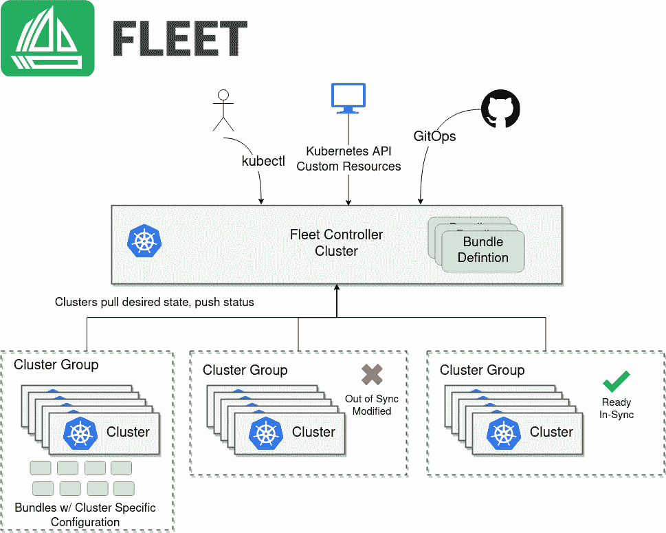

# kube con EU:Kubernetes 边缘部署激增导致集群蔓延

> 原文：<https://thenewstack.io/kubecon-eu-surge-of-kubernetes-edge-deployments-leads-to-cluster-sprawl/>

Kubernetes 在零售场所、装配线和其他“边缘计算”环境中的部署激增正在导致集群蔓延，这可能是一个安全隐患，正如 edge solutions 的牧场主副总裁 Keith Basil 将在他即将于本周虚拟举行的[kube con+CloudNativeCon Europe](https://events.linuxfoundation.org/kubecon-cloudnativecon-europe/)会议上讨论的那样。

事实上，被 SUSE 收购的 Rancher 声称，它看到了 Kubernetes 的使用向边缘的根本转变。

“正如我们所知，Kubernetes 集群不再位于数据中心，”Basil 在接受新堆栈采访时表示。

巴兹尔的演讲， " [管理集群蔓延](https://kccnceu20.sched.com/event/Zh3C/sponsored-keynote-managing-cluster-sprawl-are-you-ready-keith-basil-vp-edge-solutions-rancher) ，"将于周四，16:10在 CEST 举行。 他将讨论 管理 在管理大规模集群时必须克服的安全、异构架构和连接性的挑战。

Rancher 的 [K3s](https://k3s.io/) ，一个针对资源受限环境的精简版 Kubernetes 发行版，已经为公司取得了不声不响的成功。目前，Rancher 每周看到大约 20，000 次下载，其中许多来自评估 K3s 可能的生产用途的公司，

在许多情况下，K3s 用于边缘部署，例如零售店、快餐店和工业生产管道。这些不是大多数人熟悉的通用大规模 Kubernetes 星团。Basil 说，相反，每个部署可以在单节点集群上运行单个应用程序。每个位置都有自己的集群，可能只运行几个 GPU 和 K3s 的一个副本。

如此多的公司处于管理大量小型远程集群的位置，或者 Basil 称之为“微集群”。回顾牧场主数据，Basil 发现许多客户有 500-700 个集群，少数客户甚至运行数万个集群。平均每个公司有近 1，700 个集群。

“问题是，‘你如何做到这一点？’”巴兹尔问道。

Basil 说，考虑到计算和存储资源可能处于“非常不利的环境”，安全态势至关重要。“如果有人从命令和控制的角度访问您的机器，他们实际上就在您的网络上。因此，作为一种威胁媒介，需要加以解决。”Basil 在加入 Rancher 之前从事云安全工作，他更喜欢用“命令和控制”的军事方法来保护环境。

在云原生环境中，这可能需要一种 [GitOps](https://thenewstack.io/gitops-git-push-all-the-things/) 方法，在这种方法中，配置由开发人员声明，然后推入 git 存储库并按需推出。“我们发现，从架构的角度来看，大规模管理集群的最佳方式是集群从某个集中的位置下载配置，”他说。

事实证明，Rancher 有自己的工具，叫做[舰队](https://github.com/rancher/fleet)，来管理大量的集群。对于 Fleet，代理安装在集群上，可以配置该集群，然后加载应用程序。巴兹尔说，如果你愿意，它“基本上可以充当你的遥控手”。

KubeCon + CloudNativeCon 是新堆栈的赞助商。

<svg xmlns:xlink="http://www.w3.org/1999/xlink" viewBox="0 0 68 31" version="1.1"><title>Group</title> <desc>Created with Sketch.</desc></svg>