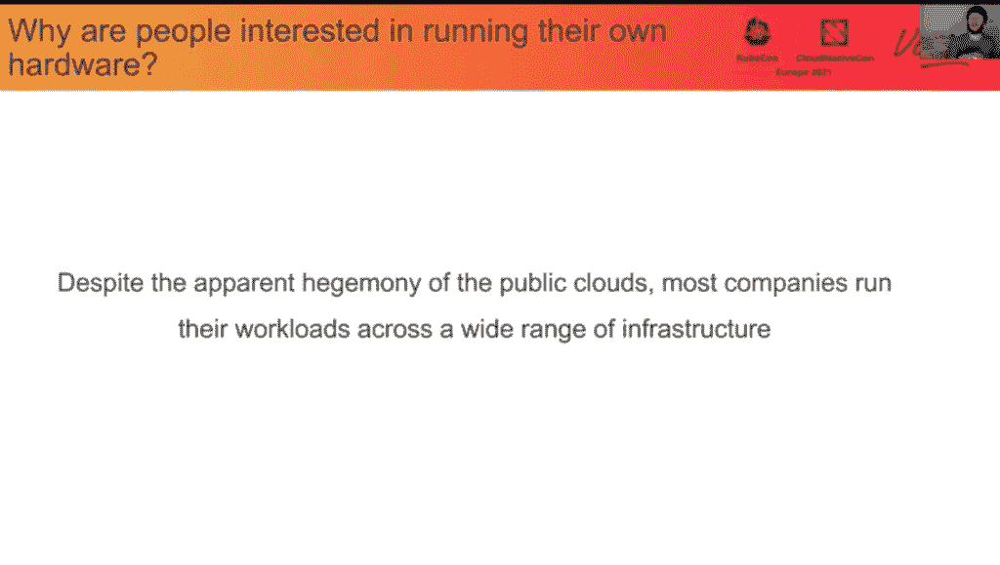
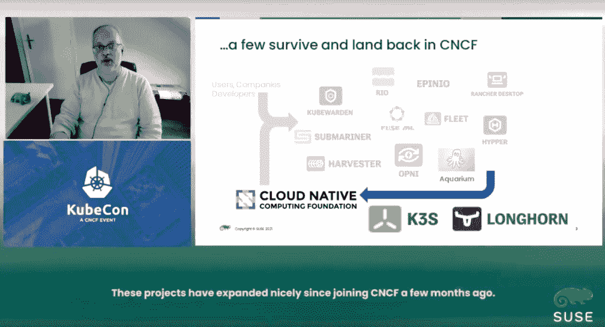
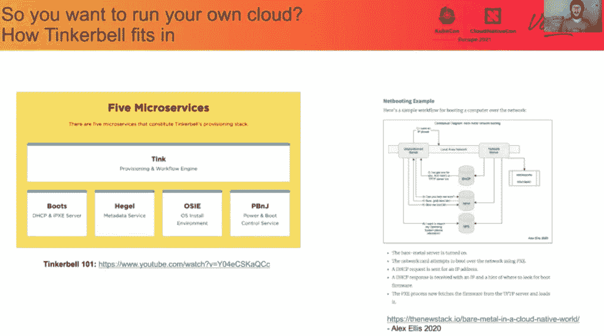
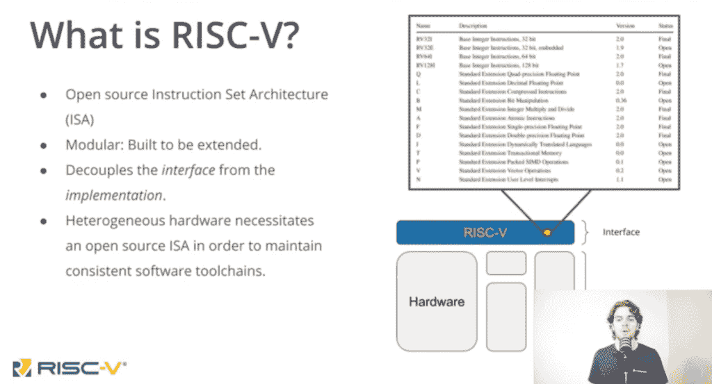
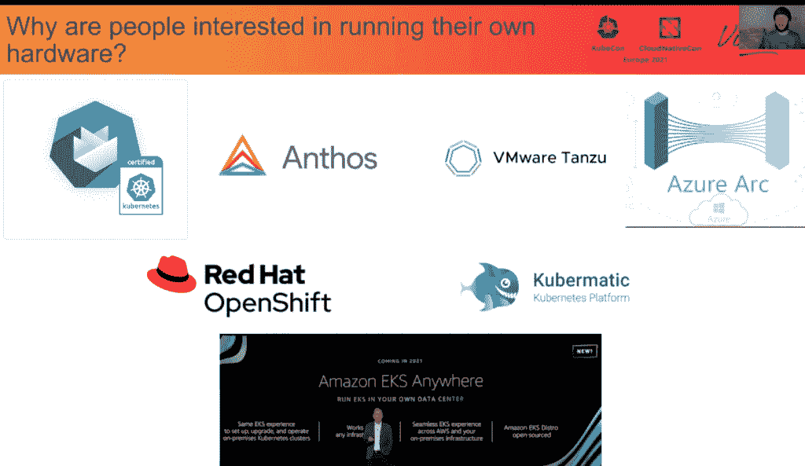

# KubeCon EU:裸机案例

> 原文：<https://thenewstack.io/kubecon-eu-the-case-for-bare-metal/>

向云的巨大转变通常会“遮蔽”内部基础架构(更具体地说，裸机服务器)在云环境中发挥的关键作用。

例如，传统行业中的组织似乎仍然在传统基础架构和传统数据中心环境中维护许多 It 资源，无法跟上更加敏捷的纯云创业公司的步伐。然而，这种假设与事实相去甚远。对于许多应用程序和部署来说，裸机服务器管理是在 Kubernetes 环境上进行部署和管理的一项要求。例如，这些可能包括边缘计算和以数据库为中心的计算。

在上周举行的[云原生计算基金会](https://cncf.io/?utm_content=inline-mention)[kube con+CloudNativeCon EU](https://www.cncf.io/kubecon-cloudnativecon-events/?utm_content=inline-mention)会议期间，保持内部部署或裸机服务器的必要性，以及选择向纯云计算模式转变的可行性和主题演讲。“对于那些使用内部部署的人来说，这确实是一个机会，因为他们可能决定不使用公共云，或者因为他们有特殊的理由，或者因为他们经常使用公共云，然后发现实际上，在他们运行的规模下，从公共云回来并在内部运行更有意义，”[Equinix Metal](https://www.linkedin.com/in/markrobertcoleman/?originalSubdomain=uk)的开发人员关系高级总监马克·科尔曼在他的演讲“用 Tinkerbell 将裸机带到云”中说

“我们看到的是，随着一些发展……对于那些‘落后者’—如果你愿意的话，我显然不同意——来说，这是一个真正的机会，成为新一波云本地创新的早期采用者。他们正在利用云原生生态系统中的许多工具，以便能够大规模运行自己的硬件，而不必使用公共云。”

作为大规模 Kubernetes 采用者，德国电信几乎不是云原生“落后者”，而是设法依赖德国不同地点的裸机服务器。对于云本地环境中的裸机主机供应，电信使用了[金属 Kubed 和讽刺的](https://github.com/metal3-io)。配置完成后，Git 和 Kubernetes API 用于管理裸机服务器来托管 Kubernetes 集群。

对裸机服务器基础设施的访问与其说是正确地“管理”它，不如说是因为该项目可以更好地描述为“一个自我管理的等式，其中基础设施会照顾好自己，”德国电信技术公司容器和云原生引擎小组负责人 [Vuk Gojnic](https://de.linkedin.com/in/vuk-gojnic) 在他的主题演讲中描述了“德国电信技术公司如何构建 Das Schiff 以在云原生海洋中航行”

“大多数时候……我们的工作(裸机服务器)实际上侧重于以布局的形式为所有这些创造一种粘合剂，使我们能够覆盖我们的多站点、基础设施和集群场景，”Gojnic 说。

## 边缘案例

裸机选择和管理通常也被视为优化边缘计算性能的关键。服务器硬件选择至关重要，例如，当机器学习应用程序必须处理来自分散数据库的低延迟馈送的大量数据时。例如，在物联网中，工厂车间的连接设备可能具有非常低的延迟和高带宽连接，但如果它缺乏必要的 CPU 和内存性能，无法以最佳速度进行数据计算或执行计算密集型的艰巨任务，它就没有多大价值。

“特别是今年，我们开始看到 edge 终于真正成为一件东西，所以我们看到各种各样的公司都希望让硬件更接近他们的用户，无论是在你的办公室，无论是在你的商店，无论是在你的棒球场。科尔曼说:“有很多原因可以解释为什么拥有一个离用户更近的数据中心会是一个好主意，当然这意味着你将会以一种你可能无法在公共云中实现的方式来运行它，你将会运行自己的硬件。”。“我认为这产生了一种有趣的现象:有一种观点认为，任何不去云计算的人都有可能成为落后者——我不同意这种观点。”

## 一直到芯片

Kubernetes 集群上运行的应用程序的性能最终很大程度上取决于裸机服务和设备的 CPU 性能。这种需求导致了在云环境中运行的裸机应用程序的大量与 CPU 相关的新发布和开发。

针对边缘设备和工业应用，SUSE 最近推出了 Longhorn 1.1 分布式存储平台，支持 ARM64 CPU 架构，专为低功耗边缘设备应用而设计(Longhorn 最初由 Rancher 创建，该公司 [SUSE 收购了](https://thenewstack.io/suse-will-gain-a-foothold-in-the-kubernetes-ecosystem-with-rancher-purchase/))。Longhorn 1.1 还扩展了边缘设备的存储能力。

对于 Kubernetes-native 分布式块存储，Longhorn“将与边缘和工业计算相关，在这些领域 Arm 显然非常活跃，”SUSE 首席技术和产品官托马斯·迪·吉亚科莫在他的主题演讲“开源创新-从失败走向成功”中说

开源 [Tinkerbell](https://www.cncf.io/sandbox-projects/) ，为云原生环境提供裸机服务器和其他设备，[在 11 月成为 CNCF 沙盒项目后，于 4 月更新](https://thenewstack.io/how-open-source-tinkerbell-was-created-to-make-bare-metal-provisioning-easier/)。Tinkerbell 最初旨在自动化裸机服务器和设备的裸机配置流程，无论它们是位于数据中心、公共云还是远程边缘应用。

Equinix Metal 的 Coleman 在主题演讲中解释了该项目如何从与 CNCF 更紧密的合作中受益。

“我们开始看到越来越多的行业合作伙伴进入并采用小叮当，通过 CNCF 实现开放和清晰的治理变得越来越重要，”Coleman 说。

再往下看，RISC-V(一种开放的标准指令集架构)正在扩展到 Kubernetes 的裸机应用中。在他的主题演讲“云原生环境的最低层”中，高级软件工程师 [Daniel Mangum](https://www.linkedin.com/in/danielmangum) 和云架构师 [Carlos Eduardo de Paula](https://br.linkedin.com/in/carlosedp) 演示了他所说的“第一台采用 PC 外形的 RISC-V 全功能计算机”

Mangum 注意到异构硬件如何需要开源 ISA 来实现一致的软件工具链，他指出“简单地将工作负载部署在价格相似的新机器上并看到巨大改进的日子可能即将结束。”

“简而言之，硬件将变得越来越多样化，”曼古姆说。

这些发展遵循了主要云和软件供应商针对云原生和 Kubernetes 的裸机计划，尤其是在支持边缘应用方面。它们包括[亚马逊 Web 服务](https://aws.amazon.com/?utm_content=inline-mention) ' [弹性 Kubernetes 服务(EKS)](https://aws.amazon.com/fr/eks/) 用于数据中心裸机服务器以及亚马逊云上的 Kubernetes 管理，以及[谷歌 Anthos](https://cloud.google.com/anthos) 、 [VMware Tanzu](https://tanzu.vmware.com/fr/tanzu) 、 [Red Hat OpenShift](https://www.openshift.com/) 不断扩大的裸机和边缘范围，以及如 Coleman 所指出的，由 [Kubermatic](https://www.kubermatic.com/products/kubermatic/) 等鲜为人知但“重要”的供应商所做的努力。

科尔曼说:“运营自己的基础设施再次变得很有吸引力。

<svg xmlns:xlink="http://www.w3.org/1999/xlink" viewBox="0 0 68 31" version="1.1"><title>Group</title> <desc>Created with Sketch.</desc></svg>