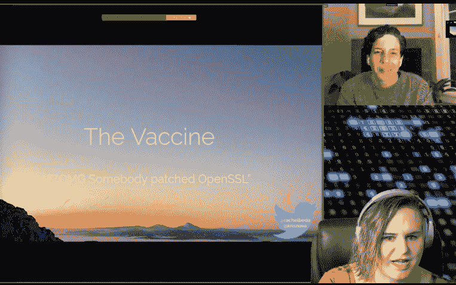

# KubeCon:新冠肺炎灾难恢复和站点可靠性工程的教训

> 原文：<https://thenewstack.io/kubecon-lessons-in-disaster-recovery-from-covid-19-and-site-reliability-engineering/>

[Honeycomb](https://www.honeycomb.io/) 正在赞助新 Stack 对 Kubecon+CloudNativeCon 北美 2020 的报道。

大灾难。无论是全球疫情还是生产中断，问题不在于是否，而在于何时。安全专家 [Kris Nóva](https://twitter.com/krisnova) 在本周 [KubeCon + CloudNativeCon](https://events.linuxfoundation.org/kubecon-cloudnativecon-europe/) 期间(当然是虚拟的)请来了西雅图的医学博士[Rachel Beda](https://twitter.com/rachelbeda)来分解灾难恢复的所有事情。

从新冠肺炎到现场可靠性工程，他们就疫情爆发、待命、应急响应和最终预防交换了意见。事实证明，在分布式系统的软件安全中，有许多来自这个疫情的经验教训。

> “你得洗手。你得打开 RBAC。”—克里斯·诺瓦，安全专家

## 当意外的疾病爆发时

无论是恶意攻击还是灾难性的生产中断，无论我们做了多么充分的准备，诺瓦说，一场意想不到的疫情将会发生。

生活在美国第一个新冠肺炎热点地区的贝达对此再清楚不过了。在这灾难性的一年开始时，很明显，这种神秘的病毒具有难以置信的传染性，甚至可以在有人出现症状之前传播。看到警告信号，Beda 的团队甚至要求一名员工在新年去亚洲旅行后进行自我隔离。她的团队准确地预测到他们会被问题淹没，并开始计划他们的回应。

西雅图也见证了第一次关闭。到 3 月初，她所在城市的学校关闭，华盛顿州迅速实施了干预措施。

Nóva 表示，这已经感觉像是在运行 Kubernetes 的云原生系统中突然爆发了一场疾病，在该系统上运行了一些应用程序。当你开始注意到你的系统出了问题时，它看起来和感觉起来都很相似。

就像医学专业人士阅读新闻和期刊一样，诺瓦说你必须通过可观察性来阅读你的分布式系统。

她将可观察性定义为“你理解系统层的能力，更重要的是，理解如何将系统的所有不同组件连接在一起的能力。”

这包括观察物理计算、存储和网络以及 Kubernetes 抽象层的行为。

然后，Nóva 指出内核跟踪不仅是调试的有效方法，也是了解系统行为、操作系统日志和虚拟机自检的有效方法。她还提到了应用程序工具，该工具使工程师能够添加代码行，这些代码行可以被 Prometheus 监控和时序记录收集，因此您的团队不仅知道什么时候出了问题，还知道何时何地以及为什么会出问题。

然而，诺娃承认，当你第一次开始练习可观测性时，它看起来就像巨大图上的小光点。她说实现一个像开源运行时安全检查器[法尔科](https://falco.org/)(诺娃帮助维护)这样的工具。你必须有一个观察系统，以便能够更快地做出反应。

然后，可观察性允许在事件之后进行取证。

“首先，你要能够复述这个故事，并让你的系统重新上线。Nóva 说:“云的美妙之处在于拍摄快照，进行复制，回到过去理解它，并将其重新构建在一起。

她继续说，Falco 有能力在您的 Kubernetes 集群中发生某些事情时触发运行时警报。

## 总得有人待命吧

一旦您最终检测到漏洞或攻击，下一步是什么？首先，让合适的人知道谁可以传播正确的后续步骤——医生和 sre 都花了很多晚上来回复页面。然后目标是通过隔离和隔离减少受影响的人数。

对于新冠肺炎，贝达说“我们的目标是减少病例数。这是一种主要在人与人之间传播的疾病。Covid 最大的传播方式是人与人之间的粒子传播，“比如咳嗽和打喷嚏。

对于这种特殊的冠状病毒，它是关于[获得低于百分之一的复制数](https://www.healthline.com/health/r-nought-reproduction-number)。取决于你住在哪里，仍然肯定有工作要做。

对于任何应急响应，正确共享信息都是至关重要的。2020 年最重要的时刻之一是中国政府在 1 月中旬完成了冠状病毒基因组测序并开放了源代码。这使得每个人都可以更快地研究潜在的疫苗和治疗方法。

关于口罩和其他个人防护设备(PPE)协议的好处，当然有一些误解，以及它如何传播的不确定性。

然后有明显的错误信息或假新闻，说它会在夏天消失。

事实证明，人类和传统计算机病毒之间又有许多相似之处。如果您没有做好准备，甚至 Kubernetes 的性质也会使攻击者更容易得手。

“Kubernetes 的整个要点是，它为您提供了一组抽象，使您可以轻松方便地访问同一集群中基础设施的其他部分，从攻击者的角度来看，这是非常有趣的，因为理论上，一旦您破坏了[身份验证]材料，您不仅可以访问集群中的其他节点，而且您还拥有一套令人惊叹的工具，人们投入了大量时间和精力，使您可以方便地访问集群中的其他节点，”Nóva 说。

她解释说，一旦你有了一个非法的 kubeconfig，它在运营商和管理员日常使用的工具的整个生态系统中工作，现在就可以被攻击者使用。

Falco 发出警报后，它会继续隔离 Kubernetes 中的节点，这样无论是什么影响了您的一个节点，都不会传播到其他节点。这是在横向攻击开始之前阻止它们的关键组成部分，就像当患者被隔离以防止感染他人一样。

Nóva 还继续建议查看故障率，以及如何使用 Kubernetes 的[集群 API](https://github.com/kubernetes-sigs/cluster-api) 做出响应，允许您拍摄受感染节点的快照，然后迁移、变异和耗尽节点，以离线获得任何感染，以便您可以再次启动新的不可变基础架构。

网络隔离是隔离的另一个重要部分，在网络层减轻感染或恶意行为者，以显著减缓他们的踪迹。

Nóva 强调说，“我们看到隔离在这里很重要，但更重要的是采取行动的能力，并了解一旦您有一个潜在的危害，您就可以看到它蔓延到基础架构的其他部分。”

她说，当事情发生时，有时团队会默认错误信息、猜测和归咎责任。诺娃说，在开源世界，如果你碰巧发现了一个漏洞，会有一个负责任的披露时间，让维护者修复它，但随后应该向更广泛的社区发布补丁。除非有开放的交流，否则开源是不好的。

大多数安全团队也有事后评估，这是聚在一起了解发生了什么的仪式。诺瓦强调说，这不应该是一种指责。

她说，你也可能有假阳性和转移注意力的情况，看起来好像你正在检测问题或了解发生了什么——“但如果你调试一个活跃的系统，它通常更险恶，涉及 DNS。”

诺娃说，你必须在相关性和因果性之间找到平衡，投机可能同样具有生产力和破坏性。

她继续说，很容易被愚弄，这将导致更多的下游问题。她最强烈的建议是“保持怀疑”，不要证明事情的对错，而是证明你的假设“没有错”。

## 病毒预防和检测:为人类制定安全策略

人类和计算机病毒都可以被检测到，并且需要更早地被检测到以防止传播。对于这两种类型的警报，它都是关于平衡灵敏度不足(如快速测试)和特异性过度(如更准确的[基于 PCD 的实验室确认测试](https://pcdfoundation.org/overview/diagnosis/))之间的平衡。贝达说，你真的需要两者，但灵敏度较低的快速测试是首选，所以“你可以便宜，快速，重复地测试更多的人。”

> “我们的预防技术越强大，我们的预防政策就越有力，我们的系统就越健康。”—克里斯·诺瓦，安全专家

诺娃说，这在很大程度上取决于你基于角色的访问控制。不仅仅是打开它，而是定义了系统的多少部分？系统的多少部分被集中到这个访问控制中？

对于云原生社区，这些安全工具包括:

*   **许可控制器:**允许你控制允许什么和不允许什么进入你的 Kubernetes 集群
*   **[开放策略代理(OPA)看门人](https://kubernetes.io/blog/2019/08/06/opa-gatekeeper-policy-and-governance-for-kubernetes/) :** 用户和客户端在您的 Kubernetes 集群中可以做什么，不可以做什么
*   **回归测试:**你如何证明和反驳你不希望发生的事情再次发生，不仅仅是在软件层面，还包括网络、内核和存储
*   **内核控制:**可以控制用户可以做什么进程，人们可以对我们的生态系统做什么

预防技术越严格，集群生病的可能性就越小。

然后，关于检测，Nóva 说，在 Kubernetes 中，你希望能够检查假阳性，但你也需要尽你所能。她说，一个网站可靠性工程师必须从接受一定量的不确定性开始，然后在此基础上建立，就像你知道的 90%的克隆已经启动并运行，健康比没有好。

就像 Covid 测试一样，Nóva 提倡贴片的数量胜于质量，只是让事情尽可能快地变得健康。

她谈到了如何再次使用 Falco 来查看内核发生了什么，以检测运行时安全异常。

她说，只要深入 SRE 了解情况，然后你就可以根据你学到的东西开始做决定。

## 群体免疫有可能吗？

现在我们来谈谈群体免疫。这并不是来自于大多数人感染了病毒。根据新冠肺炎的平均感染率，这发生在 70%的人有免疫力的时候。Beda 表示，这可以通过向 70%的人口分发 100%有效的疫苗或者 100%的人口获得 70%有效的疫苗来实现。对于百日咳，有些人永远不会有免疫反应，因此，目标是 94%的人在一生中多次接种疫苗。

当然，这部分是为了确保每个实体或政府都有应对未来疫情的疫情应对计划，包括个人防护设备、抗生素、呼吸道和呼吸药物以及最终疫苗的战略储备。该计划还需要包括指挥链和快速部署战略。

> “你不能只是等着坏事发生。”—瑞秋·贝达医生，聪明的病人

诺娃说，你必须有一个计划，如何在生产中打补丁，如何摆脱恶意用户，同时还要找出他们是如何进入的。毫无疑问，你要确保你正在部署的东西不会很糟糕。使用某种形式的[渐进交付](https://thenewstack.io/the-rise-of-progressive-delivery-for-systems-resilience/)，比如部分补丁或 AB 测试来缓慢发布，允许快速回滚到最后一个已知状态。

然后，您将这些知识应用于更新您的安全策略，也许您的回归测试，以防止它再次发生。

就像医疗响应一样，软件响应必须保持清晰的文档和清晰的指挥链——这样你[就不会不必要地吵醒错误的人](https://thenewstack.io/call-rotations-best-wake-devs-middle-night/)。

*也请务必收听[我们与克里斯·诺瓦](https://thenewstack.io/sysdigs-kris-nova-we-can-never-be-prepared-but-open-source-can-help/)的对话，在疫情开始时录制:*

[Sysdig 的 Kris nóva——我们永远无法做好准备，但开源可以帮助我们](https://thenewstack.simplecast.com/episodes/sysdigs-kris-nova-how-we-can-never-be-prepared-but-open-source-can-help)

KubeCon+CloudNativeCon 和 VMware 是新堆栈的赞助商。

<svg xmlns:xlink="http://www.w3.org/1999/xlink" viewBox="0 0 68 31" version="1.1"><title>Group</title> <desc>Created with Sketch.</desc></svg>