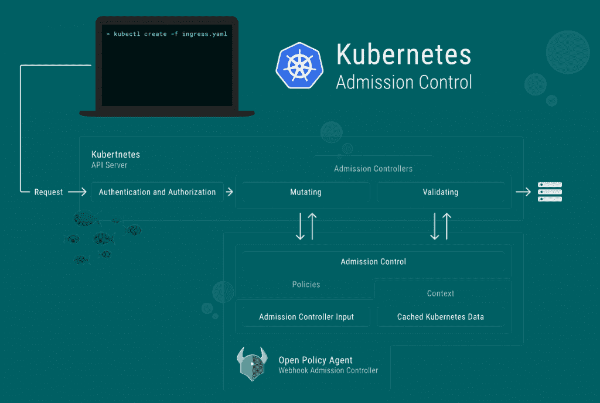

# KubeCon:用政策保护 Kubernetes 的新工具

> 原文：<https://thenewstack.io/kubecon-new-tools-for-protecting-kubernetes-with-policy/>

如果让开发人员创建不安全或违反公司政策的系统，云原生平台的动态特性和容器带来的部署简单性并不总是优势。虽然您使用容器化应用程序部署的内容每次都是相同的，但如果有人最终向集群添加额外的工具或权限来修复生产中的问题，它并不总是保持不变。这些手动干预无法扩展，制定策略也不是您的 devops 团队必须手动实现的事情。

无论策略是关于满足安全性、治理和合规性规则，还是只是整理您从过去的事件和错误中吸取的教训以确保它们不再重复，它都必须自动应用，而不是手动应用，以跟上云原生技术的速度和规模。

Kubernetes 1.9 测试版中引入的[准入控制器 webhooks](https://kubernetes.io/docs/reference/access-authn-authz/extensible-admission-controllers/) 允许 Istio 注入 Envoy sidecars 并允许自动提供持久卷，这也是一种无需重新编译 Kubernetes API 服务器即可应用策略的极好方式，无论是在部署对象之前验证映像存储库还是强制执行唯一的入口主机名。如果一个团队使用特定的入口主机名，您可以阻止其他团队使用该主机名，这样就不会发生冲突。

准入 webhooks 还支持将容器注册表列入白名单或黑名单，因此您可以限制开发人员使用公司存储库。

每当一个资源被创建、更新或删除时，这些 webhooks 都会被执行；它们在请求通过身份验证和授权之后，但在请求的对象被持久化到 etcd 之前，拦截对 Kubernetes 控制器的请求。它们可以是验证、突变或两者兼有。

验证准入 webhooks 拦截请求并拒绝任何不符合策略的请求；它们不对对象做任何更改，因此可以并行运行。这使您可以限制资源创建以匹配策略，如对服务可以运行的副本数量设置团队限制，阻止部署标记为尚未准备好用于生产的代码，或确保所有资源都被标记。

变异准入 webhooks 不能并行运行，因为它们可以通过向 webhook 服务器(可以是集群中运行的 HTTP 服务器，也可以是别处的无服务器函数)发送请求来对对象进行更改；例如，将特使代理添加为边车会改变已部署的对象。不是简单地拒绝请求，变异的许可 webhooks 可以改变请求，使它们符合策略并被允许完成；例如，向对象添加所需的标记和标签，以便项目或团队可以轻松地对其进行审核，或者更改所请求的负载平衡器，使其成为内部负载平衡器。

创建招生网页挂钩可能很复杂，一个选择是使用[开放政策代理](https://www.openpolicyagent.org/)，这是一个 CNCF 托管的沙盒项目(这意味着它是实验性的，不一定准备好生产)。这是一个通用的策略引擎，它根据策略验证 JSON，因此您可以使用相同的工具将策略应用到 Kubernetes、Terraform、REST APIs 访问和 SSH 上的远程连接。

在 OPA 的声明性策略语言[减压阀](https://www.openpolicyagent.org/docs/how-do-i-write-policies.html)中，策略被写成规则或查询，拒绝规则指定策略违规。输入和输出都是 JSON，因此您可以更新策略而无需重新编译(JSON 输出可以是符合策略的修改后的请求)。

来自微软 Azure containers 团队的新开源 [Kubernetes 策略控制器](https://github.com/Azure/kubernetes-policy-controller)项目是一个使用 OPA 的验证和变异准入 webhook[本周在 Kubecon 介绍该项目](https://kccna18.sched.com/event/GrZQ/securing-kubernetes-with-admission-controllers-dave-strebel-microsoft)微软开源架构师 [Dave Strebel](https://twitter.com/dave_strebel) 表示，Kubernetes 策略控制器将很快进入 OPA 项目。

Kubernetes 策略控制器还扩展了标准的 Kubernetes 基于角色的访问控制(RBAC)授权模块，在其前面添加了一个黑名单。所有授权的请求都可以被阻塞，包括阻塞 kubectl 命令在 pod 上的执行。也可以用于审计，查看特定集群上是否违反了任何策略。

repo 中已经有一些示例策略，包括验证入口主机名在所有名称空间中是唯一的，以及将对资源的所有创建、更新或删除请求限制到一组指定的用户。该项目还将托管由社区贡献的样本策略，为 devops 团队提供一个策略库以供使用；有一个在政策上合作的松散渠道。

Strebel 指出，OPA 和 Kubernetes 策略控制器的优点是可以将策略从应用程序中分离出来；策略只需编写一次，就可以应用于整个体系中的多个应用程序。

使用策略会增加一点延迟，尽管对于大多数应用程序来说，他认为这可以忽略不计。Kubernetes 策略控制器的部署是三个容器，策略在内存中运行；这增加了一点开销，但使其适用于对应用程序非常敏感的应用程序。

减压阀将成为许多开发人员的新语言，因为应用策略的影响可能意味着所请求的对象和资源不可用，所以正确制定策略规则很重要。斯特雷贝尔指出，对物体进行变异时要小心也很重要；因为对象发生了变化，这不是开发人员期望得到的，这可能会导致意外的行为或不同的结果。但是，与在 Kubernetes 集群上自动执行策略并能够审计其执行情况的优势相比，这些都是相对较小的缺点。

预计这些工具将快速发展，因为随着 Kubernetes 部署被用于更多的企业应用程序，政策将变得越来越重要，在这些企业应用程序中，法规遵从性和治理是至关重要的。

云本地计算基金会和 KubeCon+CloudNativeCon 是新堆栈的赞助商。

专题图片:CNCF 联合主席 Liz Rice 在 KubeCon 2018，[演示了](https://twitter.com/thenewstack/status/1072909271904342016)准入控制器 webhooks 如何阻止恶意 YAML 代码。

<svg xmlns:xlink="http://www.w3.org/1999/xlink" viewBox="0 0 68 31" version="1.1"><title>Group</title> <desc>Created with Sketch.</desc></svg>