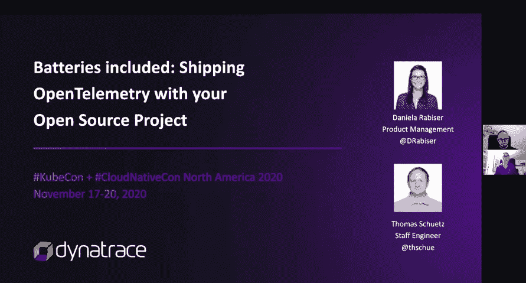

# KubeCon:为什么尽管如此，云原生技术仍继续流行和繁荣

> 原文：<https://thenewstack.io/kubecon-why-cloud-native-continues-to-prevail-and-thrive-despite-everything/>

[Honeycomb](https://www.honeycomb.io/) 正在赞助新 Stack 对 Kubecon+CloudNativeCon 北美 2020 的报道。

显然，现在不是好时候。世界许多地方仍有新冠肺炎死亡病例。以及[丹·科恩](https://www.linuxfoundation.org/in-memoriam-dan-kohn/)的早逝，他是[云原生计算基金会(CNCF)](https://www.cncf.io/) 的前执行董事——作者可以确定他是一个真正善良正派的人——给今年的虚拟 [KubeCon + CloudNativeCon](https://events.linuxfoundation.org/kubecon-cloudnativecon-north-america/) 蒙上了一层阴影。

但尽管如此，今年的 KubeCon 证明了云原生开发和技术不仅在继续发展，而且在蓬勃发展。该社区还继续支持云原生开发的多样性和包容性，这是会议的主题和讨论之一。换句话说，云原生和开源社区继续蓬勃发展。

“这是云原生的最佳表现，正如你所看到的，我们的终端用户正在改变世界，你们中的许多人今天正坐在自己家中的观众席上。这就是终端用户驱动的开源如此鼓舞人心的原因，”CNCF 总经理 Priyanka Sharma 在开幕虚拟主题演讲中说。“今天，工作负载以前所未有的规模运行，复杂性管理是我们从未体验过的。在我们的最终用户和项目之间建立一个直接的反馈回路非常有价值，并且进一步使团队云原生多样化。”

## 最佳比特可观测性

可观察性和采用正确的监控系统来实现应用程序性能的最佳可见性已经成为 DevOps 社区的一个关键挑战。毫不奇怪，OpenTelemetr y 项目是今年 KubeCon 的一个主题。作为提高可观察性跟踪工具之间互操作性的一种方式，创建该项目是为了以一种厂商中立的方式帮助创建可观察性工具的标准。换句话说，OpenTelemetry 将允许组织测试和采用跟踪工具，而不必为来自不同供应商的每个工具创建[SDK](https://en.wikipedia.org/wiki/Software_development_kit)。

“总的来说，我们的目标是确保人们有一个清晰的解决方案来解决如何将仪器数据添加到他们的项目中，无论是开源框架还是最终用户，或者是在可观测性或遥测公司工作的人，”支持 OpenTelemetry 的可观测性提供商 Honeycomb 的主要开发人员 Liz Fong Jones 在新的 Stack livestream 播客[“理解可观测性，然后提升”](https://www.pscp.tv/thenewstack/1mnGeaMbPXrGX)中说:

[LogDNA](https://logdna.com/) 也致力于调整其“Kubernetes Enrichment”平台——在 KubeCon 周期间推出——以符合 OpenTelemetry 标准。该标准将帮助其平台更好地满足用户规范，作为 Kubernetes 环境(包括基础设施和部署的应用)的相关事件和资源指标的可观察性的单一面板。

LogDNA 产品经理 [Michael Shi](https://www.linkedin.com/in/mikeshi42/) 表示:“通过 [Kubernetes Enrichment](https://logdna.com/blog/kubernetes-enrichment/) ，我们主要关注通过在 LogDNA 中展示更多 Kubernetes 指标和元数据来实现新的应用内开发人员工作流。

在 KubeCon 周期间，分布式跟踪和分析提供商 [Dynatrace](https://www.dynatrace.com/) 推出了其可观察性平台 PurePath 4 平台，用于跨多云环境的交易。在整合 OpenTelemetry 和 W3C Trace Context 的同时，这些工具支持针对亚马逊网络服务(AWS)、微软 Azure 和谷歌云平台的无服务器计算的云原生架构，并提供网格配置。

此外，Dynatrace 还将 OpenTelemetry 集成到了其 [Keptn.sh](https://keptn.sh/) 开源项目中。“对于复杂的系统来说，可观察性是关键，”【Dynatrace 的技术产品经理 Daniela Rabiser 在她的 KubeCon 演讲[中说，“电池包括:与您的开源项目一起提供 OpenTelemetry。”](https://onlinexperiences.com/scripts/Server.nxp?LASCmd=AI:1;F:US!100&DisplayItem=E490865&RandomValue=1606149360645)她描述了如何为开源项目预装 OpenTelemetry，以“确保它带有可观测性电池”

同样在 KubeCon 周期间，Diamanti 扩展了其用于 Kubernetes 环境管理和 Ultima 数据平面服务的 Diamanti Spektra 3.1“单一控制台”，以支持亚马逊网络服务(AWS)部署。Spektra 首先支持[微软 Azure](https://azure.microsoft.com/fr-fr/) ，而该公司预计在 2021 年初增加对[谷歌云平台(GCP](https://console.cloud.google.com/?hl=fr) )的支持。

## 15，000 个节点“已经是一件事了”

即使 Kubernetes 开始支持生产级工作负载，研究人员仍在研究 Kubernetes 能力的外部限制。新的工具和平台继续填补部署和管理 Kubernetes 的最佳方式的不确定性真空，以便不断改进容器编排器。

组织也越来越能够以难以置信的规模扩展 Kubernetes 集群。例如，在 KubeCon 关于 SIG 可伸缩性的主题演讲中， [Wojciech Tyczyński](https://www.linkedin.com/in/wojciech-tyczy%C5%84ski-69207417/?originalSubdomain=pl) 是 Google 的一名高级软件工程师，他已经开发 Kubernetes 和 Kubernetes 引擎五年多了，他描述了现在管理具有 15，000 个节点的 Kubernetes 集群是如何可行的。

“拥有 15，000 个节点的集群已经成为现实，”tyczynski 说。

虽然许多(也许是大多数)读者将为其可伸缩性需求从不需要如此大规模的节点来扩展的组织工作，但支持 15，000 个 Kubernetes 节点的研究也将有助于更小级别的集群管理。Tyczyński 说:“可扩展性工作对几乎每个人都很重要，因为可扩展性不仅仅是集群的大小，我们为推动可扩展性限制所做的改进也是——或者甚至可能是主要的——使较小的集群更加可靠和更具性能。

[Go 编程语言](https://golang.org/)，更具体地说是 Kubernetes，Kubernetes 的 Go 客户端，已经成为构建集群应用程序的一种流行且经过验证的方式。

Tyczyński 说:“你们中的许多人可能会感到惊讶，但 Go 内存中的锁争用已经成为 Kubernetes 的一个主要瓶颈。”然而，这个小挫折仍然是意料之中的事，因为贡献的速度和修复的创建继续有增无减。Tyczyński 说，一些针对 Go 瓶颈的优化“已经落地”，“甚至更多的优化即将到来”。“这不仅有利于 Kubernetes，也有利于所有在 Go 中编写应用程序的人，”他说。

其他最近的改进包括消除与读写操作相关的 [Etcd](https://etcd.io/) 分布式键值存储的瓶颈。Tyczyński 说，现在，当列出定制资源时，API 延迟的尖峰已经被消除。

Tyczyński 表示:“随着即将发布的[Kubernetes]版本，您可以期待更多的改进，同时扩展由 15，000 个节点的集群支持的用例组合。

<svg xmlns:xlink="http://www.w3.org/1999/xlink" viewBox="0 0 68 31" version="1.1"><title>Group</title> <desc>Created with Sketch.</desc></svg>