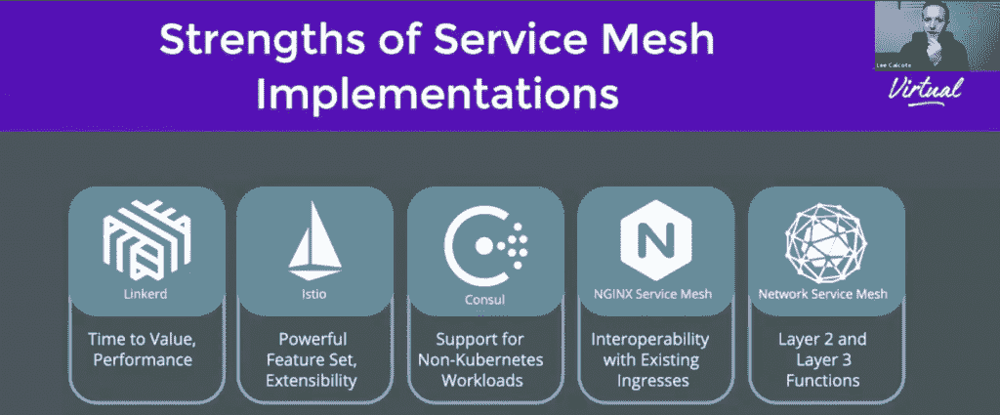
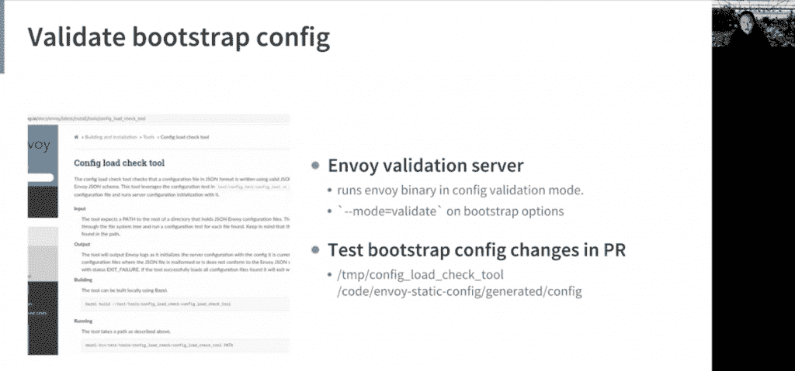
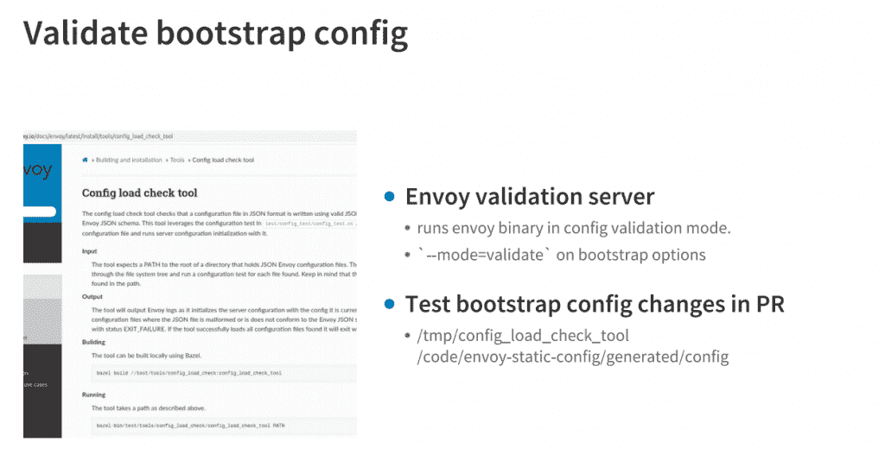
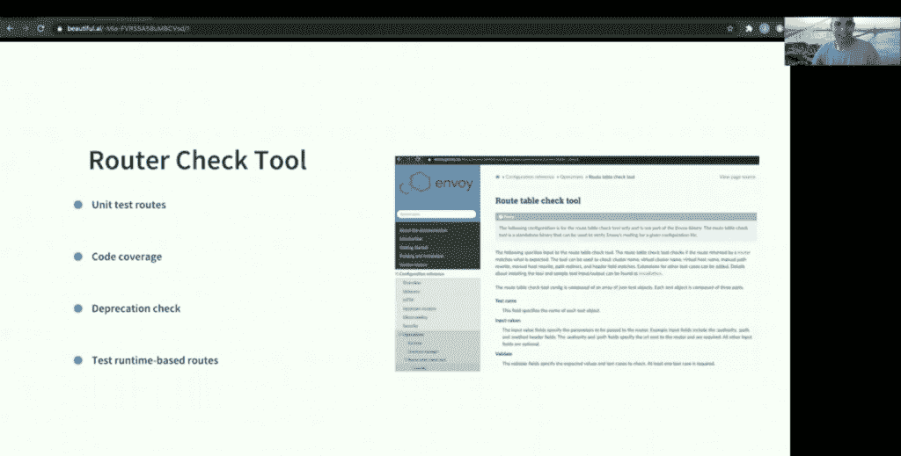
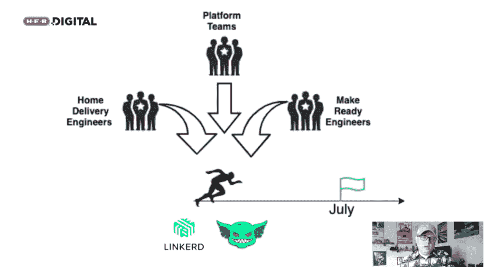
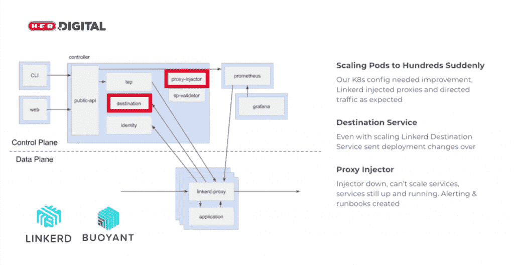
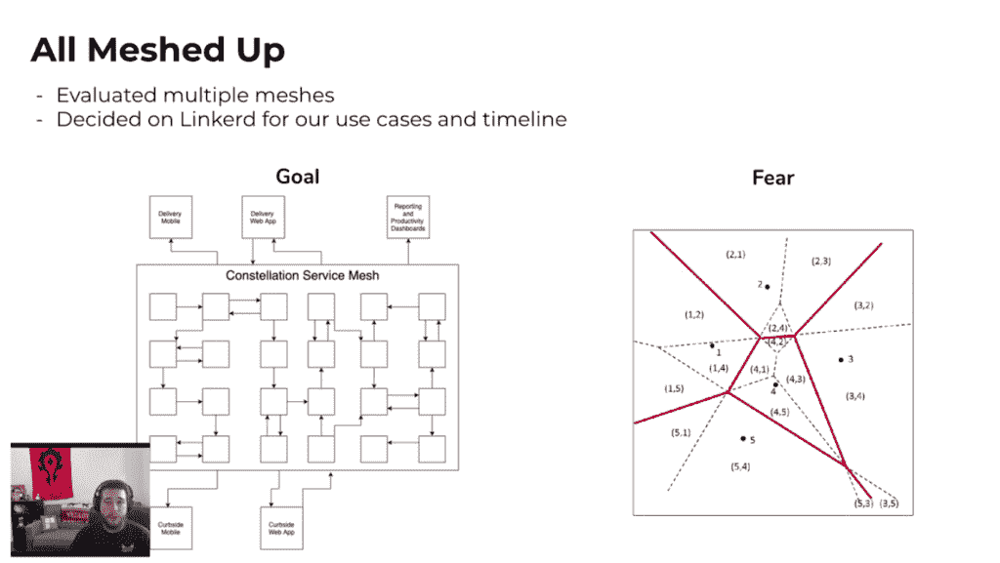
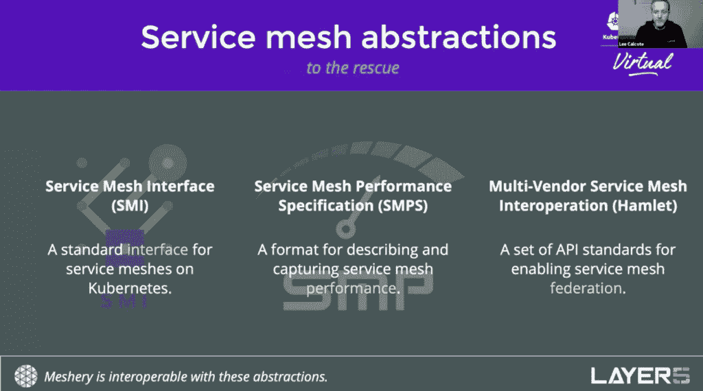
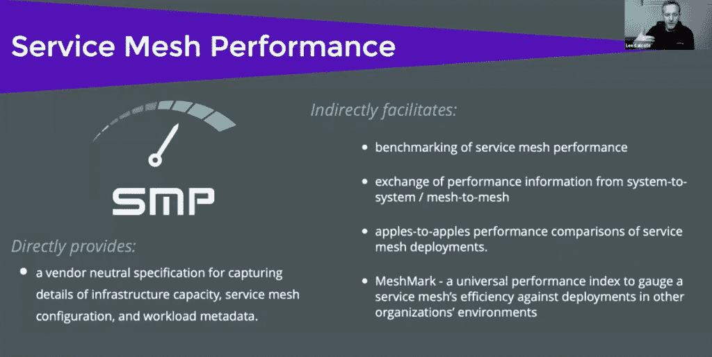

# KubeCon+CloudNativeCon:服务网格战斗故事和修复

> 原文：<https://thenewstack.io/kubeconcloudnativecon-service-mesh-battle-stories-and-fixes/>

[Honeycomb](https://www.honeycomb.io/) 正在赞助新 Stack 对 Kubecon+CloudNativeCon 北美 2020 的报道。

随着越来越多的组织实现服务网格，他们正在发现什么有效，什么需要更多的工作，并且他们正在围绕这一知识创建新的管理实践。上个月在 [KubeCon+CloudNativeCon](https://events.linuxfoundation.org/kubecon-cloudnativecon-north-america/) 期间，详细介绍了一些久经考验的最佳实践。

[Layer5](https://layer5.io/) 的创始人[李·卡尔科特](https://www.linkedin.com/in/leecalcote)在与 Layer5 维护者 Kush Trivedi 进行的题为[“服务网格规范及其在您的部署中的重要性”的谈话中解释道:“关于每一个服务网格及其工作方式，我们有很多要说的:它们的架构，它们为什么被制造出来，它们的重点是什么，它们出现时做了什么，为什么其中一些不再存在，以及为什么我们仍在看到新的服务网格。”](https://kccncna20.sched.com/event/ekEz/service-mesh-specifications-and-why-they-matter-in-your-deployment-lee-calcote-kush-trivedi-layer5)

服务网格越来越被视为在 Kubernetes 环境中管理微服务的一项要求，它提供了一个中央控制平面来管理微服务访问、测试、指标和其他功能。在我们读者的新堆栈调查中，三分之一的受访者表示他们的组织已经在使用服务网格。在众多可用的服务网格选项中；特使、伊斯蒂奥、林克尔德和库马只是其中的几个。

Layer5 的创始人 Lee Calcote 在他的演讲“服务网格规范及其在您的部署中的重要性”中

## 如何避免服务网格中断

汽车共享平台和优步的竞争对手 Lyft 几年前创建并开源了特使 T21 平台，以帮助更好地控制和管理 Kubernetes 集群中运行的服务和容器。特使随后成为一个主要的控制平面，一个服务网的基本组成部分。

在他们的谈话中"[安全地将 100K 线路特使 YAML 配置部署到生产](https://kccncna20.sched.com/event/ekEq/safely-deploying-a-100k-line-envoy-yaml-configuration-to-production-lisa-lu-jyoti-mahapatra-lyft)，"[斯坦福大学法学院研究员、前 Lyft 软件工程师卢燕](https://www.linkedin.com/in/lisaclu)和[Lyft 网络团队软件工程师 Jyoti Mahapatra](https://www.linkedin.com/in/jyoti-ranjan-mahapatra-82aa976) 讨论了如何在实施和使用特使时避免常见的配置问题。他们还讨论了 Envoy 中内置的一些护栏如何帮助缓解软件产品发布和性能问题。

考虑到 Lyft 庞大且可扩展的云原生基础设施，Lu 和 Mahapatra 拥有大规模管理特使的第一手知识。

“随着 Lyft 在一些边车上增加的服务和路线数量，我们有超过 10 万条 YAML 的配置，这使得维护和修改变得极其复杂和危险，”卢说。

Lu 和 Mahapatra 描述了自动化测试和冲突确认过程的最佳实践，“以便您的服务所有者可以快速和独立地迭代，”Lu 说。“这也将防止你的特使运营商陷入代码审查，”她说

人为错误是服务网络瓶颈和中断的主要来源。在用户忽略了与 Envoy 的服务或路由冲突的情况下，正如 Lu 所描述的，可以“破坏”服务启动或“弃用”，Lu 展示了如何验证 Envoy 的引导配置以避免该问题。Lu 说，其中一个修正包括在验证模式下运行 Envoy 二进制程序。这个过程“获取你的二进制文件，获取你的引导配置，并试图启动特使”，并“它将尽可能地通过服务器初始化过程，如果没有错误，它将成功退出，”卢说。

冲突加载检查工具——一个独立的二进制文件，可用于 Envoy 管理的 Kubernetes 集群中的所有引导配置——检查由 [proto](https://developers.google.com/protocol-buffers/docs/proto3) 和 [JSON](https://www.json.org/) 模式定义的所有值和字段是否有效。Lu 说，这两种检查都是针对所有拉式请求和持续集成(CI)而运行的。

卢说，这些工具“使审查这些更改变得容易得多，因为作为一名审查者，你已经知道该配置是有效的特使配置”，以便“确保更改做它应该做的事情”。

服务网状网与 DNS 相反，因为 DNS 提供类似垂直的网络流量检查，而服务网状网横向扩展以确保集群内不同服务和侧柜之间的连续性。

Mahapatra 描述了一个[特使路由器检查](https://www.envoyproxy.io/docs/envoy/latest/configuration/operations/tools/router_check)工具，创建该工具是为了帮助防止与路由器相关的故障——甚至在极端情况下的中断。例如，Mahapatra 说，在“高流量变化的情况下，错误地添加在列表顶部的路由…可能会中断所有流量”。他说，路由器检查功能允许用户运行单元测试，检查字段限制，添加代码覆盖约束，并根据报头匹配、运行时和集群冲突测试复杂的路由配置，从而有助于降低风险

Lyft 对 Envoy 的贡献仍然经常(如果不是主要的话)涉及 Lyft 开发人员面临的问题的解决方案。这就是为 Envoy 开发路由器检查工具的动机，例如，它并不总是具有计算覆盖范围的能力，或者具有对运行时谷和标志的测试支持，Lu 说。

与此同时，“仍然有一堆用户想要的功能，”陆说。“因此，用路由器检查工具可以测试的行为种类肯定有很大的增加空间，”Lu 说。

## 服务网发展杂货连锁店

在去年开始的新冠肺炎疫情之后，圣安东尼奥的杂货店大纲 [H-E-B](https://www.heb.com/) 面临着路边杂货店提货需求的激增。虽然这家零售连锁店已经开发了一款应用程序，允许客户在线订购，然后提取他们的杂货，但需求的爆炸表明，一个旨在管理服务的单片软件平台是远远不够的。

H-E-B 的高级工程经理贾斯汀·特纳(Justin Turner)说:“随着业务规模的扩大，我们开始遇到挑战:努力快速交付，以及与变化相关的大量风险，最终还有可靠性问题。”。“因此，这让我们踏上了进军微服务的现代化之旅。”

在他们的“[H-E-B curb side 如何在疫情](https://kccncna20.sched.com/event/ekEw/how-h-e-b-curbside-adopted-linkerd-during-a-pandemic-justin-turner-garrett-griffin-h-e-b)期间采用 Linkerd”的谈话中，Turner 和 H-E-B 高级软件工程师 [Garrett Griffin](https://www.linkedin.com/in/garrett-griffin) 描述了他们的 DevOps 团队如何选择 Linkerd 来支持他们的可观察性以及运行和部署应用程序以及更新路边杂货店应用程序的其他需求。

“假设是[服务网]将帮助我们解决我们在构建微服务和支持它们的运营肌肉时遇到的一些挑战，”特纳说。

为了测试，DevOps 团队使用 Linkerd 来验证当他们将 pod 扩展到数百个实例时会发生什么，以查看代理是否仍然会被注入。格里芬说:“在做这个(测试)时，我们最终发现了一个与 Linkerd 完全无关的连接问题。”“但是，我们仍然能够修复它并继续运营。”

Griffin 说，为了在扩展服务单元时帮助检查潜在的流量分布问题，DevOps 团队能够通过测试确定，例如，使用 Linkerd 和其他工具在没有扩展干扰的情况下定向流量是可能的。

格里芬说，“我们最大的担心是代理注射器和控制平面，”但在“他们无法扩展或部署新版本的情况下，他们仍然在工作”。“这让我们松了一口气，因为我们知道，如果这种情况发生在生产中，我们将有时间解决问题。”

## 互操作性是服务网格来来去去的关键

组织可能会为其集群使用至少一个以上的 API 服务层和服务网格。这就是为什么互操作性以及规范对于控制平面也很重要。例如，在上面提到的“服务网格规范及其在您的部署中的重要性”的演讲中，Calcote 反问:

“可以说，有多少规范、多少标准可以帮助我们理解现有的各种服务网格并与之进行互操作？”卡尔科特说。

也就是说，Calcote 在他的演讲中描述了[服务网格接口(SMI)](https://smi-spec.io/) 、[服务网格性能规范(SMPS)](https://layer5.io/projects/service-mesh-performance) 和[多厂商服务网格互操作(Hamlet)](https://github.com/vmware/hamlet) 规范。

服务网格可用于测试路由器性能、服务延迟和其他变量。然而，以点对点的方式确定服务网格性能可能具有挑战性。Calcote 说，当研究“一些发布性能结果的服务网格(来自提供商)发布的结果时，你会发现他们可能使用的环境不一定像你的环境”。“他们还使用不同的统计数据和指标来衡量[他们的服务网络] …但这毫无帮助。”

[服务网格性能(SMP)](https://smp-spec.io/) 是为了建立一种比较不同服务性能的方法而创建的。Calcote 说:“SMP 是在与一些不同的服务网格维护者合作的基础上诞生的，并创造了一种表达网格性能的标准方式。”

在考虑的变量中，除了服务网格本身之外，还包括集群数量、工作负载、节点类型、控制计划配置和客户端库的使用都会影响性能。

“什么成本更高，什么更高效，什么更强大:这些都是 SMP 在您的环境中帮助回答的开放性问题，”Calcote 说。

KubeCon+CloudNativeCon 是新堆栈的赞助商。

<svg xmlns:xlink="http://www.w3.org/1999/xlink" viewBox="0 0 68 31" version="1.1"><title>Group</title> <desc>Created with Sketch.</desc></svg>