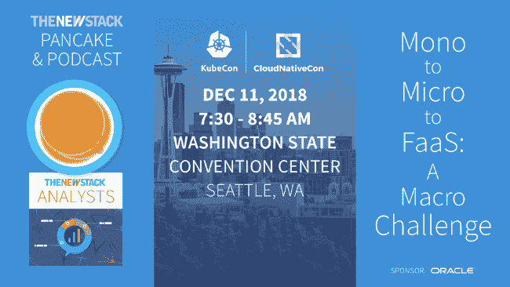

# KubeCon+CloudNativeCon 激发 Kubernetes 在中国的使用

> 原文：<https://thenewstack.io/kubeconcloudnativecon-sparks-growing-kubernetes-use-in-china/>

云原生计算基金会在中国举办 [KubeCon + CloudNativeCon](https://kccncchina2018english.sched.com/) 的目标之一是建立个人贡献者社区参与。从 2015 年华为创立的白金 CNCF 合作伙伴关系到今天的 30 多个中国成员组织，中国的终端用户市场显示出了良好的增长前景。这些组织的承诺从 2016 年的 2，181 个增加到 2017 年的 5，679 个，截至 2018 年 11 月 29 日为 4，044 个。然而，贡献者层面的更多参与将深化和加速 Kubernetes 在更大的中国企业组织之外的潜在采用。

上个月在上海 KubeCon 举办的 Kubernetes 新贡献者研讨会吸引了大约 50 名与会者。这是由 InfoSiftr 的客户支持副总裁兼 CNCF 的云原生大使[诺亚·亚伯拉罕](https://www.linkedin.com/in/noahabrahams/)精心策划的。当被问及在中国举办的第一次新贡献者研讨会的突出之处时，亚伯拉罕斯指出，所有人的反馈都是，“我们希望每次会议都以这些为起点。”

虽然大多数与会者是因为他们特定工作的需要而参加的，但他们希望该研讨会将成为个人更广泛地投资于整个社区的切入点。注意到一个需要修复的 bug，看到一个尚不可用的特性，想要学习一项新技术，发现需要更全面的支持文档——所有这些最终都可能成为更多参与的灵感。

很少有人比[更熟悉 Kubernetes 的自我创业，他是财云的首席技术官，也是 Kubernetes 在中国最早的传播者之一。2014 年，在谷歌研究博格时寻求新的挑战，他一头扎进了 Kubernetes，并很快看到了它的潜力。“在我开始使用 Kubernetes 后，我把它介绍给了我的一些中国朋友，他们都说‘这很好！“我们实际上可以在我们的公司使用这个，”他说，他的声音中闪烁着自豪的光芒。从那时起，我开始在中国社区投入大量精力。"](https://github.com/ddysher)

今天，虽然中国的 Kubernetes 社区已经成长，但这种成长更多地是由大型企业组织自上而下推动的，而不是由在沙盒中创新的个人推动的。回忆起早年在中国公司接触同事的日子，邓沉思道:“说实话，我感到有点遗憾。我帮助客户和企业，但是我没有写很多关于它的博客，所以我没有给更广泛的 Kubernetes 贡献者社区加油。我从没想过它会这么大，但我很兴奋能看到它。”

当邓意识到 Kubernetes 已经转危为安，并开始看到企业组织之外的牵引力时。“许多公司和贡献者来到这个社区，形成了不同的 SIG(特殊利益团体)。那时我没有时间关注(社区的发展)。”随着 SIG 的出现，Kubernetes 在中国有了自己的生活，在没有他或最初企业支持者的支持下生存了下来。

SIG 是 Kubernetes 发展的驱动力，也是新贡献者的主要入口。New Contributor Workshop 让新员工熟悉了许多 SIG 中的一些，并建议更深入地探索它们，以确定每个人最合适的切入点。在此基础上，研讨会讨论了非成员、成员、审阅者、批准者和所有者的沟通协议和组织层次结构，以帮助与会者了解谁将批准他们的工作以及如何批准，以及在社区中向上移动的阶梯。

随着 Kubernetes 社区在中国的不断发展，大部分变革的影响将来自哪里还有待观察:是少数大型企业组织还是由个人投资的个人贡献者组成的广泛基础。与此同时，中国的第一个新贡献者研讨会尽了自己的一份力量，让所有感兴趣的人都加入进来，这不会是最后一次。Kubernetes 的下一次新贡献者研讨会将于 12 月 9 日至 10 日在西雅图的 KubeCon North America 举行。

云计算原生计算基金会是新堆栈的赞助商。

通过 Pixabay 的特征图像。

<svg xmlns:xlink="http://www.w3.org/1999/xlink" viewBox="0 0 68 31" version="1.1"><title>Group</title> <desc>Created with Sketch.</desc></svg>