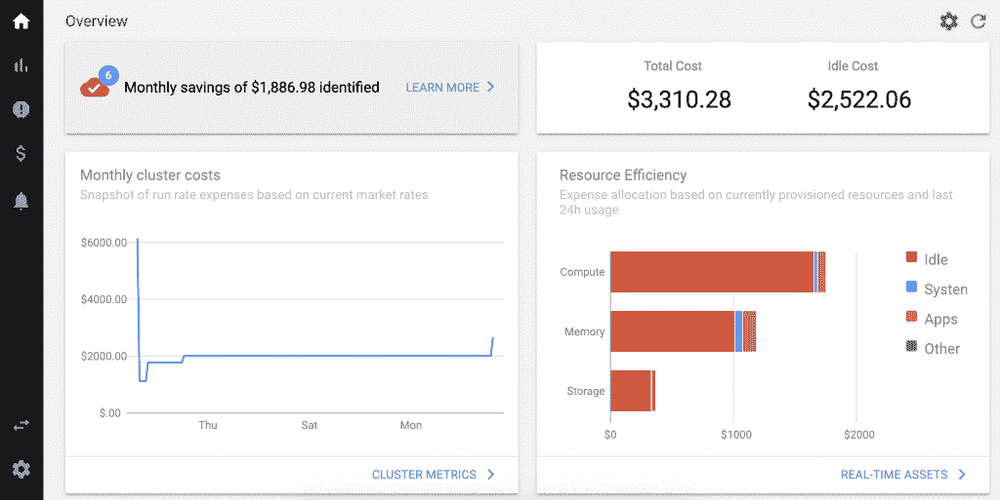

# Kubecost 拓宽了 Kubernetes 成本管理的范围

> 原文：<https://thenewstack.io/kubecost-broadens-scope-beyond-kubernetes-cost-management/>

[蜂巢](https://www.honeycomb.io/)赞助了新栈对 Kubecon+CloudNativeCon 北美 2020 的报道。

StackWatch 扩展了其 [Kubecost](https://kubecost.com/) 工具的功能，超出了 Kubernetes 环境中成本和容量的管理和监控。

该公司宣布，去年推出的 Kubecost 现在已经能够提供 Kubernetes 集群以外的云服务支出的可见性。通过这一步，Kubecost 为用户提供了关于 Kubernetes 和“集群外”云资源支出的单一视图。

StackWatch 首席执行官兼联合创始人[韦伯·布朗](https://www.linkedin.com/in/webbbrown/)表示:“Kubecost 新的统一成本视图使用户能够看到全貌，将集群内节点、磁盘等支出与集群外外部服务支出(如 AWS S3 和 RDS)相结合。“工程、财务和领导层首次可以在不到五分钟的时间内全面了解其基础架构。”

以前，Kubecost 对标记的外部资源的支持很少，所以这是它的第一组功能，其中集群内和集群外资源都集成了重要的细节。根据 Brown 的说法，这是客户非常需要的功能，代表了 Kubecost 在这一领域的重大改进。该公司结合本周虚拟举行的 [Kubecon+CloudNativeCon 北美](https://events.linuxfoundation.org/kubecon-cloudnativecon-north-america/)发布了更新。

这项新功能无需额外费用即可获得，并支持亚马逊网络服务和谷歌云平台。通过将实时 Kubernetes 成本数据与外部云计费数据合并，Kubecost 现在允许团队查看 Kubernetes 和其他云服务分解的成本，而无需任何标记。

随着范围的扩大，团队可以深入了解 Kubernetes 集群资产(如节点、磁盘和负载平衡器)以及外部云资源(如 AWS Lambda 和 S3 存储桶)的成本和容量数据。统一数据也可以按团队、部门、项目等进行筛选。

## 照亮 Kubernetes 的成本

布朗和 StackWatch 首席技术官兼联合创始人 Ajay Tripathy 在谷歌与 Kubernetes 合作时产生了这个想法，并最终成为 Kubecost。“我们开始看到的核心问题是，对于许多大规模运营的团队来说，Kubernetes 的成本在很大程度上是他们开发团队的一个黑箱，”Brown 说。“他们不知道微服务的成本是多少。他们甚至不知道群集、命名空间或部署的成本。这真的很难让人看到。”

在谷歌，特里帕蒂是一名基础设施工程师，而布朗是一名产品经理，两人都专注于基础设施监控和可观察性。他们意识到缺乏对 Kubernetes 成本和性能的了解是由于 Kubernetes 环境的技术复杂性和动态性，以及开发人员分散的决策制定。

“这使得团队很难保持领先，并了解他们在哪里花费资源，以及什么团队或应用程序实际上在推动支出，”Brown 说。

最终，布朗和特里帕蒂创建了 Kubecost 作为一个开源项目，后来又创建了 StackWatch 来提供该产品的商业版本，现在有超过 1000 个团队在使用该产品。Kubecost 可用于监控内部和多云环境。“我们非常关注对 Kubernetes 运行的环境完全不可知，”他说。

根据 Brown 的说法，该产品的主要目标是“开发人员授权”，因此它的目标是应用程序和基础设施工程师，但它也用于财务和会计团队，以及产品和执行领导人。Kubecost 的能力跨越三个主要领域。第一个是关于成本可见性和成本分配。“这通常是团队的起点，因为当我们开始与他们合作时，他们通常很少或根本不了解成本，”他说。

第二个领域是提供见解和建议，以提高资源消耗的效率。这些见解可以通过 Kubecost UI 访问，或者通过 Kubecost API 以编程方式访问。最后，Kubecost 通过监控预算和资源效率的阈值并触发警报来帮助治理。

StackWatch 还非常重视将 Kubecost 与许多云原生工具紧密集成，如 Prometheus、AlertManager 和 Grafana。“例如，使用 AlertManager 的团队现在可以将我们的指标放在那里，并将其插入他们自己的警报系统。或者，如果他们使用 Grafana，他们可以直接在 Grafana 用户界面中引入成本指标，”Brown 说。

展望未来，StackWatch 计划到 2021 年第一季度将员工人数增加一倍，达到 15 人，并宣布第一轮融资。在功能方面，它着眼于通过智能警报和自动化操作提供更多的“辅助智能”。

布朗说:“我们坚信，通过赋予开发者权力，并向他们提供基本上不可用或以前不透明的数据，我们已经挖掘到了一些强大的东西。”“我们已经看到了让这些数据的访问真正民主化是多么重要，因为各种规模的团队都发现这些信息很有价值。”

亚马逊网络服务和 KubeCon+CloudNativeCon 是新堆栈的赞助商。

Buffik 通过 Pixabay 制作的特征图像。

<svg xmlns:xlink="http://www.w3.org/1999/xlink" viewBox="0 0 68 31" version="1.1"><title>Group</title> <desc>Created with Sketch.</desc></svg>