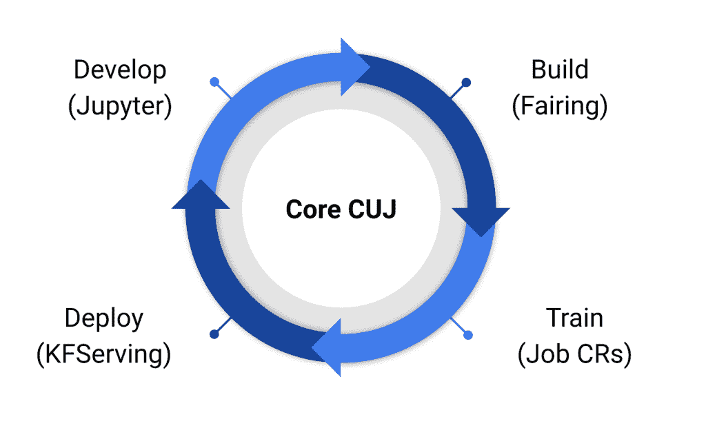

# Kubeflow 1.0 为 Kubernetes 带来了一个生产就绪的机器学习工具集

> 原文：<https://thenewstack.io/kubeflow-1-0-brings-a-production-ready-machine-learning-toolset-to-kubernetes/>

对于希望使用 Kubernetes 更轻松地并行化(和更多)他们的机器学习(ML)工作负载的开发人员来说，开源项目 [Kubeflow](https://www.kubeflow.org/) 本周已经[发布了 1.0](https://medium.com/kubeflow/kubeflow-1-0-cloud-native-ml-for-everyone-a3950202751) 版本。这个现已投入生产的项目提供了“在 Kubernetes 上高效开发、构建、训练和部署模型所需的一套稳定的核心应用程序。”

该项目于 2017 年 12 月在 KubeCon+CloudNativeCon 首次开源，此后发展到来自[30 多家参与组织](https://github.com/kubeflow/community/blob/master/member_organizations.yaml)的数百名贡献者，如谷歌、思科、IBM、微软、红帽、亚马逊网络服务和阿里巴巴。除了 Kubeflow 团队自己的[博客帖子，谷歌还提供了一个关于](https://medium.com/kubeflow/kubeflow-1-0-cloud-native-ml-for-everyone-a3950202751)[Kubeflow 如何与 Anthos](https://cloud.google.com/blog/products/ai-machine-learning/run-ml-workflows-in-production-with-cloud-native-toolkit-kubeflow-1-0)一起工作的帖子，而[IBM 的 Animesh Singh 探索了 T11 我们与 kube flow 社区合作的“工作亮点，引领了企业级 Kubeflow 1.0。”](https://developer.ibm.com/blogs/kubeflow-and-ibm-an-open-source-journey-to-10/)

在接受 New Stack 的采访时，Singh 解释了 Kubeflow 的起源，他试图简单地将 TensorFlow 引入 Kubernetes。

“这个项目萌芽时的核心理念是确保我们可以在 Kubernetes 上以一流的方式运行 TensorFlow，”Singh 说。“这意味着能够跨多个 Kubernetes 容器分发培训，然后提供现成的解决方案，如果有人想使用 TensorFlow 和 Kubernetes 运行分布式培训，他们可以轻松地开始。”

辛格解释说，基本问题归结为数据量和缺乏训练模型的处理能力。使用 Kubernetes，这些工作负载可以更容易地并行化，从而将训练模型的时间从他所说的最近的“几天，如果不是几周的话”减少到了“几天”。

“数据量增加了，所以训练时间也增加了，总的来说，它们是非常计算密集型的——不是你可以在笔记本电脑上处理的东西，”辛格说。

然而，Kubeflow 不仅仅是训练模型，而是用一系列工具来处理整个机器学习过程。

如图所示，Kubeflow 1.0 允许用户使用 Jupyter 来开发模型，使用像 fairing (Kubeflow 的 python SDK)这样的 Kubeflow 工具来构建容器并创建 Kubernetes 资源来训练他们的模型，最后使用 [KFServing](https://github.com/kubeflow/kfserving) (构建在 [Knative](https://knative.dev/) 之上)来创建和部署用于推理的服务器。

[https://www.youtube.com/embed/HBxyLnEzyhw?feature=oembed](https://www.youtube.com/embed/HBxyLnEzyhw?feature=oembed)

视频

目前，Kubeflow 附带了许多“分级”应用程序，包括 [Kubeflow UI](https://www.kubeflow.org/docs/components/central-dash/overview/) 、 [Jupyter 笔记本控制器](https://github.com/kubeflow/kubeflow/tree/master/components/notebook-controller)和 web 应用程序、用于分布式培训的 [Tensorflow 操作符](https://www.kubeflow.org/docs/components/training/tftraining/) (TFJob)和 [PyTorch 操作符](https://www.kubeflow.org/docs/components/training/pytorch/)、用于部署和升级的 kfctl，以及用于多用户管理的 [profile 控制器](https://github.com/kubeflow/kubeflow/tree/master/components/profile-controller)和 UI。此外，项目团队解释说，目前还有几个应用程序处于测试阶段，他们计划在未来的版本中升级到 1.0 版。这些应用程序包括用于定义复杂 ML 工作流的管道，用于跟踪数据集、作业和模型的[元数据](https://www.kubeflow.org/docs/components/metadata/)，用于超参数调整的 katib，以及用于其他框架的一些额外的分布式操作符，如 [xgboost](https://github.com/kubeflow/xgboost-operator) 。

Kubeflow 团队写道，开始使用 Kubeflow 就像一个命令一样简单，为 Google 云平台、AWS、IBM、Google Anthos 等提供了预构建的清单。根据 Singh 的说法，“核心目标是不要将它绑定到任何供应商”，Kubeflow 应该可以在任何 Kubernetes 集群上工作，只要您使用受支持的版本——现在，这意味着 Kubernetes 1.15 和更低版本，以及 Istio 1.31 和更低版本。

亚马逊网络服务、红帽和 KubeCon+CloudNativeCon 是新栈的赞助商。

<svg xmlns:xlink="http://www.w3.org/1999/xlink" viewBox="0 0 68 31" version="1.1"><title>Group</title> <desc>Created with Sketch.</desc></svg>