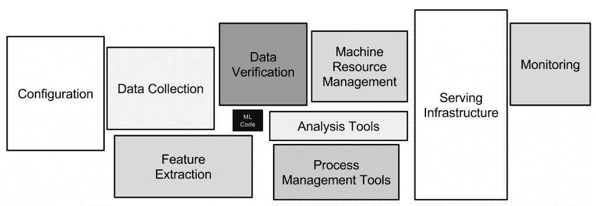
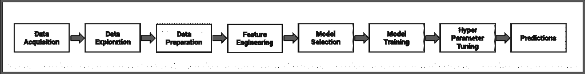
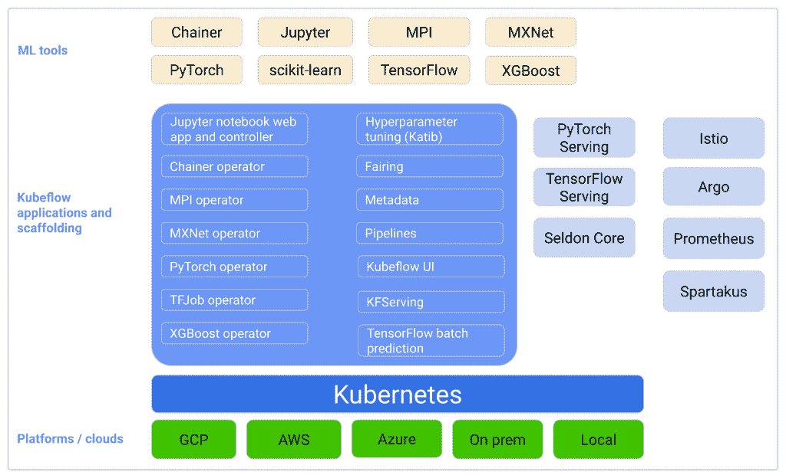

# Kubeflow:机器学习与现代基础设施相遇的地方

> 原文：<https://thenewstack.io/kubeflow-where-machine-learning-meets-the-modern-infrastructure/>

编者按:这篇文章是探索 Kubeflow 机器学习平台系列文章的第一篇。请每周五回来查看未来的分期付款。

Kubernetes 提供的可扩展性和规模使其成为构建现代平台的理想选择。 [Kubeflow](https://www.kubeflow.org/) 是一个开源的利基型专业机器学习平台，它利用 Kubernetes 的功能为数据科学家、ML 工程师和 DevOps 专业人员提供端到端的工作流。

本系列文章将向开发人员和操作人员介绍 Kubeflow 及其功能。这第一部分介绍了 Kubeflow，而其余部分通过端到端的示例介绍了核心构建模块、安装、配置和管理机器学习模型的生命周期。在本系列结束时，您将对 Kubeflow 及其功能有一个全面的了解。

使用 Kubeflow 的关键优势在于，它隐藏了将数据准备、训练、调优和部署机器学习模型所需的代码容器化所涉及的复杂性。使用 Kubeflow 的数据科学家在训练模型时最不可能知道 pod 和 statefulsets 的概念。它是一个真正的机器学习平台，有自己的 UI、API，甚至命令行工具，这些工具基于 Kubernetes 和相关技术抽象了基础设施。

公共云中可用的 Amazon SageMaker、Azure ML、Google Cloud AI 和 IBM Watson Studio 等企业 ML 平台提供端到端的功能。对于考虑本地开源 ML 平台的客户来说，Kubeflow 是这些服务的一个很好的替代方案。它接近于大多数商业产品提供的特性和功能，而没有锁定。

## Kubeflow 概述

Kubeflow 是一个为想要构建和试验 ML 管道的数据科学家提供的平台。Kubeflow 也面向希望将 ML 系统部署到各种开发、测试和生产级服务环境的 ML 工程师和运营团队。

有一种误解认为，机器学习只是掌握算法和代码来训练模型。根据 2015 年[神经信息处理系统](https://www.facebook.com/nipsfoundation/) (NIPS)会议上一篇现在很有名的论文“[机器学习](https://papers.nips.cc/paper/2015/file/86df7dcfd896fcaf2674f757a2463eba-Paper.pdf)中隐藏的技术债务”，只有一小部分真实世界的 ML 系统是由 ML 代码组成的，如中间的小黑框所示。必要的周边基础设施庞大而复杂。

操作机器学习模型的过程超出了为模型训练编写的代码。在生产中部署、扩展和管理 ML 模型与管理关键任务应用程序没有什么不同。这个过程很复杂，需要数据科学家、开发人员、ML 工程师和操作员之间的协作。

Kubeflow 利用了多种云原生技术，包括 Istio、Knative 和 Tekton。它利用核心 Kubernetes 原语，如存储类、部署、服务和定制资源。通过 Istio 和 Knative，Kubeflow 获得了流量分流、蓝/绿部署、金丝雀释放、扩展到零以及自动扩展等功能。Tekton 带来了在平台内本地构建映像的能力。

因为它是在 Knative 之上，Kubeflow 抽象了 Kubernetes 的组件，向 ML 开发者和工程师展示了一个平台。

除了 Istio、Knative 和 Tekton，Kubeflow 还非常依赖各种云原生和开源项目，包括 Scikit-learn、TensorFlow、PyTorch、Apache MXNet、Argo Workflows、MinIO、Apache Spark、Prometheus 和 Seldon Core。这种集成提供了端到端的能力，包括数据准备、培训和服务。

从数据获取到模型监控，机器学习在操作机器学习模型时涉及多个步骤。Kubeflow 提供了映射到机器学习工作流程每个阶段的工具。这些工具被转化为 Kubernetes 资源，如 pods、statefulsets、jobs、deployments 和幕后服务。

该项目的主要贡献者之一谷歌将 Kubeflow 的一些组件与该公司的 manage ML PaaS 产品[云人工智能](https://cloud.google.com/products/ai)集成在一起。这种集成将 Kubeflow 变成了一个混合 ML 平台，可以产生内部数据中心和公共云。客户可以在内部训练模型，并在公共云中为其提供服务，反之亦然。

Kubeflow 是一个很好的例子，展示了如何在 Kubernetes 之上构建一个复杂的平台。它扩展了 Kubernetes 提供高度分布式、并行化、大规模机器学习模型训练和部署的承诺。

尽管 Kubernetes 缺乏多租户支持，但 Kubeflow 使得隔离个人和团队使用的环境成为可能。Kubeflow 提供的共享多租户机器学习平台使其成为企业的理想候选。

## Kubeflow 用例

**托管数据集**
借助 Kubeflow，大型数据集可以集中存储，并与从事各种项目的数据科学家共享。通过利用 Kubernetes 持久卷和基于共享文件系统的声明，Kubeflow 使得跨项目共享托管数据集成为可能。

**特征工程**
[盛宴](https://www.kubeflow.org/docs/components/feature-store/overview/) (Feature Store)，Kubeflow 的可选组件，是一个运营数据系统，用于管理和服务机器学习特征到生产中的模型。数据科学家和 ML 工程师可以在训练和推理期间使用 Feast 来定义、管理、发现、验证和服务 ML 模型的特征。

**运行 Jupyter 笔记本**
Kubeflow 配备了基于 JupyterHub 的多租户笔记本服务器。每个笔记本服务器都可以基于为项目定制的不同容器映像。例如，从事数据准备工作的团队可能会推出基于 CPU 的笔记本服务器。相比之下，ML 工程师可以启动不同的笔记本服务器来执行基于 GPU 的分布式培训。

**ML 模型的分布式训练**
Kubeflow 基于 TensorFlow、PyTorch 等主流框架，轻松执行分布式机器学习作业。它利用 Kubernetes 的调度程序和定制控制器来执行大规模培训。

**创建可重复的实验**
训练基于深度学习和神经网络的复杂模型类似于科学实验。研究人员和 ML 工程师在得出满意结果的模型之前，用各种参数进行实验。Kubeflow 管道带来了一致且可重复的实验环境。

**超参数调优**
Katib 是一个针对自动机器学习(AutoML)的 Kubernetes-native 项目。Katib 支持超参数调整、提前停止和神经架构搜索(NAS)。通过将 Katib 与 Kubeflow 集成，您可以轻松地调整学习速率、神经网络的层数以及每层的节点数。除了超参数调整，Katib 还提供了神经架构搜索功能，可以最大限度地提高深度学习模型的预测准确性和性能。

**模型服务**
kube flow 的一个关键优势是为模型提供推理服务。基于 KfServing 和 Seldon Core，Kubeflow 为模型服务带来了一些成熟的扩展技术和管理微服务。KfServing 和 Seldon Core 都支持 Scikit-learn、TensorFlow、PyTorch 和 MXNet 等主流框架用于模型服务。

**模型监控**kube flow 与普罗米修斯集成模型监控。操作员和 sre 可以使用熟悉的 Grafana 仪表板来监控部署模型的性能。

在本系列的下一部分中，我们将在具有一个或多个 GPU 节点的集群上安装 Kubeflow。我将介绍 NVIDIA 的 DeepOps 工具包，并演示如何使用它来自动安装 Kubeflow。敬请关注。

贾纳基拉姆·MSV 的网络研讨会系列“机器智能和现代基础设施(MI2)”提供了涵盖前沿技术的信息丰富、见解深刻的会议。在 [http://mi2.live](http://mi2.live) 上注册参加即将举行的 MI2 网络研讨会。

<svg xmlns:xlink="http://www.w3.org/1999/xlink" viewBox="0 0 68 31" version="1.1"><title>Group</title> <desc>Created with Sketch.</desc></svg>