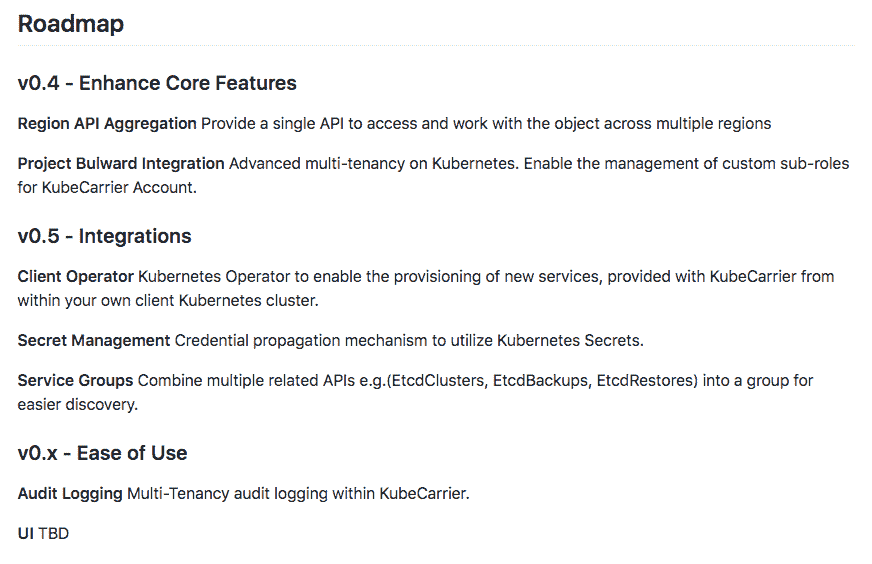

# Kubermatic KubeCarrier 为多集群和多云准备了单一界面

> 原文：<https://thenewstack.io/kubermatic-kubecarrier-readies-a-single-interface-for-multiclusters-and-multiclouds/>

该解决方案很简单，但其创建却非常复杂:总部位于汉堡的 Kubermatic(前身为 T2)表示，组织现在可以使用其 Kubermatic Kubernetes 平台来自动化多云环境和地理区域中跨 Kubernetes 集群的服务和应用程序的供应和生命周期管理，所有这一切都通过一个 API 完成。

额外的功能来自 Kubermatic [KubeCarrier](https://github.com/kubermatic/kubecarrier) ，这是一款在 Apache 2.0 下获得许可的新软件，该公司声称它为 Kubernetes 运营商提供了一个抽象层，可以跨不同的集群和云提供应用程序。

Scheele 说，作为 Kubernetes 十大项目贡献者之一(领先于阿里巴巴、亚马逊和英特尔，仅次于谷歌、VMware、微软和红帽)，Kubermatic 长期以来一直提供“对众多集群及其部署的支持”。“现在，我们正在支持服务方面，并帮助客户管理应用程序和日常运营。”

Kubermatic 的 Kubernetes 平台的一大部分是帮助运营部门自动化和管理“第 2 天”的 Kubernetes 运营。“下一步，我们将允许客户在其整个 Kubernetes 部署中自动调配服务，通常分布在多云和本地基础设施中。”

在 KubeCarrier 的保护伞下，DevOps 团队可以管理数据库、存储和其他无状态应用程序，并通过单一界面应用监控、服务网格和其他 Kubernetes 工具来管理所有已部署的集群，”Kubermatic 首席执行官兼联合创始人 [Sebastian Scheele](https://www.linkedin.com/in/sebastian-scheele) 告诉新堆栈。

例如，如果您的内部客户正在运行数百个数据库，您如何通过提供更新等来管理所有这些数据库舍勒说。“我们创建了 KubeCarrier，为运营提供一个增长框架，以利用众多集群及其下运行的应用和工具。”

例如，一个组织的数据库团队可能支持提供 CRM 和其他企业应用程序供组织用户使用的内部客户，而另一个 DevOps 团队可能依赖来自不同云服务的其他集群上的时序数据服务。KubeCarrier 不需要单独管理应用程序，而是允许数据库运营团队使用一个 API 来管理跨不同集群和独立提供商运行的数据库。跨基础架构提供商管理应用程序不再是一项需要专业技能的孤立任务。不同的团队还可以访问部署在各种云和内部环境中的多个应用程序和数据库，而不必担心它们的生命周期管理。

Scheele 说:“你可以把这些放在一起，这取决于需求和不同团队之间需要交流的内容。“他们可以单独向彼此提供这种服务。”

Kubermatic 的目标客户是电信公司等通常会部署和管理 10 个或更多集群的客户。

“如果你说‘好吧，从长远来看，我只计划拥有一个集群’，那么我认为你不需要这样做，但如果你说‘我们目前已经有 5 个或 10 个集群，我们需要扩大规模，扩大更多’，那么这肯定是正确的做法，”Scheele 说。

Kubermatic 介绍了 KubeCarrier 提供的以下功能:

*   服务、应用和 API 可访问的硬件设备的自动化供应和整个生命周期管理。
*   独立于云、区域或数据中心的服务、应用和设备的注册。
*   应用程序服务商店。
*   多租户和用户管理，通过访问权限控制、权限和策略来定义配额。
*   自动化配置和可调整的应用服务。
*   对所有 Kubernetes 操作者的本地支持。

Red Hat 和 VMware 是新堆栈的赞助商。

Pixabay 的 skeeze 的专题图片。

<svg xmlns:xlink="http://www.w3.org/1999/xlink" viewBox="0 0 68 31" version="1.1"><title>Group</title> <desc>Created with Sketch.</desc></svg>