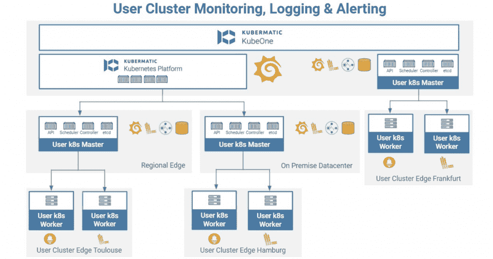

# Kubermatic Kubernetes 平台通过自动化战胜复杂性

> 原文：<https://thenewstack.io/kubermatic-kubernetes-platform-beats-complexity-through-automation/>

Kubermatic 发布了其最新版本的 [Kubermatic Kubernetes 平台(KKP)](https://www.kubermatic.com/products/kubermatic/) ，据称这是迄今为止最大的一次发布。Kubermatic [的前身是 Loodse，去年采用了新名字](https://thenewstack.io/loodse-becomes-kubermatic-an-open-source-kubernetes-provider/)，随之而来的是提供自动化版本的 Kubernetes 的新愿景。对于 KKP 2.18，[Kubermatic 的 Edge 和产品副总裁 Sascha Haase](https://de.linkedin.com/in/haasesascha/en) 解释说，该公司的最新版本进一步推进了其“通过自动化提供动力”的目标

“我们在 Kubermatic 的愿景是，我们希望通过自动化来强调电力，我们真的希望实现最高程度的系统自治，这样你就根本不需要任何人工关注，”哈斯说。他指出，问题在于公司需要在单一的 IT 保护伞下实现所有这些自动化。

“很明显，迄今为止，我们所见过的任何空间或环境中的数字领导者都是云原生的。Gartner 表示，采用率很高，但有趣的是，只有 5%的应用程序迁移到了原生云中，这似乎有点矛盾，但事实并非如此，”Haase 说。“当您看到不同组织之间存在巨大差距时，我们认为需要一个 IT 来管理所有系统和设置。你必须在服务应用和平台本身之间建立一种前所未有的连接。”

为此，KKP 2.18 在第二天和第三天操作的基础上提供了许多新功能，并为其目标受众(具有高度复杂性的 Kubernetes 用户)提供了自动化和集成的 Kubernetes 环境。

哈斯首先指出，KKP 集成了几个开源工具，包括 Prometheus、Grafana、Loki 和 Cortex，增加了边缘就绪监控、日志记录和警报功能。集成不仅遵循 KKP 的现有用户权限，而且还可以在一个仪表板中使用，只需单击一下即可实现。该公司还强调，由于 [KKP 的架构](https://docs.kubermatic.com/kubermatic/master/architecture/monitoring_logging_alerting/user_cluster/)，新功能“非常适合高度分布式的边缘场景，其中每一块内存都很重要，”根据[博客帖子](https://www.kubermatic.com/blog/kubermatic-kubernetes-platform-2-18-is-here/)详细介绍了新版本的功能。Haase 进一步解释说，建立新的集成是因为“特别是当我们谈到 edge 和大规模时，您可以购买的现有解决方案对预算有着巨大的影响”，并指出有些解决方案非常昂贵。

接下来，KKP 2.18 还带来了许多简化治理和控制的功能，所有这些功能都通过 KKP 用户界面集中管理。例如，用户现在可以创建集群模板，以使未来的集群部署更快、更容易，允许根据集群的部署位置(本地或公共云)进行自定义和可重复的配置。在 KKP 2.17 中获得支持的开放策略代理也看到了一些增强的功能，例如限制哪些集装箱注册中心将被允许向 KKP 传送图像。自动备份现在也可用，Haase 再次强调用户界面是这里的一个关键组件，因为他们最初的备份集成“有点重”。

“灵活性，与规模和复杂性相结合，往往是矛盾的，但我们试图通过我们的软件来实现这一点，”哈斯说。

KKP 2.18 还引入了新的计量集成，哈斯解释说，这将“非常容易集成到您的企业资源规划(ERP)系统中，然后进行相互比较，并让您的数据科学团队找出最佳工作负载可以部署在哪里。”

除了新的计量集成，KKP 还增加了更先进的 AWS Spot 实例支持，它说这将使客户能够根据成本配置 Spot 实例，帮助节省“高达 70%”。

最后，KKP 2.18 还增加了一些新的迁移工具，比如针对[即将到来的 Docker 运行时弃用](https://github.com/kubernetes/kubernetes/blob/master/CHANGELOG/CHANGELOG-1.20.md#deprecation)的工具。虽然反对是[没什么好担心的](https://thenewstack.io/this-week-in-programming-kubernetes-says-dont-panic-about-docker-deprecation/)，但这是管理员必须处理的事情，Haase 提供了他们的迁移工具，再次证明了他们对“自动化带来的力量”的关注。

“在这方面，我认为，宠物与牛的讨论还没有结束，因为我们看到许多组织——甚至是拥有大量集群的更先进的组织——出于这样的原因将集群视为牛:‘我需要迁移我的容器运行时接口。“我该怎么做，”“嗯，理想情况下，你不应该这样做，”哈斯说理想情况下，您的平台可以提供这种价值，我们做到了。只需一次点击，您就可以在集群配置中的 Docker 和 containerd 之间来回跳转。"

KKP 2.18 现在可以下载，并将为 Kubernetes 1.22 提供支持。

“当然，展望未来，我们希望增强我们现有的架构优势，”哈斯说。“我们押注于我们极具竞争力的价格模式，我们认为我们现在击败了市场上的任何其他竞争对手，我们希望将重点放在解决后天的问题上。”

<svg xmlns:xlink="http://www.w3.org/1999/xlink" viewBox="0 0 68 31" version="1.1"><title>Group</title> <desc>Created with Sketch.</desc></svg>